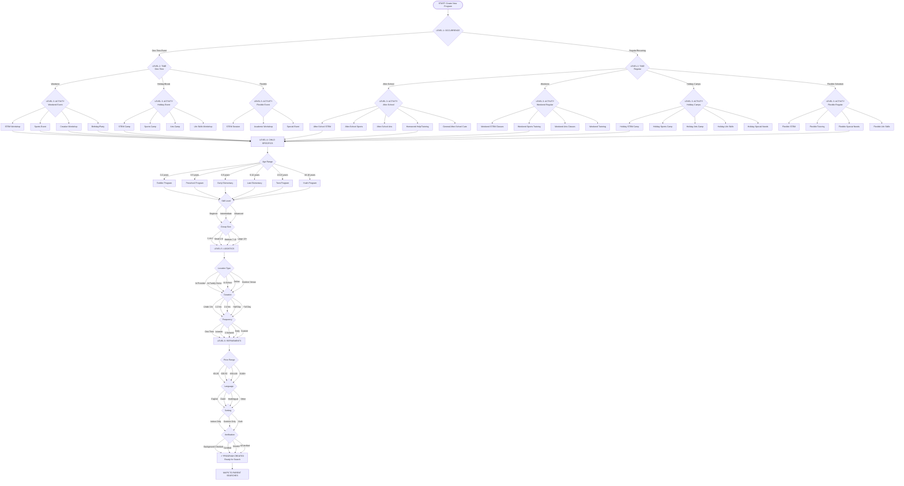

```mermaid
graph TD
    Start([START: Create New Program]) --> L1{LEVEL 1: OCCURRENCE}
    
    %% Level 1: Occurrence Type
    L1 -->|"One-Time Event"| L2A{LEVEL 2: TIME<br/>One-Time}
    L1 -->|"Regular/Recurring"| L2B{LEVEL 2: TIME<br/>Regular}
    
    %% Level 2: Time Constraint - One-Time Branch
    L2A -->|"Weekend"| L3A1{LEVEL 3: ACTIVITY<br/>Weekend Event}
    L2A -->|"Holiday/Break"| L3A2{LEVEL 3: ACTIVITY<br/>Holiday Event}
    L2A -->|"Flexible"| L3A3{LEVEL 3: ACTIVITY<br/>Flexible Event}
    
    %% Level 2: Time Constraint - Regular Branch
    L2B -->|"After-School"| L3B1{LEVEL 3: ACTIVITY<br/>After-School}
    L2B -->|"Weekend"| L3B2{LEVEL 3: ACTIVITY<br/>Weekend Regular}
    L2B -->|"Holiday Camps"| L3B3{LEVEL 3: ACTIVITY<br/>Holiday Camps}
    L2B -->|"Flexible Schedule"| L3B4{LEVEL 3: ACTIVITY<br/>Flexible Regular}
    
    %% Level 3: Activity Type - One-Time Events
    L3A1 --> STEM1[STEM Workshop]
    L3A1 --> Sports1[Sports Event]
    L3A1 --> Creative1[Creative Workshop]
    L3A1 --> Party1[Birthday/Party]
    
    L3A2 --> STEM2[STEM Camp]
    L3A2 --> Sports2[Sports Camp]
    L3A2 --> Creative2[Arts Camp]
    L3A2 --> Life2[Life Skills Workshop]
    
    L3A3 --> STEM3[STEM Session]
    L3A3 --> Academic3[Academic Workshop]
    L3A3 --> Special3[Special Event]
    
    %% Level 3: Activity Type - Regular Programs
    L3B1 --> AfterSTEM[After-School STEM]
    L3B1 --> AfterSports[After-School Sports]
    L3B1 --> AfterCreative[After-School Arts]
    L3B1 --> AfterAcademic[Homework Help/Tutoring]
    L3B1 --> AfterCare[General After-School Care]
    
    L3B2 --> WeekendSTEM[Weekend STEM Classes]
    L3B2 --> WeekendSports[Weekend Sports Training]
    L3B2 --> WeekendCreative[Weekend Arts Classes]
    L3B2 --> WeekendAcademic[Weekend Tutoring]
    
    L3B3 --> HolidaySTEM[Holiday STEM Camp]
    L3B3 --> HolidaySports[Holiday Sports Camp]
    L3B3 --> HolidayCreative[Holiday Arts Camp]
    L3B3 --> HolidayLife[Holiday Life Skills]
    L3B3 --> HolidaySpecial[Holiday Special Needs]
    
    L3B4 --> FlexSTEM[Flexible STEM]
    L3B4 --> FlexAcademic[Flexible Tutoring]
    L3B4 --> FlexSpecial[Flexible Special Needs]
    L3B4 --> FlexLife[Flexible Life Skills]
    
    %% Connect all activity types to Level 4 (showing a few examples for clarity)
    STEM1 --> L4[LEVEL 4: CHILD SPECIFICS]
    Sports1 --> L4
    Creative1 --> L4
    Party1 --> L4
    STEM2 --> L4
    AfterSTEM --> L4
    AfterAcademic --> L4
    WeekendSports --> L4
    HolidaySTEM --> L4
    FlexSpecial --> L4
    
    %% Level 4: Child Specifics
    L4 --> Age{Age Range}
    Age -->|"0-2 years"| L4_Toddler[Toddler Program]
    Age -->|"3-5 years"| L4_Preschool[Preschool Program]
    Age -->|"6-8 years"| L4_EarlyElem[Early Elementary]
    Age -->|"9-12 years"| L4_LateElem[Late Elementary]
    Age -->|"13-15 years"| L4_Teen[Teen Program]
    Age -->|"16-18 years"| L4_Youth[Youth Program]
    
    L4_Toddler --> Skill{Skill Level}
    L4_Preschool --> Skill
    L4_EarlyElem --> Skill
    L4_LateElem --> Skill
    L4_Teen --> Skill
    L4_Youth --> Skill
    
    Skill -->|"Beginner"| GroupSize{Group Size}
    Skill -->|"Intermediate"| GroupSize
    Skill -->|"Advanced"| GroupSize
    
    GroupSize -->|"1-on-1"| L5[LEVEL 5: LOGISTICS]
    GroupSize -->|"Small 2-6"| L5
    GroupSize -->|"Medium 7-12"| L5
    GroupSize -->|"Large 13+"| L5
    
    %% Level 5: Logistics
    L5 --> Location{Location Type}
    Location -->|"At Provider"| Duration{Duration}
    Location -->|"At Family Home"| Duration
    Location -->|"At School"| Duration
    Location -->|"Online"| Duration
    Location -->|"Outdoor Venue"| Duration
    
    Duration -->|"Under 1hr"| Frequency{Frequency}
    Duration -->|"1-2 hrs"| Frequency
    Duration -->|"2-4 hrs"| Frequency
    Duration -->|"Half Day"| Frequency
    Duration -->|"Full Day"| Frequency
    
    Frequency -->|"One-Time"| L6[LEVEL 6: REFINEMENTS]
    Frequency -->|"1x/week"| L6
    Frequency -->|"2-3x/week"| L6
    Frequency -->|"Daily"| L6
    Frequency -->|"Custom"| L6
    
    %% Level 6: Refinements
    L6 --> Price{Price Range}
    Price -->|"€0-20"| Lang{Language}
    Price -->|"€20-50"| Lang
    Price -->|"€50-100"| Lang
    Price -->|"€100+"| Lang
    
    Lang -->|"English"| Indoor{Setting}
    Lang -->|"Dutch"| Indoor
    Lang -->|"Multilingual"| Indoor
    Lang -->|"Other"| Indoor
    
    Indoor -->|"Indoor Only"| Verify{Verification}
    Indoor -->|"Outdoor Only"| Verify
    Indoor -->|"Both"| Verify
    
    Verify -->|"Background Checked"| Complete[✓ PROGRAM CREATED<br/>Ready for Search]
    Verify -->|"Certified"| Complete
    Verify -->|"Insured"| Complete
    Verify -->|"All Verified"| Complete
    
    Complete --> SearchMap[MAPS TO PARENT SEARCHES]
```
