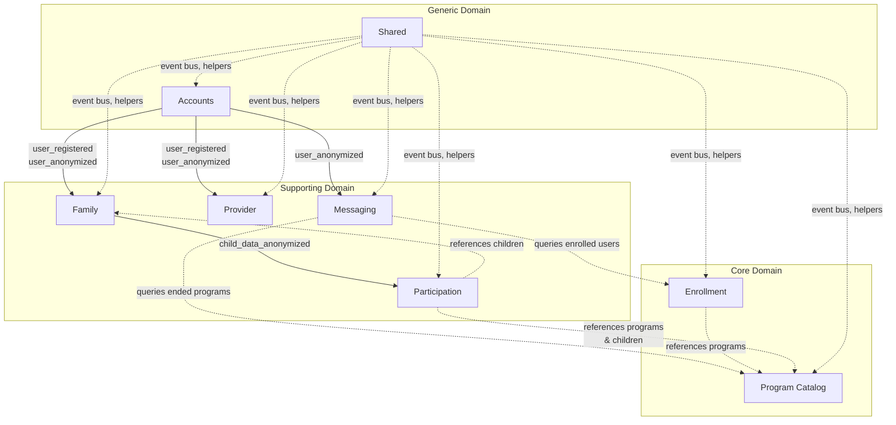

# Context Map

High-level view of all bounded contexts and how they relate to each other.

## Legend

- **Solid arrows** = integration events (async, event-driven communication)
- **Dashed arrows** = direct queries or references (sync, through ports)

## Context Summary

| Context | Type | Purpose |
|---|---|---|
| **Accounts** | Generic | User auth, registration, tokens, sessions |
| **Family** | Supporting | Parent profiles, children, consents, referral codes |
| **Provider** | Supporting | Provider profiles, staff, verification documents |
| **Program Catalog** | Core | Program discovery, categories, pricing, availability |
| **Enrollment** | Core | Bookings, fee calculations, subscription tiers |
| **Messaging** | Supporting | Conversations, messages, participants, retention |
| **Participation** | Supporting | Session tracking, check-in/out, attendance |
| **Shared** | Generic | Event bus, domain event publishing, Ecto helpers |

## Key Integration Events

| Event | Published By | Consumed By | Purpose |
|---|---|---|---|
| `user_registered` | Accounts | Family, Provider | Create parent/provider profiles on registration |
| `user_anonymized` | Accounts | Family, Provider, Messaging | GDPR data cleanup across contexts |
| `child_data_anonymized` | Family | Participation | Anonymize child attendance records |
