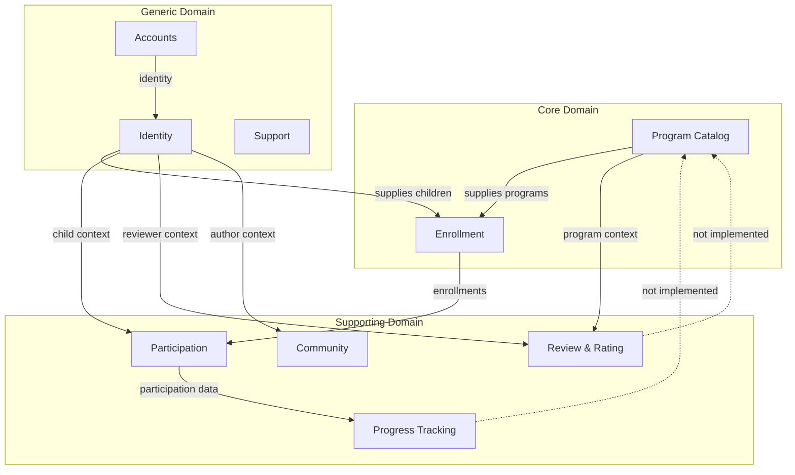
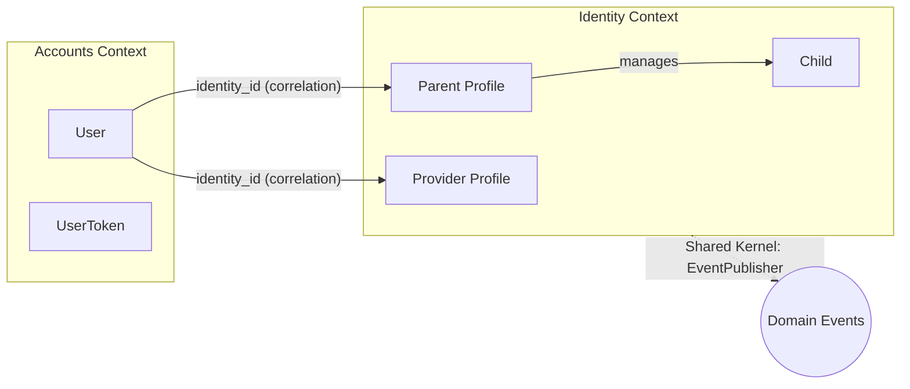
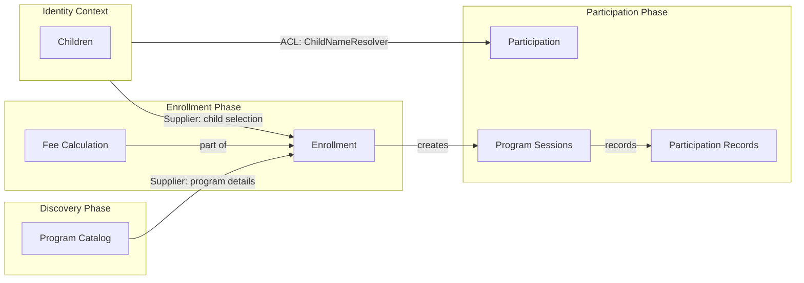
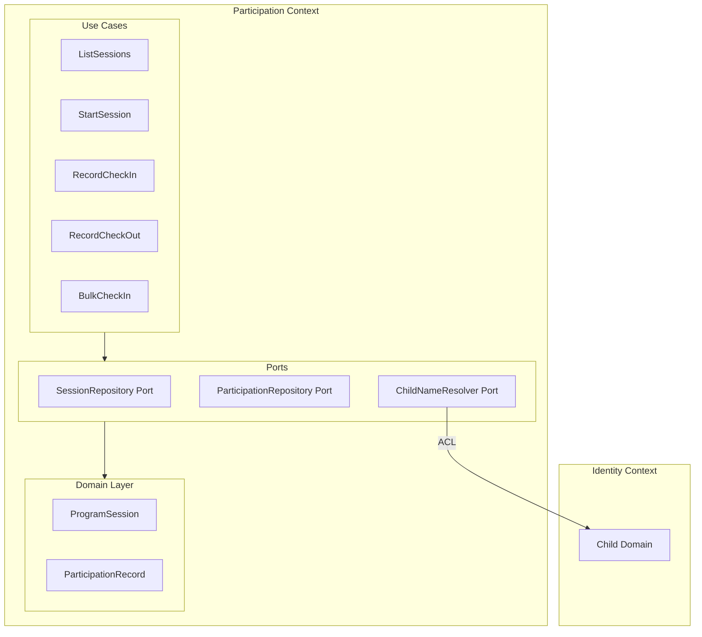
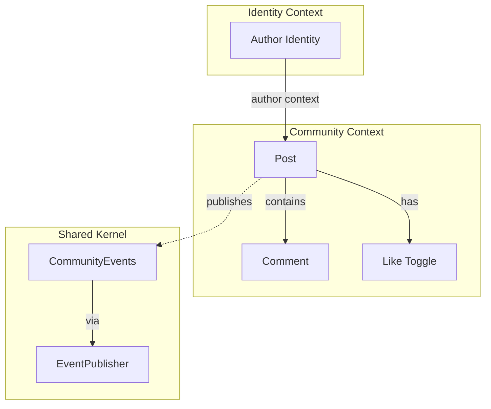
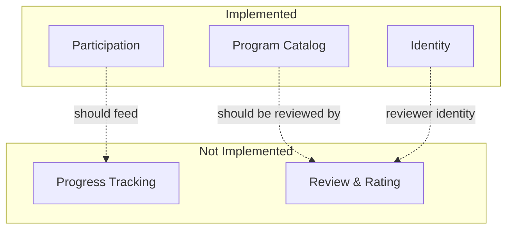
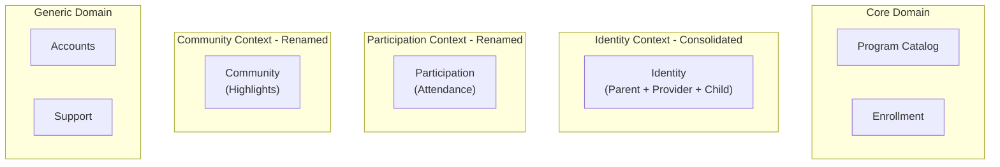

# Context Maps for Klass Hero Application

This document contains context maps for the Klass Hero bounded contexts, showing high-level domain relationships and interactions.

**Scope**: Maps show both **current state (as-is)** and **planned state (to-be)** with clear visual distinction:
- **Solid lines/boxes**: Currently implemented
- **Dashed lines/boxes**: Planned but not implemented

---

## 1. Strategic Context Map

This map shows all bounded contexts and their relationships at a strategic level.

**Legend:**
- **Solid arrows**: Implemented relationships
- **Dashed arrows**: Planned but not implemented
- **Core Domain**: Essential business differentiators
- **Supporting Domain**: Supports core but not differentiating
- **Generic Domain**: Commodity functionality

---

## 2. Identity & Profile Context Map

Shows how user identity flows through the consolidated Identity context.

**Relationship Types:**
- **Accounts -> Identity**: Conformist (Identity conforms to Accounts identity)
- **Consolidated**: Parent profiles, provider profiles, and child management unified in single context

---

## 3. Program Lifecycle Context Map

Shows the journey from program discovery to participation.

**Relationship Types:**
- **Program Catalog -> Enrollment**: Supplier (upstream)
- **Identity -> Enrollment**: Supplier (upstream)
- **Identity -> Participation**: Anti-Corruption Layer (ChildNameResolver adapter)

---

## 4. Participation Context Detail Map

Shows the internal structure and cross-context dependencies.

**Pattern**: Anti-Corruption Layer (ACL) protects Participation from Identity context changes.

---

## 5. Social Features Context Map

Shows the Community context and its relationships.

**Status**: In-memory only, no database persistence.

---

## 6. Identified Gaps

### Missing Contexts (Documented but Not Implemented)

### Implementation Status

| Context | Status | Notes |
|---------|--------|-------|
| Accounts | Complete | Standard Phoenix auth |
| Program Catalog | Complete | Full DDD implementation |
| Identity | Complete | Consolidated Parenting + Providing + Family |
| Participation | Complete | Renamed from Attendance, full DDD with ACL |
| Enrollment | Skeleton | Only fee calculation |
| Community | Partial | Renamed from Highlights, in-memory only |
| Support | Basic | Contact form only |
| Progress Tracking | Not Started | Documented only |
| Review & Rating | Not Started | Documented only |

---

## 7. Context Relationship Summary

| Upstream | Downstream | Relationship Type | Status |
|----------|------------|-------------------|--------|
| Accounts | Identity | Conformist | Implemented |
| Program Catalog | Enrollment | Supplier | Partial |
| Identity | Enrollment | Supplier | Partial |
| Identity | Participation | ACL | Implemented |
| Participation | Progress Tracking | Supplier | Not Started |
| Program Catalog | Review & Rating | Supplier | Not Started |
| Identity | Review & Rating | Supplier | Not Started |
| Identity | Community | Supplier | Implemented |

---

## 8. Consolidation Status

### Previous State: 9 Implemented Contexts

The application previously had 9 bounded contexts (Accounts, Parenting, Providing, Family, Attendance, Highlights, Program Catalog, Enrollment, Support), with 2 additional contexts planned but never implemented (Progress Tracking, Review & Rating).

### Current State: 7 Contexts ✅

**Consolidation Achievements:**
1. **Identity Context**: Successfully merged Parenting + Providing + Family contexts - all manage user profiles and identity
2. **Participation Context**: Renamed from Attendance for better semantic clarity
3. **Community Context**: Renamed from Highlights for clearer domain purpose

**Future Opportunities:**
- **Participation + Progress**: When Progress Tracking is implemented, consider merging with Participation
- **Community + Reviews**: When Review & Rating is implemented, consider merging with Community

---

## Open Questions

1. **Progress Tracking**: Planned, would depend on Participation data - consider merging with Participation when implemented
2. **Review & Rating**: Planned, would depend on Program Catalog and Identity - consider merging with Community when implemented
3. **Enrollment Completion**: Currently skeletal (fee calculation only) - needs full implementation

---

## References

- `docs/domain-stories.md` - Business domain understanding
- `lib/klass_hero/` - Implementation of bounded contexts
