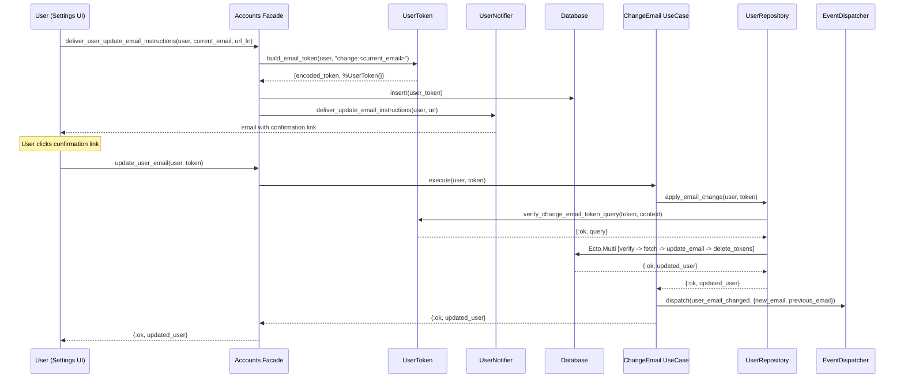
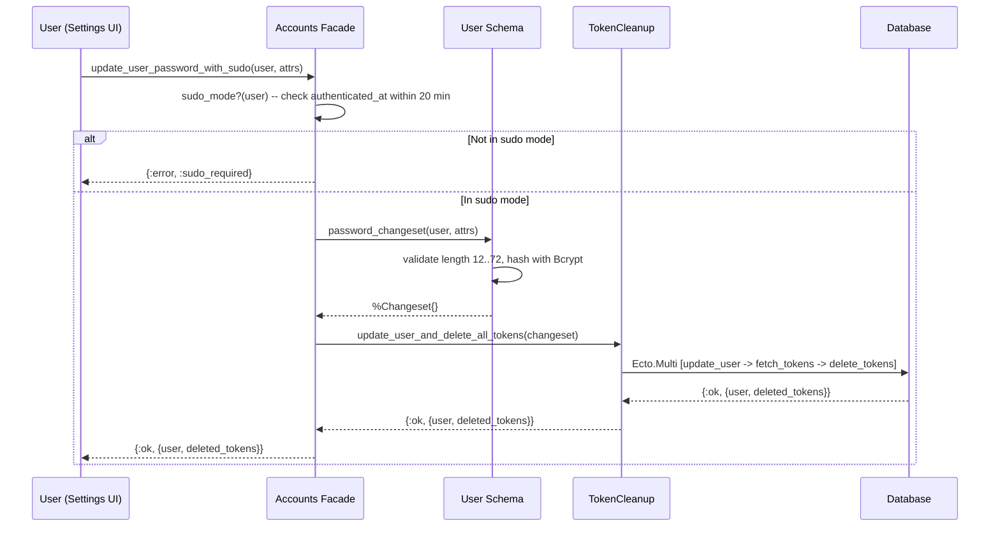

# Feature: Email and Password Management

> **Context:** Accounts | **Status:** Active
> **Last verified:** 17f796f3

## Purpose

Allows authenticated users to change their email address (with a two-step confirmation flow) and set or update their password from the settings page.

## What It Does

- **Change email** -- generates a confirmation token, sends an email to the *new* address, and applies the change only after the user clicks the confirmation link
- **Set / change password** -- validates and hashes a new password, then atomically invalidates all existing sessions (forces re-login on every device)
- **Sudo-gated password change** -- requires the user to have authenticated within the last 20 minutes before allowing a password update
- **Domain event emission** -- publishes a `user_email_changed` event (with `previous_email` for audit) after a successful email change

## What It Does NOT Do

| Out of Scope | Handled By |
|---|---|
| User registration and initial account creation | Accounts / `RegisterUser` use case |
| Magic-link login and email confirmation on first login | Accounts / `LoginByMagicLink` use case |
| Session token lifecycle (create, verify, delete) | Accounts facade (`generate_user_session_token`, `get_user_by_session_token`) |
| Account deletion / GDPR anonymization | Accounts / `AnonymizeUser` use case |

## Business Rules

```
GIVEN  an authenticated user requests an email change to a new address
WHEN   the new email passes format/length/uniqueness validation
THEN   a hashed "change:<current_email>" token is stored in the database
  AND  a confirmation email is sent to the NEW email address
  AND  the user's email is NOT yet changed
```

```
GIVEN  a user clicks the email-change confirmation link
WHEN   the token is valid, unexpired, and matches the context "change:<current_email>"
THEN   the user's email is atomically updated to the new address
  AND  all "change:" tokens for this user/context are deleted
  AND  a "user_email_changed" domain event is dispatched
```

```
GIVEN  an email-change confirmation token
WHEN   more than 7 days have passed since token creation
THEN   the token is considered expired and the change is rejected with :invalid_token
```

```
GIVEN  a user requests an email change to an address already in use
WHEN   the changeset is validated
THEN   a uniqueness error is returned (enforced at both Ecto and database level)
```

```
GIVEN  a user submits a new email identical to their current email
WHEN   the changeset is validated
THEN   an "email did not change" error is returned
```

```
GIVEN  an authenticated user in sudo mode submits a new password
WHEN   the password is between 12 and 72 characters
THEN   the password is hashed with Bcrypt and stored
  AND  all existing session tokens are deleted (logged out everywhere)
  AND  the deleted tokens are returned to the caller for session invalidation
```

```
GIVEN  an authenticated user NOT in sudo mode attempts to change their password
WHEN   the update_user_password_with_sudo function is called
THEN   {:error, :sudo_required} is returned and no change is made
```

```
GIVEN  a user submits a password shorter than 12 characters or longer than 72 characters
WHEN   the changeset is validated
THEN   a length validation error is returned
```

## How It Works

### Email Change Flow



### Password Change Flow



## Dependencies

| Direction | Context | What |
|---|---|---|
| Internal | Shared | `EventDispatchHelper` for publishing domain events |
| Internal | Shared | `RepositoryHelpers` for read query patterns |
| Provides to | Any subscriber | `user_email_changed` domain event with `previous_email` and `new_email` payload |

## Edge Cases

- **Email already taken** -- `unsafe_validate_unique` + `unique_constraint` on the Ecto changeset returns a validation error; the database unique index acts as a final safeguard
- **Expired confirmation token** -- tokens older than 7 days are excluded by the `verify_change_email_token_query` WHERE clause; the Multi returns `{:error, :invalid_token}`
- **Malformed token (bad base64)** -- `Base.url_decode64` returns `:error`, normalized to `{:error, :invalid_token}` in the repository
- **Password too short / too long** -- changeset validates `min: 12, max: 72`; a secondary `max: 72, count: :bytes` check runs before hashing to prevent Bcrypt DoS
- **Password confirmation mismatch** -- `validate_confirmation(:password)` rejects mismatched password/password_confirmation pairs
- **Concurrent token deletion** -- `Ecto.StaleEntryError` is rescued and treated as success since the token is already gone
- **Sudo mode expired** -- `update_user_password_with_sudo` returns `{:error, :sudo_required}` if `authenticated_at` is older than 20 minutes
- **No password set (passwordless user)** -- password is optional; users who registered via magic link may have `hashed_password: nil` and can set a password for the first time through the same flow

## Roles & Permissions

| Role | Can Do | Cannot Do |
|---|---|---|
| Authenticated user | Change own email, set/change own password | Change another user's email or password |
| Unauthenticated visitor | -- | Access any email/password management features |
| Admin | [NEEDS INPUT] | [NEEDS INPUT] |

---

*Generated from code. Sections marked `[NEEDS INPUT]` require manual review.*
