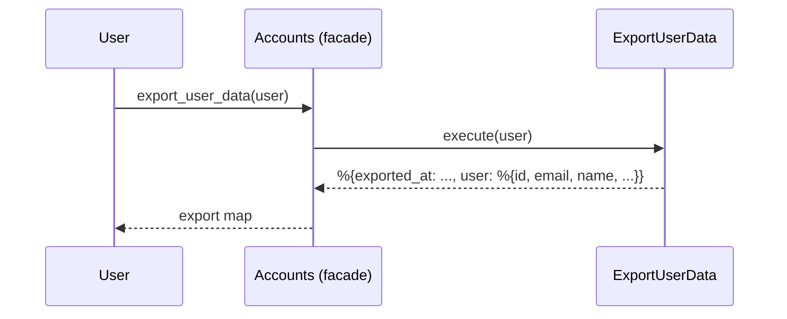
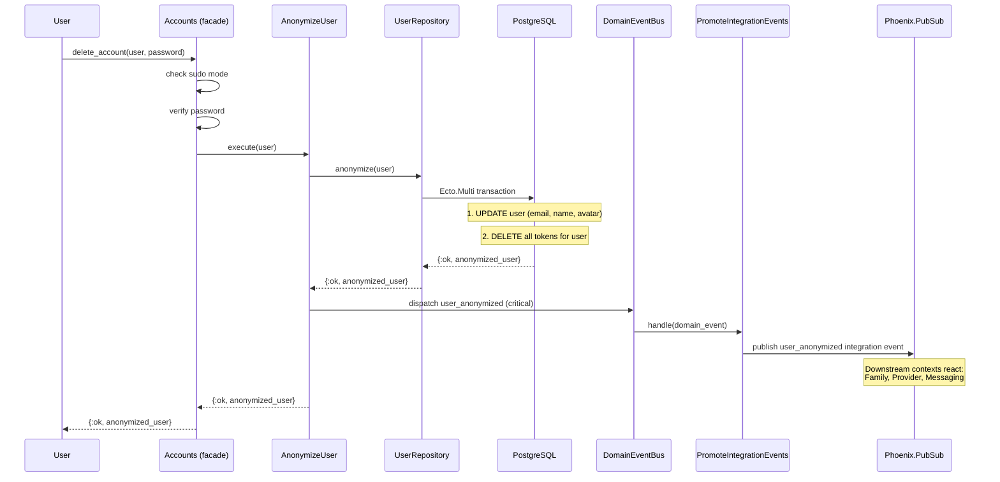

# Feature: GDPR Compliance

> **Context:** Accounts | **Status:** Active
> **Last verified:** 17f796f3

## Purpose

Allows authenticated users to exercise their GDPR rights: exporting all personal data held in the Accounts context, and requesting account anonymization (right to erasure). Anonymization replaces PII with placeholders and cascades to downstream contexts via integration events.

## What It Does

- **Data export** — serializes all user PII (id, email, name, avatar, timestamps) into a JSON-ready map with an `exported_at` timestamp
- **Account anonymization** — atomically replaces email with `deleted_<id>@anonymized.local`, name with `"Deleted User"`, clears avatar, and deletes all session/email tokens
- **Cascade notification** — publishes a critical `user_anonymized` integration event so downstream contexts can anonymize their own data
- **Account deletion facade** — `delete_account/2` wraps anonymization with sudo-mode and password verification guards

## What It Does NOT Do

| Out of Scope | Handled By |
|---|---|
| Anonymizing family data (parent profiles, children, consents) | Family context (reacts to `user_anonymized` integration event) |
| Anonymizing provider data (provider profiles, staff, documents) | Provider context (reacts to `user_anonymized` integration event) |
| Anonymizing messages and conversations | Messaging context (reacts to `user_anonymized` integration event) |
| Exporting data from other contexts (family, provider, enrollment) | Each context owns its own GDPR export [NEEDS INPUT] |
| Hard-deleting the user row from the database | By design — soft anonymization preserves referential integrity |

## Business Rules

```
GIVEN an authenticated user
WHEN  they request a data export
THEN  a map is returned containing all their PII (id, email, name, avatar, confirmed_at, created_at, updated_at) with an exported_at timestamp
```

```
GIVEN an authenticated user in sudo mode who provides a valid password
WHEN  they request account deletion
THEN  email is replaced with deleted_<id>@anonymized.local
  AND name is replaced with "Deleted User"
  AND avatar is set to nil
  AND all session and email tokens are deleted (logged out everywhere)
  AND a critical user_anonymized domain event is published
  AND a critical user_anonymized integration event is published via PubSub
```

```
GIVEN an authenticated user NOT in sudo mode
WHEN  they request account deletion
THEN  the request is rejected with :sudo_required
```

```
GIVEN an authenticated user in sudo mode who provides an invalid password
WHEN  they request account deletion
THEN  the request is rejected with :invalid_password
```

```
GIVEN a user_anonymized integration event is published
WHEN  downstream contexts (Family, Provider, Messaging) receive it
THEN  each context anonymizes its own data for that user_id independently
```

## How It Works

### Data Export



### Account Anonymization (via delete_account/2)



## Dependencies

| Direction | Context | What |
|---|---|---|
| Provides to | Family | `user_anonymized` integration event (triggers family data anonymization) |
| Provides to | Provider | `user_anonymized` integration event (triggers provider data anonymization) |
| Provides to | Messaging | `user_anonymized` integration event (triggers message data anonymization) |
| Internal | Shared | `EventDispatchHelper`, `DomainEventBus`, `IntegrationEventPublishing` for event infrastructure |

## Edge Cases

- **Nil user passed to anonymize** — `AnonymizeUser.execute(nil)` returns `{:error, :user_not_found}` immediately; facade `anonymize_user(nil)` also short-circuits
- **Already-anonymized user** — the anonymize changeset will succeed idempotently (email already matches `deleted_<id>@anonymized.local`, name is already `"Deleted User"`); no tokens exist to delete; `user_anonymized` event is still published [NEEDS INPUT: should re-anonymization be a no-op or publish again?]
- **Event handler failure** — `user_anonymized` is marked `:critical`, so `EventDispatchHelper.dispatch/2` uses `dispatch_critical` which returns per-handler results; the primary anonymization still succeeds even if the integration event publish fails, but the failure is logged at error level
- **Database transaction failure** — if the Ecto.Multi transaction fails (e.g., constraint violation), the entire operation is rolled back and `{:error, changeset}` is returned; no event is published
- **Password hash not cleared** — the `anonymize_changeset` replaces email, name, and avatar but does not clear `hashed_password` [NEEDS INPUT: is this intentional? The anonymized user cannot log in (email is changed), but the hash remains in the database]

## Roles & Permissions

| Role | Can Do | Cannot Do |
|---|---|---|
| Authenticated user (any role) | Export their own data; delete their own account (requires sudo mode + password) | Export or delete another user's account |
| Admin | [NEEDS INPUT: can admins trigger anonymization on behalf of a user?] | — |
| Unauthenticated | Nothing | Any GDPR operation |

## Key Files

| File | Responsibility |
|---|---|
| `lib/klass_hero/accounts.ex` | Public facade: `export_user_data/1`, `anonymize_user/1`, `delete_account/2` |
| `lib/klass_hero/accounts/application/use_cases/export_user_data.ex` | Serializes user PII into export map |
| `lib/klass_hero/accounts/application/use_cases/anonymize_user.ex` | Orchestrates anonymization + event dispatch |
| `lib/klass_hero/accounts/domain/models/user.ex` | Owns `anonymized_attrs/0` — single source of truth for anonymization values |
| `lib/klass_hero/accounts/domain/events/user_events.ex` | Factory for `user_anonymized` domain event (critical) |
| `lib/klass_hero/accounts/domain/events/accounts_integration_events.ex` | Factory for `user_anonymized` integration event (critical) |
| `lib/klass_hero/accounts/domain/ports/for_storing_users.ex` | Port defining `anonymize/1` contract |
| `lib/klass_hero/accounts/adapters/driven/persistence/repositories/user_repository.ex` | Ecto.Multi transaction: update user + delete all tokens |
| `lib/klass_hero/accounts/adapters/driven/events/event_handlers/promote_integration_events.ex` | Promotes domain event to integration event via PubSub |
| `lib/klass_hero/accounts/adapters/driven/persistence/schemas/user.ex` | `anonymize_changeset/1` — delegates field values to domain model |

---

*Generated from code. Sections marked `[NEEDS INPUT]` require manual review.*
