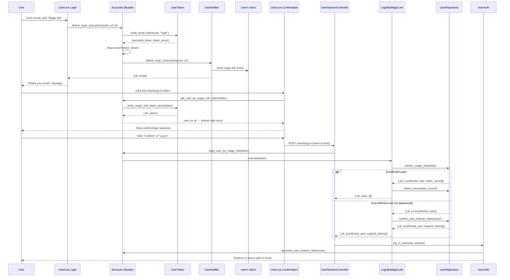

# Feature: Magic Link Login

> **Context:** Accounts | **Status:** Active
> **Last verified:** 17f796f3

## Purpose

Allows users to log in without a password by receiving a one-time link via email. This is the primary authentication method -- users who register without a password are confirmed and logged in through their first magic link click.

## What It Does

- Generates a cryptographically secure, URL-safe token tied to a user's email and stores a SHA-256 hash in the database
- Delivers an email containing the magic link (or a confirmation email for unconfirmed users)
- Verifies the token on click: decodes, hashes, and matches against the stored hash within the validity window
- Creates a session (with optional remember-me cookie) upon successful verification
- Auto-confirms unconfirmed users on first magic link login, expiring all existing tokens
- Generates a magic link token without sending an email (used by the invite claim flow)
- Dispatches a `user_confirmed` domain event when an unconfirmed user is confirmed via magic link

## What It Does NOT Do

| Out of Scope | Handled By |
|---|---|
| Password-based login | `UserSessionController` email+password path / `Accounts.get_user_by_email_and_password/2` |
| User registration | `RegisterUser` use case / `UserLive.Registration` |
| Password management (set, change, reset) | `Accounts.update_user_password/2` / `UserLive.Settings` |
| Role assignment after login | Router-level `live_session` guards (`:require_provider`, `:require_parent`) |

## Business Rules

```
GIVEN a registered user requests a magic link
WHEN  they submit their email on the login page
THEN  a hashed token with context "login" is persisted
  AND an email with the magic link URL is delivered
  AND the same success message is shown regardless of whether the email exists (prevents enumeration)
```

```
GIVEN a confirmed user clicks a valid magic link
WHEN  the token is unexpired (within 15 minutes) and matches the user's current email
THEN  the user is logged in with a new session token
  AND the specific magic link token is deleted
  AND a "Welcome back!" flash message is shown
```

```
GIVEN an unconfirmed user (no password) clicks a valid magic link
WHEN  the token is unexpired (within 15 minutes)
THEN  the user's email is confirmed (confirmed_at is set)
  AND ALL existing tokens for that user are deleted
  AND a user_confirmed domain event is dispatched with confirmation_method: :magic_link
  AND the user is logged in with a new session token
  AND a "User confirmed successfully." flash message is shown
```

```
GIVEN a user clicks the magic link
WHEN  the user chooses "Keep me logged in on this device" (remember_me)
THEN  a signed remember-me cookie is set with a 14-day max age
  AND session tokens expire after 14 days
```

```
GIVEN a magic link token
WHEN  more than 15 minutes have passed since token creation
THEN  the token is considered expired and the query returns no result
  AND the user sees "Magic link is invalid or it has expired."
```

```
GIVEN an unconfirmed user with a password set
WHEN  they attempt to use a magic link
THEN  a :security_violation error is returned
  AND the user is NOT logged in (prevents session fixation attacks)
```

## How It Works



## Dependencies

| Direction | Context | What |
|---|---|---|
| Internal | Shared | `EventDispatchHelper` for dispatching `user_confirmed` domain events |
| Provides to | Family | `user_confirmed` event (triggers downstream profile setup) |
| Provides to | Provider | `user_confirmed` event (triggers downstream profile setup) |

## Edge Cases

- **Expired token (>15 min)**: The `verify_magic_link_token_query` WHERE clause excludes tokens older than 15 minutes. The Confirmation LiveView shows "Magic link is invalid or it has expired." and redirects to login.
- **Already-used token**: After login, the token is deleted (single token for confirmed users) or all tokens are deleted (unconfirmed users). Re-clicking the link returns no query result, treated as expired.
- **Malformed token (bad base64)**: `Base.url_decode64` returns `:error`, which is normalized to `{:error, :invalid_token}`. The session controller catches this and shows "The link is invalid or it has expired."
- **User not found / token not in DB**: `Repo.one(query)` returns `nil`, which resolves to `{:error, :not_found}`. Handled identically to expired tokens.
- **Unconfirmed user with password set**: Returns `{:error, :security_violation}`. This prevents session fixation attacks where an attacker registers with someone's email + a password, then the real owner clicks the magic link and unknowingly logs into the attacker-controlled account. The session controller treats this as an invalid link.
- **Concurrent token deletion**: If the token is deleted between verification and login (race condition), `Repo.delete` raises `Ecto.StaleEntryError`, which is rescued and treated as success.
- **Non-existent email submitted**: The login page shows the same "check your email" message regardless of whether the email exists, preventing user enumeration.
- **Invite claim flow**: `generate_magic_link_token/1` creates a token without sending email, allowing the invite controller to build the redirect URL directly.

## Roles & Permissions

| Role | Can Do | Cannot Do |
|---|---|---|
| Any registered user | Request a magic link, log in via magic link, get auto-confirmed on first login | N/A |
| Unauthenticated visitor | Request a magic link (email may or may not exist) | Access protected routes without completing login |
| Admin | Same as any registered user | N/A (no admin-specific magic link behavior) |

---

*Generated from code. Sections marked `[NEEDS INPUT]` require manual review.*
