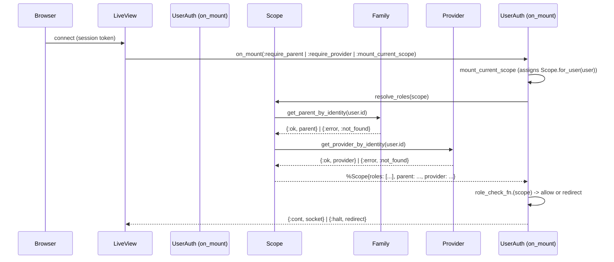

# Feature: Role Resolution

> **Context:** Accounts | **Status:** Active
> **Last verified:** 17f796f3

## Purpose

Determines what roles a user holds (parent, provider, or both) by checking whether matching profiles exist in the Family and Provider contexts, then exposes those roles via `@current_scope` in every LiveView and controller.

## What It Does

- Builds a `Scope` struct from the authenticated user (`Scope.for_user/1`)
- Resolves roles at LiveView mount time by querying Family and Provider for profile existence (`Scope.resolve_roles/1`)
- Attaches the resolved parent/provider profiles directly onto the scope for downstream access
- Provides query helpers: `has_role?/2`, `parent?/1`, `provider?/1`, `staff_provider?/1`, `parent_tier/1`, `provider_tier/1`
- Powers the `on_mount` hooks (`:require_parent`, `:require_provider`, `:redirect_provider_or_staff_from_parent_routes`) that gate access to role-specific routes

## What It Does NOT Do

| Out of Scope | Handled By |
|---|---|
| Authentication (magic-link / password verification) | Accounts: Magic-Link Login, Email & Password Management |
| Permission enforcement within a role | Future feature (permission structure defined in `UserRole` but not enforced) |
| Profile creation or onboarding | Family context (`create_parent_profile`), Provider context (`create_provider_profile`) |
| Storing resolved roles in the database | Roles are resolved at mount time, not persisted |

## Business Rules

```
GIVEN a user with an existing parent profile in the Family context
WHEN  their scope is resolved at LiveView mount
THEN  the scope contains :parent in its roles list and the parent profile struct
```

```
GIVEN a user with an existing provider profile in the Provider context
WHEN  their scope is resolved at LiveView mount
THEN  the scope contains :provider in its roles list and the provider profile struct
```

```
GIVEN a user with both a parent and provider profile
WHEN  their scope is resolved
THEN  the scope contains both :parent and :provider roles with both profile structs
```

```
GIVEN a user with no parent or provider profile
WHEN  their scope is resolved
THEN  the scope has an empty roles list and nil parent/provider fields
```

```
GIVEN a user whose intended_roles at registration included :parent
WHEN  the user has not yet created a parent profile
THEN  resolve_roles returns no :parent role (intended_roles are aspirational, not authoritative)
```

```
GIVEN a nil user (unauthenticated request)
WHEN  Scope.for_user(nil) is called
THEN  the scope is nil and resolve_roles is never invoked
```

## How It Works



### Step-by-step

1. **Plug pipeline** (`fetch_current_scope_for_user`): Reads session token, loads user from DB, calls `Scope.for_user(user)` to create a bare scope (no roles yet). Assigns `@current_scope`.
2. **LiveView mount** (`on_mount` hooks): Calls `Scope.resolve_roles/1` which queries Family and Provider contexts by `user.id`.
3. **Profile extraction**: Each context call returns `{:ok, profile}` or `{:error, :not_found}`. The private `extract_profile/1` normalizes these to a struct or `nil`.
4. **Role accumulation**: `maybe_add_role/3` prepends `:parent` or `:provider` to the roles list when the corresponding profile is non-nil.
5. **Scope update**: The scope struct is updated with `roles`, `parent`, and `provider` fields, then reassigned to the socket.
6. **Gate check**: The `on_mount` hook applies a role-check function (`Scope.parent?/1` or `Scope.provider?/1`). On failure, the socket is redirected with a flash error.

### Key design decision

Roles are resolved on every LiveView mount rather than cached in the session. This means profile changes (e.g., completing provider onboarding) take effect immediately without requiring re-login, at the cost of two DB queries per mount.

## Dependencies

| Direction | Context | What |
|---|---|---|
| Requires | Family | `get_parent_by_identity/1` -- checks for parent profile existence |
| Requires | Provider | `get_provider_by_identity/1` -- checks for provider profile existence |
| Provides to | All LiveViews | `@current_scope` with resolved roles, parent/provider profiles, and subscription tiers |
| Provides to | Enrollment | Scope's `parent` field used to validate booking eligibility |
| Provides to | Router (on_mount hooks) | `:require_parent`, `:require_provider`, `:redirect_provider_or_staff_from_parent_routes` |

## Edge Cases

- **User with no profiles**: `resolve_roles` returns `%Scope{roles: [], parent: nil, provider: nil}`. Routes guarded by `:require_parent` or `:require_provider` redirect to home with an error flash.
- **Context call returns `{:error, _}`**: `extract_profile/1` maps any error tuple to `nil`, so the role is simply absent. No crash, no retry. This covers both `:not_found` and unexpected errors.
- **Both roles active**: The user holds both `:parent` and `:provider`. Routes guarded by either role succeed. The `:redirect_provider_or_staff_from_parent_routes` hook redirects non-parent users away from parent-only routes to their role's dashboard (staff → `/staff/dashboard`, provider → `/provider/dashboard`).
- **Nil user (unauthenticated)**: `Scope.for_user(nil)` returns `nil`. `resolve_roles` is never called. Hooks that require authentication redirect to login.
- **`intended_roles` vs resolved roles**: `intended_roles` (set at registration) are stored on the user schema but are **not** used by `resolve_roles`. They serve as a signal for onboarding flows, not as authorization input.

## Roles & Permissions

| Role | Can Do | Cannot Do |
|---|---|---|
| System-internal | This feature is consumed by the auth pipeline, not directly by end users | N/A |

Role Resolution is infrastructure: it populates `@current_scope` so that downstream LiveViews and controllers can make role-based decisions. It does not itself enforce any business-level permissions.

### on_mount hooks summary

| Hook | Resolves roles? | Gate |
|---|---|---|
| `:mount_current_scope` | No | None (just mounts bare scope) |
| `:require_authenticated` | No | User must be non-nil |
| `:require_parent` | Yes | `Scope.parent?/1` must be true |
| `:require_provider` | Yes | `Scope.provider?/1` must be true |
| `:redirect_provider_or_staff_from_parent_routes` | Yes | Redirects providers and staff to their role's dashboard |
| `:require_admin` | No | `user.is_admin` must be true |

---

*Generated from code. Sections marked `[NEEDS INPUT]` require manual review.*
