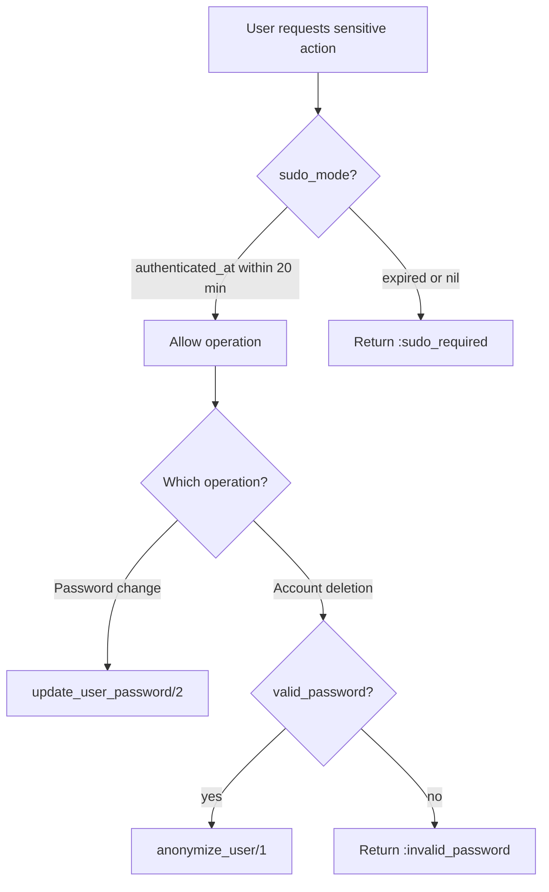

# Feature: Sudo Mode and Locale

> **Context:** Accounts | **Status:** Active
> **Last verified:** 17f796f3

## Purpose

Provides a time-limited security window (sudo mode) that gates sensitive account operations, and allows users to store a language preference so the UI renders in their chosen locale.

## What It Does

- Grants a 20-minute sudo mode window after authentication, during which password changes and account deletion are permitted
- Exposes a configurable `sudo_mode?/2` check (default 20 minutes, overridable)
- Stores a per-user locale preference (`en` or `de`) on the user record
- Validates locale changes against the supported locale list before persisting

## What It Does NOT Do

| Out of Scope | Handled By |
|---|---|
| User authentication (login, magic links, sessions) | Accounts context -- auth features |
| Full user settings management (email change, password hashing) | Accounts context -- settings features |
| Gettext locale switching at request level | `KlassHeroWeb` plugs / LiveView hooks |
| Role or permission enforcement | `Accounts.Scope` role resolution |

## Business Rules

```
GIVEN an authenticated user whose last authentication was within 20 minutes
WHEN  the system checks sudo_mode?/1
THEN  the check returns true, allowing sensitive operations
```

```
GIVEN an authenticated user whose last authentication was more than 20 minutes ago
WHEN  the system checks sudo_mode?/1
THEN  the check returns false, blocking sensitive operations
```

```
GIVEN a user not in sudo mode
WHEN  they attempt to change their password via update_user_password_with_sudo/2
THEN  the operation returns {:error, :sudo_required}
```

```
GIVEN a user not in sudo mode
WHEN  they attempt to delete their account via delete_account/2
THEN  the operation returns {:error, :sudo_required}
```

```
GIVEN an authenticated user
WHEN  they update their locale to a supported value ("en" or "de")
THEN  the locale is persisted on their user record
```

```
GIVEN an authenticated user
WHEN  they attempt to set an unsupported locale value
THEN  the changeset returns a validation error
```

## How It Works



```mermaid
flowchart TD
    A[User submits locale change] --> B[locale_changeset/2]
    B --> C{locale in ~w\(en de\)?}
    C -->|yes| D[Repo.update]
    C -->|no| E[Changeset error: invalid locale]
    D --> F[Return {:ok, user}]
```

## Dependencies

| Direction | Context | What |
|---|---|---|
| Internal | Accounts (User schema) | `authenticated_at` virtual field populated at session load |
| Internal | Accounts (User schema) | `locale` persisted field with default `"en"` |
| Consumed by | KlassHeroWeb | Sudo mode check before rendering sensitive settings forms |
| Consumed by | KlassHeroWeb | Locale value for Gettext locale switching |

## Edge Cases

- **`authenticated_at` is nil**: `sudo_mode?/2` returns `false` -- no window is open when authentication timestamp is missing
- **Unsupported locale string**: `locale_changeset/2` rejects it via `validate_inclusion/3`; the update returns `{:error, changeset}`
- **Locale field missing from attrs**: `validate_required([:locale])` in `locale_changeset/2` ensures the field cannot be blanked out
- **Sudo mode boundary (exactly 20 minutes)**: uses `DateTime.after?/2` against `utc_now + (-20 minutes)`, so the check is exclusive at the boundary
- **Custom sudo duration**: callers can pass a different minute value to `sudo_mode?/2` to tighten or relax the window

## Roles & Permissions

| Role | Can Do | Cannot Do |
|---|---|---|
| Authenticated user | Check own sudo status, change own locale, change password (if in sudo), delete account (if in sudo + valid password) | Modify another user's locale or bypass sudo |
| Unauthenticated visitor | Nothing | Any sudo or locale operation |
| Admin | [NEEDS INPUT] | [NEEDS INPUT] |

---

*Generated from code. Sections marked `[NEEDS INPUT]` require manual review.*
