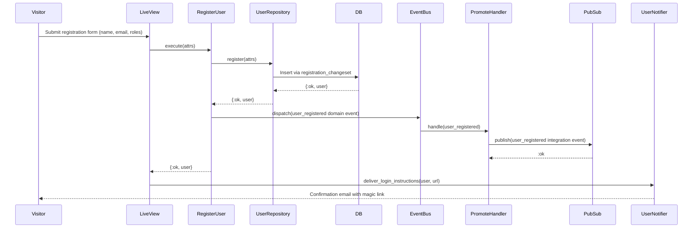

# Feature: User Registration

> **Context:** Accounts | **Status:** Active
> **Last verified:** 17f796f3

## Purpose

Allows new users to create an account on the platform by providing their name, email, and intended roles, then triggers downstream profile creation via domain events so they can start using Klass Hero as a parent, provider, or both.

## What It Does

- Accepts name, email, and intended roles (parent, provider, or both) to create a new user record
- Defaults to the `:parent` role when no role is explicitly selected
- Validates input: name length (2-100 chars), email format and uniqueness, at least one valid role
- Persists the user via `ForStoringUsers.register/1` port (no password at registration)
- Dispatches a `:user_registered` domain event (marked critical) with email, name, and intended roles
- Promotes the domain event to a `:user_registered` integration event via PubSub for cross-context listeners
- Sends a confirmation email with a magic link for email verification (delivered via `UserNotifier`)

## What It Does NOT Do

| Out of Scope | Handled By |
|---|---|
| Logging in / authenticating | Magic-link login flow (Accounts - login use case) |
| Creating parent profiles | Family context (reacts to `user_registered` integration event) |
| Creating provider profiles | Provider context (reacts to `user_registered` integration event) |
| Password management | Separate password changeset flow (not used during registration) |
| Email confirmation | Magic-link login flow confirms on first click |

## Business Rules

```
GIVEN a visitor is on the registration page
WHEN  they submit a valid name, email, and at least one role
THEN  a new unconfirmed user record is created
  AND a confirmation email with a magic link is sent
  AND a critical user_registered domain event is dispatched
  AND an integration event is published for downstream contexts
```

```
GIVEN a visitor submits the registration form without selecting a role
WHEN  the intended_roles field is nil or empty
THEN  the system defaults to [:parent]
```

```
GIVEN a visitor submits the registration form
WHEN  the email is already registered
THEN  the registration fails with a uniqueness error on the email field
```

```
GIVEN a visitor submits the registration form
WHEN  the name is shorter than 2 characters or longer than 100 characters
THEN  the registration fails with a length validation error on the name field
```

```
GIVEN a visitor submits the registration form
WHEN  they select an invalid role (not :parent or :provider)
THEN  the registration fails with a subset validation error on intended_roles
```

```
GIVEN a visitor registers with the provider role
WHEN  they also provide a provider_subscription_tier
THEN  the tier must be one of the valid provider subscription tiers
  AND the tier is included in the user_registered event payload
```

```
GIVEN a user has been successfully registered
WHEN  the user_registered domain event is dispatched
THEN  it is promoted to an integration event on the Accounts PubSub topic
  AND downstream contexts (Family, Provider) create the appropriate profiles
```

## How It Works



## Dependencies

| Direction | Context | What |
|---|---|---|
| Provides to | Family | `user_registered` integration event triggers parent profile creation |
| Provides to | Provider | `user_registered` integration event triggers provider profile creation |
| Uses | Shared | `EventDispatchHelper` for domain event dispatch, `IntegrationEventPublishing` for PubSub |
| Uses | Shared | `SubscriptionTiers` for provider tier validation |

## Edge Cases

- **Duplicate email:** `registration_changeset` applies both `unsafe_validate_unique` (fast UI feedback) and `unique_constraint` (DB-level guarantee); returns changeset error
- **Missing roles / empty list:** `put_default_role/1` automatically sets `[:parent]` when roles are nil or empty, so the at-least-one-role validation always passes for default cases
- **Invalid role atoms:** `validate_subset` against `UserRole.valid_roles()` (`:parent`, `:provider`) rejects unknown roles
- **Invalid email format:** Regex validation requires `@` sign, no spaces, max 160 characters
- **Event dispatch failure:** `user_registered` is marked `:critical`; `PromoteIntegrationEvents` propagates publish failures so the caller is aware
- **Invalid provider subscription tier:** Validated against `SubscriptionTiers.provider_tiers()`; rejected if not in the valid list
- **Corrupted persistence data on read:** `UserMapper.to_domain/1` raises if `@enforce_keys` are missing, preventing silent data corruption

## Roles & Permissions

| Role | Can Do | Cannot Do |
|---|---|---|
| Public (unauthenticated) | Register a new account | Access any authenticated routes |
| Parent (after registration) | Log in via magic link, access parent features | Provider features (unless also registered as provider) |
| Provider (after registration) | Log in via magic link, access provider features | Parent features (unless also registered as parent) |

---

*Generated from code. Sections marked `[NEEDS INPUT]` require manual review.*
