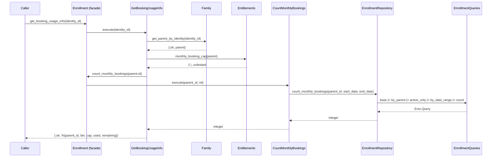

# Feature: Booking Usage Tracking

> **Context:** Enrollment | **Status:** Active
> **Last verified:** 17f796f3

## Purpose

Lets parents see how many program bookings they have used this month versus their subscription cap, so they know whether they can enroll in another program before attempting to book.

## What It Does

- Counts a parent's active enrollments (pending or confirmed) within the current calendar month
- Retrieves the parent's subscription tier and its monthly booking cap from the Entitlements service
- Computes remaining bookings (cap minus used, floored at 0) and returns a structured usage summary
- Accepts an optional `month` parameter for querying historical months

## What It Does NOT Do

| Out of Scope | Handled By |
|---|---|
| Enforcing the booking cap (rejecting over-limit enrollments) | `CreateEnrollment` use case |
| Changing a parent's subscription tier | Family context / billing (not yet implemented) |
| Tracking provider-side capacity per program | `EnrollmentPolicy` / capacity check in `create_with_capacity_check` |

## Business Rules

```
GIVEN a parent on the "explorer" tier
WHEN  their booking usage is retrieved for the current month
THEN  the cap is 2 and remaining = max(0, 2 - used)
```

```
GIVEN a parent on the "active" tier
WHEN  their booking usage is retrieved for the current month
THEN  the cap is :unlimited and remaining is :unlimited regardless of used count
```

```
GIVEN a parent with no enrollments this month
WHEN  their booking usage is retrieved
THEN  used = 0 and remaining equals the full cap (2 for explorer, :unlimited for active)
```

```
GIVEN an enrollment with status "cancelled" or "completed"
WHEN  monthly bookings are counted
THEN  the enrollment is excluded — only "pending" and "confirmed" statuses count
```

```
GIVEN an enrollment created on January 31
WHEN  monthly bookings are counted for February
THEN  the January enrollment is excluded (date range is the 1st to end of the target month, inclusive)
```

## How It Works



### Key implementation details

- **Date range**: `CountMonthlyBookings` derives start/end from `Date.beginning_of_month/1` and `Date.end_of_month/1` using UTC today when no month is supplied.
- **Date filtering**: `EnrollmentQueries.by_date_range/3` converts Date boundaries to UTC DateTimes (00:00:00 to 23:59:59) and filters on `enrolled_at`.
- **Active statuses**: Hardcoded as `~w(pending confirmed)` in both the queries module and the repository.
- **Remaining calculation**: `calculate_remaining(:unlimited, _used) -> :unlimited` and `calculate_remaining(cap, used) -> max(0, cap - used)`.

## Dependencies

| Direction | Context | What |
|---|---|---|
| Requires | Entitlements | `monthly_booking_cap/1` — pure function returning cap for a tier holder |
| Requires | Family | `get_parent_by_identity/1` — resolves identity_id to parent profile |
| Provides to | Web layer | Usage info map consumed by dashboard LiveViews to display booking quota |
| Provides to | CreateEnrollment | `count_monthly_bookings/2` reused during enrollment cap enforcement |

## Edge Cases

- **No parent profile**: `GetBookingUsageInfo` returns `{:error, :no_parent_profile}` when `Family.get_parent_by_identity/1` returns `:not_found`.
- **Zero enrollments this month**: `count_monthly_bookings` returns `0`; remaining equals the full cap.
- **Unlimited tier**: Both `cap` and `remaining` are the atom `:unlimited` — callers must handle this non-integer value.
- **Month boundary**: Enrollments are attributed to the month of their `enrolled_at` timestamp, not their program start date. An enrollment created at 23:59 UTC on Jan 31 counts toward January.
- **Nil subscription tier**: `Entitlements` falls back to `:explorer` when tier is nil (see `get_parent_limit/2`), so a parent with no tier set gets the default 2/month cap.

## Roles & Permissions

| Role | Can Do | Cannot Do |
|---|---|---|
| Parent | View their own booking usage via `get_booking_usage_info` | View another parent's usage |
| Provider | [NEEDS INPUT] | [NEEDS INPUT] |
| Admin | [NEEDS INPUT] | [NEEDS INPUT] |

---

*Generated from code. Sections marked `[NEEDS INPUT]` require manual review.*
