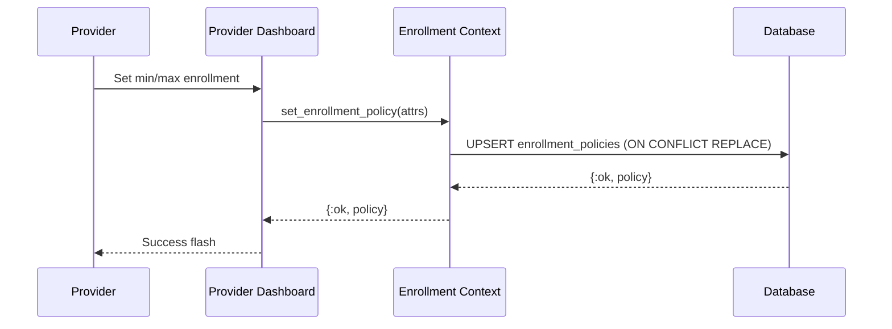
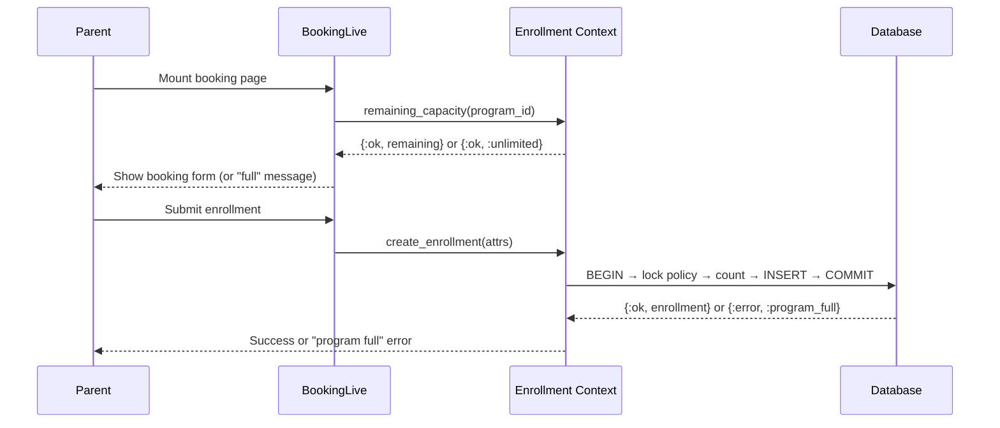

# Feature: Enrollment Capacity

> **Context:** Enrollment | **Status:** Active
> **Last verified:** b46b4b4

## Purpose

Enrollment capacity lets providers set minimum and maximum enrollment limits on their programs. The system enforces these limits when parents book — rejecting enrollments when a program is full and tracking how many spots remain. This prevents overbooking and lets providers define the minimum headcount needed for a program to run.

## What It Does

- **Set capacity per program.** Providers configure min and/or max enrollment via the provider dashboard. Uses upsert — creating or updating in one operation.
- **Enforce max capacity at booking time.** When a parent enrolls, the system atomically checks remaining spots and rejects the enrollment if the program is full.
- **Calculate remaining spots.** Returns how many spots are left for a single program or a batch of programs.
- **Count active enrollments.** Returns the number of pending/confirmed enrollments for a program (single or batch).
- **Check minimum threshold.** Domain model exposes `meets_minimum?/2` to check if a program has reached its minimum headcount.
- **Inline form validation.** Provider dashboard validates capacity fields in real-time before program creation.

## What It Does NOT Do

| Out of Scope | Handled By |
| --- | --- |
| Waitlists when a program is full | Not implemented |
| Notifying providers when min enrollment is reached | Not implemented |
| Auto-cancelling programs that don't meet minimum enrollment | Not implemented |
| Changing capacity after program has started | [NEEDS INPUT] |

## Business Rules

```
GIVEN a provider is creating or editing a program
WHEN  they set enrollment capacity
THEN  at least one of min or max enrollment must be provided
  AND both values must be >= 1 when set
  AND min must not exceed max when both are set
```

```
GIVEN a program has a max enrollment policy
WHEN  a parent tries to enroll their child
THEN  the system locks the policy row (SELECT FOR UPDATE)
  AND counts active enrollments inside the transaction
  AND rejects with :program_full if count >= max
  AND creates the enrollment if capacity remains
```

```
GIVEN a program has no enrollment policy
WHEN  remaining capacity is queried
THEN  the system returns :unlimited (no cap)
```

```
GIVEN a program is deleted
WHEN  the program record is removed
THEN  the enrollment policy is cascade-deleted automatically
```

```
GIVEN a provider sets capacity on a program that already has a policy
WHEN  the policy is saved
THEN  the existing min/max values are replaced (upsert via ON CONFLICT)
```

## How It Works

### Setting Capacity (Provider)



### Enforcing Capacity (Parent Booking)



## Dependencies

| Direction | Context | What |
| --- | --- | --- |
| Provides to | Enrollment (internal) | Capacity check during `create_with_capacity_check` |
| Provides to | Provider Dashboard (Web) | Remaining capacity display, batch capacity queries |
| Provides to | Booking LiveView (Web) | Pre-booking capacity check, `:program_full` error handling |

## Edge Cases

- **No policy exists.** `remaining_capacity/1` returns `{:ok, :unlimited}`. Enrollment proceeds without capacity check.
- **Concurrent enrollments.** `SELECT FOR UPDATE` on the policy row serializes concurrent attempts. Only one transaction proceeds at a time per program, preventing TOCTOU races.
- **Policy save fails during program creation.** Program is still created. Dashboard shows a warning flash: "Program created, but enrollment capacity could not be saved." The program shows "—/—" instead of phantom capacity values.
- **Min exceeds max.** Rejected at both domain model validation and Ecto changeset level, plus a DB check constraint as a safety net.
- **Both fields blank.** Policy creation is skipped entirely — treated as "no capacity constraint."
- **Program deleted.** Policy is cascade-deleted (`on_delete: :delete_all` on the FK).
- **Remaining capacity is 0 or negative.** `remaining_capacity/2` in the domain model floors at 0 via `max(max - count, 0)`. Booking LiveView treats any non-positive value as `:program_full`.

## Roles & Permissions

| Role | Can Do | Cannot Do |
| --- | --- | --- |
| Provider | Set/update enrollment capacity on their programs | [NEEDS INPUT] Can they remove capacity limits once set? |
| Parent | See remaining spots, get blocked when program is full | Set or modify capacity |
| Admin | [NEEDS INPUT] | [NEEDS INPUT] |

---

*Generated from code. Sections marked `[NEEDS INPUT]` require manual review.*
