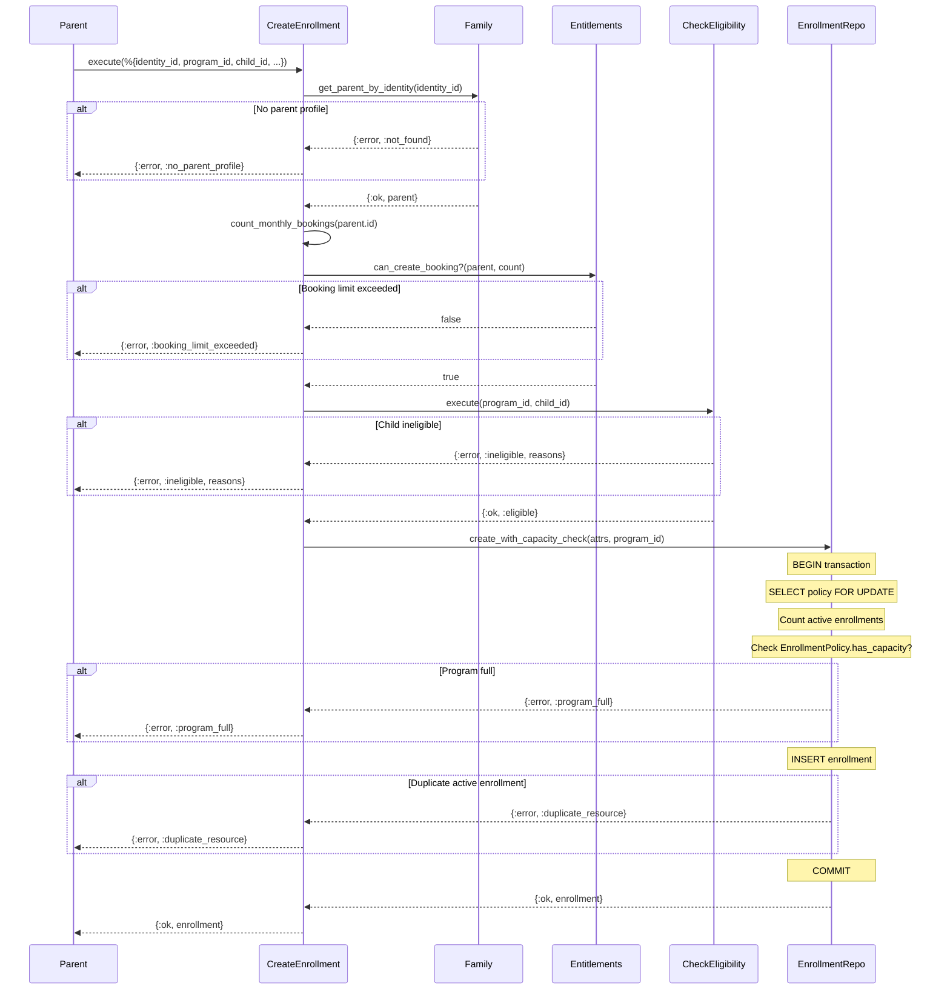

# Feature: Create Enrollment

> **Context:** Enrollment | **Status:** Active
> **Last verified:** 17f796f3

## Purpose

Allows a parent to enroll their child in a program, enforcing subscription-tier booking limits, program capacity, participant eligibility, and duplicate prevention before persisting the enrollment.

## What It Does

- Validates the parent profile exists (via Family context ACL)
- Enforces monthly booking cap based on the parent's subscription tier (via Entitlements)
- Checks participant eligibility against the program's age/gender/grade restrictions
- Performs an atomic capacity check (SELECT FOR UPDATE on enrollment policy row) to prevent race conditions
- Prevents duplicate active enrollments for the same child+program pair (DB partial unique index)
- Creates a `pending` enrollment with fee fields and optional special requirements
- Supports two entry paths: validated (with `identity_id`) and direct (with `parent_id` only, skips entitlement/profile validation)

## What It Does NOT Do

| Out of Scope | Handled By |
|---|---|
| Defining or updating capacity limits (max enrollment) | Enrollment > [Capacity](capacity.md) |
| Defining participant age/gender/grade restrictions | Enrollment > [Participant Restrictions](participant-restrictions.md) |
| Invite-based enrollment (CSV import, claim flow, saga) | Enrollment > [Invite Management](invite-management.md), [Import CSV](import-enrollment-csv.md) |
| Fee calculation or payment processing | [NEEDS INPUT] |
| Enrollment confirmation or completion transitions | Enrollment domain model (`confirm/1`, `complete/1`) — no dedicated use case yet |
| Cancellation by admin | `CancelEnrollmentByAdmin` use case (separate feature) |

## Business Rules

```
GIVEN a parent with identity_id
WHEN  creating an enrollment
THEN  the system resolves the parent profile from the Family context
      and uses the parent profile ID for the enrollment record
```

```
GIVEN a parent on the "explorer" tier with 2 active bookings this month
WHEN  attempting to create a new enrollment
THEN  the system rejects with :booking_limit_exceeded
```

```
GIVEN a parent on the "active" tier
WHEN  attempting to create a new enrollment
THEN  the booking cap check always passes (unlimited bookings)
```

```
GIVEN a child who does not meet the program's participant policy
      (e.g., outside age range, wrong gender, wrong grade)
WHEN  the parent attempts to enroll
THEN  the system rejects with :ineligible and a list of human-readable reasons
```

```
GIVEN a program with no participant policy configured
WHEN  any child is enrolled
THEN  eligibility check passes (no restrictions)
```

```
GIVEN a program at max enrollment capacity
WHEN  a parent attempts to enroll
THEN  the system rejects with :program_full
      (capacity checked atomically via SELECT FOR UPDATE)
```

```
GIVEN a program with no enrollment policy
WHEN  a parent attempts to enroll
THEN  capacity is treated as unlimited (enrollment proceeds)
```

```
GIVEN a child already has an active (pending or confirmed) enrollment in a program
WHEN  the parent attempts to enroll the same child again
THEN  the system rejects with :duplicate_resource
      (enforced by partial unique index: enrollments_program_child_active_index)
```

```
GIVEN all validation passes
WHEN  enrollment is created
THEN  status is set to "pending" and enrolled_at defaults to now
```

## How It Works



## Dependencies

| Direction | Context | What |
|---|---|---|
| Requires | Entitlements | `can_create_booking?/2` — tier-based monthly booking cap check |
| Requires | Family | `get_parent_by_identity/1` — resolves parent profile from identity_id |
| Requires | Family (via ACL port) | `ForResolvingParentInfo` — parent profile ID and identity_id |
| Requires | Enrollment (internal) | `CheckParticipantEligibility` — age/gender/grade restriction validation |
| Requires | Enrollment (internal) | `EnrollmentPolicy` domain model — capacity rule evaluation |
| Requires | Enrollment (internal) | `ForManagingEnrollments` port — persistence + atomic capacity check |
| Provides to | Messaging | `enrolled?/2`, `list_enrolled_identity_ids/1` — enrollment status queries |
| Provides to | Participation | Active enrollment records for session tracking |

## Edge Cases

- **Already enrolled:** Duplicate active enrollment for the same child+program is rejected at the DB level via a partial unique index (`enrollments_program_child_active_index`), returning `{:error, :duplicate_resource}`.
- **Program full:** Capacity is checked inside a transaction with `SELECT FOR UPDATE` on the enrollment policy row, serializing concurrent attempts. Returns `{:error, :program_full}`.
- **Ineligible child:** Participant eligibility check returns `{:error, :ineligible, reasons}` with a list of human-readable strings (e.g., "Child is too young", "Gender does not match").
- **Exceeded booking cap:** Explorer-tier parents are capped at 2 bookings/month. Active-tier parents have unlimited bookings. Returns `{:error, :booking_limit_exceeded}`.
- **Concurrent enrollment race:** Two requests for the same child+program arriving simultaneously are serialized by the `FOR UPDATE` lock on the policy row. If both pass capacity, the unique index on `(program_id, child_id)` for active statuses prevents the second insert.
- **No enrollment policy:** When no `EnrollmentPolicySchema` row exists for a program, capacity is treated as unlimited (`:unlimited`), and the enrollment proceeds.
- **No participant policy:** When no `ParticipantPolicy` exists for a program, all children are eligible.
- **Eligibility check failure:** If the ACL adapter fails to resolve the child (e.g., child not found), the use case fails closed with `{:error, :processing_failed}` rather than allowing enrollment.
- **Direct creation (no identity_id):** When called with `parent_id` only (no `identity_id`), entitlement and parent profile validation is skipped. Capacity check and duplicate prevention still apply.

## Roles & Permissions

| Role | Can Do | Cannot Do |
|---|---|---|
| Parent | Create enrollments for their own children | Enroll children beyond tier booking cap; enroll ineligible children |
| Provider | [NEEDS INPUT] | [NEEDS INPUT] |
| Admin | [NEEDS INPUT] | [NEEDS INPUT] |

---

*Generated from code. Sections marked `[NEEDS INPUT]` require manual review.*
