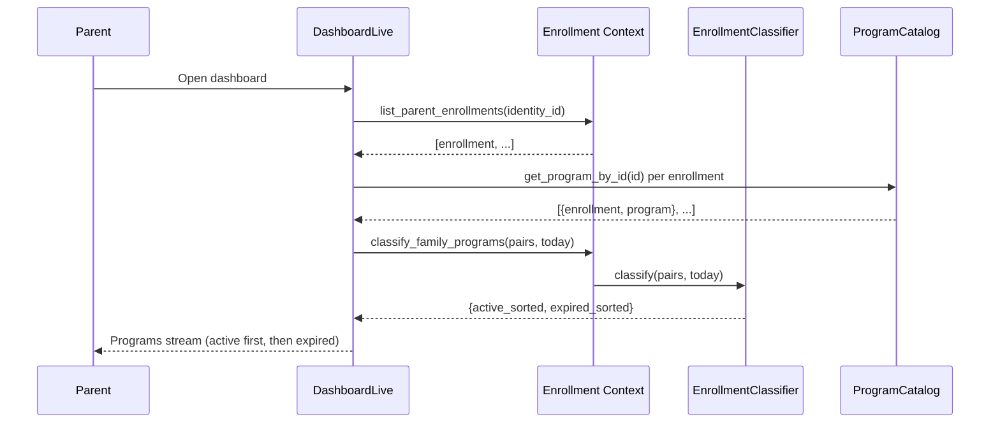

# Feature: Enrollment Classification (Active/Expired)

> **Context:** Enrollment | **Status:** Active
> **Last verified:** e158c77

## Purpose

When a parent opens their dashboard, their enrolled programs are split into two groups: active programs (upcoming or in-progress) and expired programs (finished or cancelled). Active programs are sorted by soonest start date so the parent sees what's next first, while expired programs are sorted by most recently ended. This drives the "Family Programs" section of the parent dashboard.

## What It Does

- **Classify enrollments as active or expired.** Takes a list of enrollment+program pairs and splits them into two groups based on enrollment status and program end date.
- **Sort active programs by upcoming start date.** Active programs are sorted ascending — soonest first — so the parent always sees what's next at the top. Programs without a start date sort to the end.
- **Sort expired programs by most recently ended.** Expired programs are sorted descending — most recently ended first — so the parent can find their latest completed programs easily. Programs without an end date sort to the end.
- **Pure domain logic with no side effects.** The classifier is a stateless domain service. It takes data in and returns a deterministic result — no database queries, no events, no state changes.

## What It Does NOT Do

| Out of Scope | Handled By |
|---|---|
| Fetching enrollments from the database | Enrollment / `list_parent_enrollments/1` |
| Fetching program details for each enrollment | ProgramCatalog / `get_program_by_id/1` (called by DashboardLive) |
| Rendering program cards on the dashboard | DashboardLive + ProgramPresenter |
| Filtering by program type, date range, or child | Not implemented |
| Archiving or hiding expired programs | Not implemented |
| Notifying parents when a program expires | Not implemented |

## Business Rules

```
GIVEN an enrollment has status :completed or :cancelled
WHEN  classification runs
THEN  the enrollment is classified as expired
  AND the program's end_date is not considered
```

```
GIVEN an enrollment has status :pending or :confirmed
WHEN  the program's end_date is before today
THEN  the enrollment is classified as expired
  AND this covers the case where a program ended but the enrollment was never completed
```

```
GIVEN an enrollment has status :pending or :confirmed
WHEN  the program has no end_date (nil) or the end_date is today or in the future
THEN  the enrollment is classified as active
```

```
GIVEN multiple active enrollments exist
WHEN  they are sorted
THEN  programs with the earliest start_date appear first
  AND programs with nil start_date appear last (sort key: 9999-12-31)
```

```
GIVEN multiple expired enrollments exist
WHEN  they are sorted
THEN  programs with the most recent end_date appear first
  AND programs with nil end_date appear last (sort key: 0001-01-01)
```

## How It Works



## Dependencies

| Direction | Context | What |
|---|---|---|
| Requires | ProgramCatalog | Program structs with `start_date` and `end_date` fields (provided by DashboardLive, not the classifier itself) |
| Internal | Enrollment (Domain) | Enrollment status field (`:pending`, `:confirmed`, `:completed`, `:cancelled`) |
| Provides to | DashboardLive (Web) | `{active, expired}` tuple of sorted enrollment+program pairs |

## Edge Cases

- **Empty enrollment list.** Returns `{[], []}`. No processing occurs.
- **Program with nil start_date (active).** Sorted to the end of the active list (sentinel: `~D[9999-12-31]`). Parent sees dated programs first.
- **Program with nil end_date (expired).** Sorted to the end of the expired list (sentinel: `~D[0001-01-01]`). Most recently ended dated programs appear first.
- **Program end_date equals today.** `Date.before?(end_date, today)` returns false when equal, so the enrollment is classified as **active** — the program is still running on its last day.
- **Cancelled enrollment with future program.** Classified as expired because status `:cancelled` takes precedence over program dates. The enrollment is done regardless of when the program runs.
- **Completed enrollment with future end_date.** Classified as expired because status `:completed` takes precedence. Unusual scenario but handled correctly.
- **Enrollment references deleted program.** DashboardLive filters these out before calling `classify_family_programs/2` — it logs a warning and drops the pair. The classifier never sees orphaned enrollments.
- **All enrollments expired.** Returns `{[], [expired_list]}`. The dashboard still shows the Family Programs section with all programs rendered with expired styling.
- **All enrollments active.** Returns `{[active_list], []}`. No expired section.

## Roles & Permissions

| Role | Can Do | Cannot Do |
|---|---|---|
| Parent | See their own active and expired programs on the dashboard, click through to program details | See other parents' enrollments, manually move programs between active/expired |
| Provider | N/A — classification is parent-facing | View individual parent dashboards |
| Admin | [NEEDS INPUT] | [NEEDS INPUT] |

---

*Generated from code. Sections marked `[NEEDS INPUT]` require manual review.*
