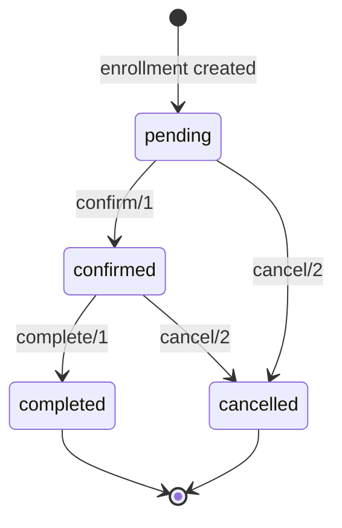
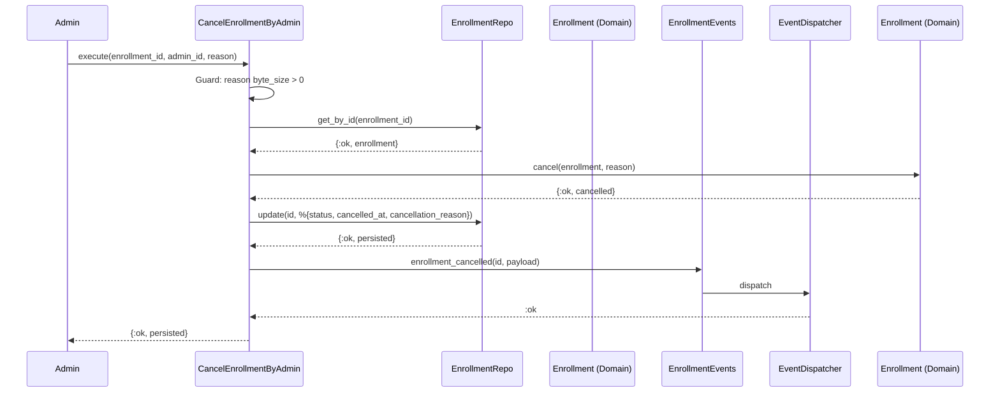
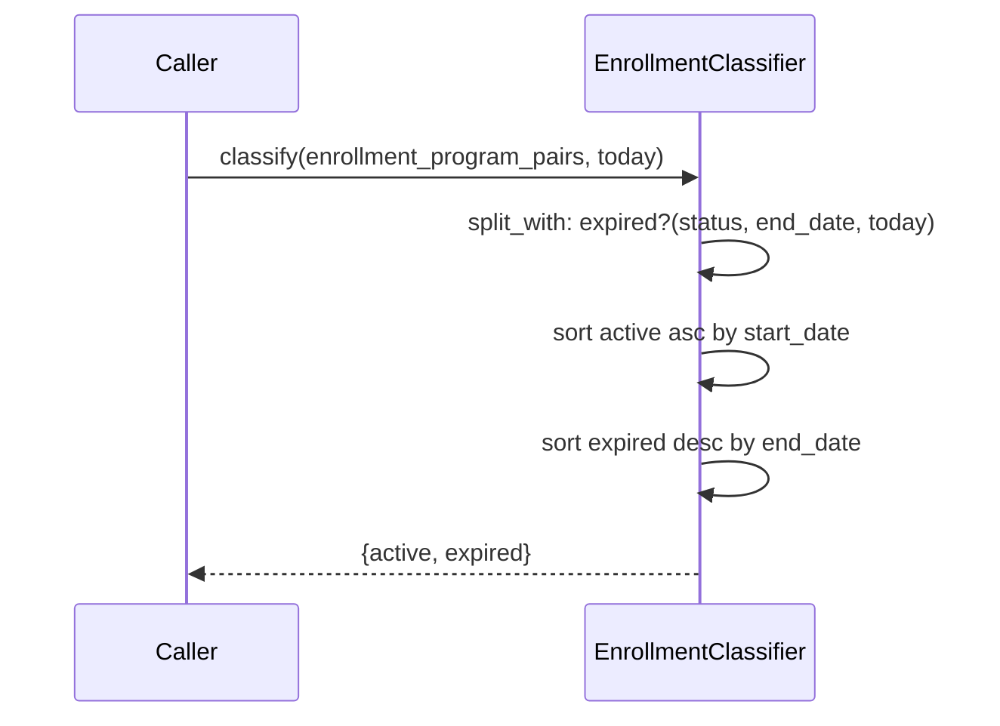

# Feature: Enrollment Status Lifecycle

> **Context:** Enrollment | **Status:** Active
> **Last verified:** 17f796f3

## Purpose

Governs how an enrollment moves through its statuses from creation to completion or cancellation, and provides queries and classification logic so parents and admins always see the correct state.

## What It Does

- Enforces a strict state machine on the `Enrollment` aggregate root: `pending -> confirmed -> completed`, with `cancelled` reachable from `pending` or `confirmed`
- Lets admins cancel an enrollment with a mandatory reason, persists the change, and dispatches an `enrollment_cancelled` domain event
- Checks whether a parent holds an active enrollment in a program (used by the Messaging context for access control)
- Retrieves a single enrollment by ID
- Lists all enrollments for a given parent, ordered by `enrolled_at` descending
- Classifies enrollment+program pairs into **active** vs **expired** buckets using status and program `end_date`, then sorts each bucket for display

## What It Does NOT Do

| Out of Scope | Handled By |
|---|---|
| Creating new enrollments (the initial `pending` record) | [Create Enrollment feature](create-enrollment.md) |
| Capacity tracking and waitlist management | [Capacity feature](capacity.md) |
| Payment processing and fee calculation | Enrollment / payment subsystem `[NEEDS INPUT]` |
| Sending notifications on status change | Downstream event subscribers `[NEEDS INPUT]` |

## Business Rules

```
GIVEN an enrollment with status :pending
WHEN  confirm/1 is called
THEN  status becomes :confirmed, confirmed_at is set to now
```

```
GIVEN an enrollment with status :confirmed
WHEN  complete/1 is called
THEN  status becomes :completed, completed_at is set to now
```

```
GIVEN an enrollment with status :pending or :confirmed
WHEN  cancel/2 is called with a non-empty reason
THEN  status becomes :cancelled, cancelled_at and cancellation_reason are set
```

```
GIVEN an enrollment with status :completed or :cancelled
WHEN  any transition (confirm, complete, cancel) is attempted
THEN  {:error, :invalid_status_transition} is returned; no change persisted
```

```
GIVEN an admin cancels an enrollment
WHEN  the reason string is empty (byte_size 0)
THEN  {:error, :invalid_reason} is returned immediately
```

```
GIVEN a list of enrollment+program pairs and today's date
WHEN  classification is performed
THEN  an enrollment is expired if its status is :completed/:cancelled
      OR its program end_date is before today;
      otherwise it is active
```

```
GIVEN the classified active list
WHEN  sorting is applied
THEN  active enrollments sort ascending by program start_date (nil last)
      and expired enrollments sort descending by program end_date (nil last)
```

## How It Works

### State Diagram



### Admin Cancellation Sequence



### Enrollment Classification



## Dependencies

| Direction | Context | What |
|---|---|---|
| Requires | Program Catalog | `Program.end_date` and `Program.start_date` for classification and sorting |
| Provides to | Messaging | `CheckEnrollment.execute/2` — boolean active-enrollment check for conversation access |
| Provides to | Web (Parent Dashboard) | `ListParentEnrollments.execute/1` — parent's enrollment list |

## Edge Cases

- **Invalid status transition** — calling `confirm` on a non-pending enrollment (or `complete` on non-confirmed, etc.) returns `{:error, :invalid_status_transition}` without touching the database
- **Already cancelled enrollment** — attempting to cancel again hits the same `:invalid_status_transition` guard since `:cancelled` is not in `[:pending, :confirmed]`
- **Empty cancellation reason** — the `CancelEnrollmentByAdmin` use case has a guard clause (`byte_size(reason) > 0`); an empty string returns `{:error, :invalid_reason}` before any DB query
- **Enrollment not found** — `get_by_id` returns `{:error, :not_found}`, which propagates through the `with` chain in cancellation
- **Program with nil end_date during classification** — treated as not expired (the `expired?/3` clause only fires when `end_date` is not nil), so the enrollment stays in the active bucket
- **Program with nil start_date in active sort** — pushed to the end of the active list via sentinel date `~D[9999-12-31]`

## Roles & Permissions

| Role | Can Do | Cannot Do |
|---|---|---|
| Parent | View own enrollment statuses via `ListParentEnrollments` | Cancel enrollments, transition statuses directly |
| Admin | Cancel enrollments via `CancelEnrollmentByAdmin` with mandatory reason | `[NEEDS INPUT]` — confirm/complete transitions not yet exposed as admin use cases |
| Provider | `[NEEDS INPUT]` — no provider-specific lifecycle use cases defined yet | `[NEEDS INPUT]` |

---

*Generated from code. Sections marked `[NEEDS INPUT]` require manual review.*
