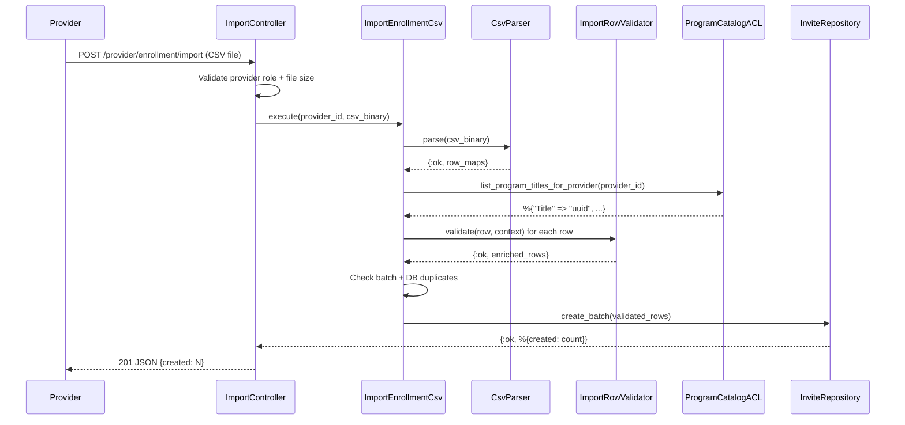

# Feature: CSV Bulk Import

> **Context:** Enrollment | **Status:** Active
> **Last verified:** f99b95f

## Purpose

CSV bulk import lets providers upload a spreadsheet of children and guardians to create enrollment invites in bulk. Instead of manually entering each child, a provider exports their existing roster as a CSV, uploads it, and the system parses, validates, deduplicates, and stores all invites in one operation. If anything is wrong, the entire upload is rejected with detailed per-row error messages so the provider can fix everything in one pass.

## What It Does

- **Parse CSV files.** Accepts a CSV binary with verbose column headers (matching the program import template). Maps headers to internal field names via prefix matching. Handles quoting, escaping, trailing empty cells, and varying date/boolean formats.
- **Validate every row.** Checks required fields, email format, program existence (matched against the provider's catalog), date-of-birth in the past, and school grade in range 1-13. Accumulates all errors across all rows.
- **Detect duplicates within the CSV.** Flags rows that share the same program + guardian email + child name (case-insensitive) within a single upload.
- **Detect duplicates against the database.** Queries existing invites for the relevant programs and flags rows that would violate the unique constraint.
- **Persist atomically.** Inserts all validated rows in a single database transaction. If any row fails, the entire batch rolls back.
- **Return structured errors.** Errors are categorized as parse errors, validation errors, or duplicate errors — each with row numbers and field-level messages.
- **Enforce file size limits.** Rejects uploads larger than 2MB before any parsing begins.
- **Require provider role.** Only authenticated users with a provider profile can upload.

## What It Does NOT Do

| Out of Scope | Handled By |
|---|---|
| Sending invitation emails to guardians | Not implemented — `invite_sent` status exists but no email logic |
| Converting invites into real enrollments after parent registration | Not implemented — `registered → enrolled` transition exists but no automation |
| Chunked/streaming import for very large files (10k+ rows) | Not implemented — single transaction for all rows |
| Editing or deleting individual invites after import | Not implemented |
| Mapping CSV rows to existing children/parents in the system | Not implemented — invites are denormalized staging records |
| Progress feedback during upload (e.g., progress bar) | Not implemented |

## Business Rules

```
GIVEN a provider uploads a CSV file
WHEN  the file is received
THEN  the system checks file size (max 2MB)
  AND rejects with 413 if too large
  AND reads the file binary for processing
```

```
GIVEN a CSV file is parsed
WHEN  headers are resolved
THEN  each column header is matched by prefix (not exact string)
  AND missing required columns produce a header-level error
  AND unknown columns are silently ignored
```

```
GIVEN a parsed CSV row
WHEN  it is validated
THEN  all validations run regardless of earlier failures (error accumulation)
  AND required fields: child_first_name, child_last_name, child_date_of_birth, guardian_email, program_name
  AND guardian_email must match a basic email regex
  AND guardian2_email is validated only when present
  AND program_name must exist in the provider's program catalog
  AND child_date_of_birth must be in the past
  AND school_grade must be 1-13 when present
```

```
GIVEN all rows pass validation
WHEN  duplicate detection runs
THEN  within-CSV duplicates are checked first (same program + email + child name, case-insensitive)
  AND then existing DB duplicates are checked
  AND duplicate errors include row numbers and clear messages
```

```
GIVEN all rows are valid and unique
WHEN  the batch is persisted
THEN  all rows are inserted in a single Ecto.Multi transaction
  AND each row goes through import_changeset (excludes lifecycle fields)
  AND status defaults to "pending"
  AND if any row fails, the entire batch rolls back
```

```
GIVEN a provider has no programs in the catalog
WHEN  they attempt a CSV import
THEN  the system returns a single error: "No programs found for this provider"
  AND no per-row validation is attempted
```

## How It Works



## Dependencies

| Direction | Context | What |
|---|---|---|
| Requires | ProgramCatalog (via ACL) | Program title → ID mapping for the provider's catalog. Direct DB query to avoid dependency cycle. |
| Provides to | Provider (Web) | HTTP endpoint for CSV upload at `POST /provider/enrollment/import` |

## Edge Cases

- **Empty CSV file.** Returns parse error: "CSV file is empty or has no data rows."
- **Headers only, no data rows.** Same as empty CSV — headers are valid but no rows to import.
- **Malformed CSV (mismatched quotes, stray escapes).** NimbleCSV ParseError is caught and returned as a parse error.
- **Missing required columns.** Header resolution fails with a list of missing column names.
- **Trailing empty cells in a row.** NimbleCSV drops trailing empties; the parser pads with empty strings to maintain column alignment.
- **Provider has no programs.** Fails early with "No programs found for this provider" before per-row validation.
- **Invalid provider UUID.** ProgramCatalogACL returns empty map; treated as "no programs."
- **Date format variations.** Accepts M/D/YYYY and MM/DD/YYYY. Non-numeric or missing parts produce row-level errors.
- **Boolean format variations.** "yes", "true", "1" (any case) → true; everything else → false.
- **Grade as non-integer.** Silently set to nil (grade is optional).
- **Duplicate rows in CSV.** Flagged with row numbers and the message "Duplicate entry in CSV."
- **Rows matching existing DB records.** Flagged with "Invite already exists for this child and program."
- **Changeset failure during batch insert.** The failing row index and changeset errors are returned; entire batch is rolled back.
- **Empty batch (0 rows after parsing).** Repository returns `{:ok, 0}`.
- **File exactly at 2MB limit.** Accepted (limit is > 2,000,000, not >=).

## Roles & Permissions

| Role | Can Do | Cannot Do |
|---|---|---|
| Provider | Upload CSV for their own programs, see detailed error reports | Upload for other providers' programs, edit invites after import |
| Parent | [NEEDS INPUT] View their pending invites? | Upload CSV |
| Admin | [NEEDS INPUT] | [NEEDS INPUT] |

---

*Generated from code. Sections marked `[NEEDS INPUT]` require manual review.*
