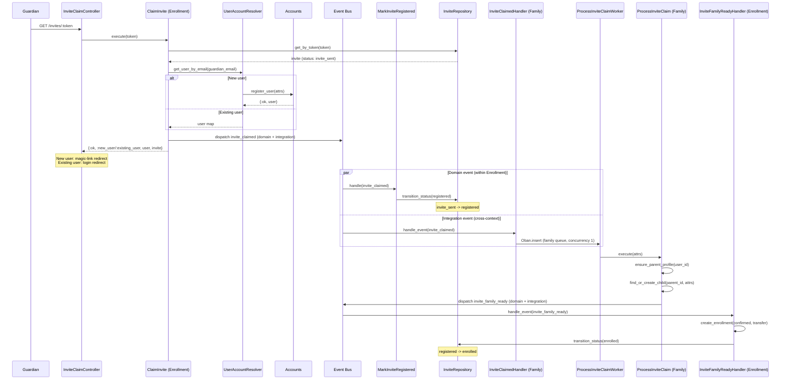

# Feature: Invite Claim Saga

> **Context:** Enrollment (orchestrator), Family, Accounts | **Status:** Active
> **Last verified:** 17f796f3

## Purpose

When a guardian clicks an invite link from their email, the Invite Claim Saga orchestrates user account resolution, family unit creation, and automatic enrollment across three bounded contexts using event-driven choreography. The guardian ends up logged in with their child enrolled -- no manual form-filling required.

## What It Does

- Validates the invite token and checks the invite is in `invite_sent` status
- Resolves an existing user account or registers a new one (passwordless, via magic link)
- Publishes `invite_claimed` domain + integration events to trigger downstream processing
- Creates a parent profile and child record in the Family context (idempotent, serialized via Oban)
- Publishes `invite_family_ready` integration event back to Enrollment
- Creates a confirmed enrollment with `transfer` payment method (no online payment)
- Transitions the invite through its full lifecycle: `invite_sent` -> `registered` -> `enrolled`

## What It Does NOT Do

| Out of Scope | Handled By |
|---|---|
| CSV import and invite record creation | [Import Enrollment CSV](import-enrollment-csv.md) |
| Sending the invite email | [Invite Email Pipeline](invite-email-pipeline.md) |
| Invite token generation and assignment | [Invite Email Pipeline](invite-email-pipeline.md) |
| Tier/eligibility validation for enrollment | Enrollment context (standard enrollment path) |
| Password management | Accounts context (user settings) |
| Invite resend and lifecycle management | [Invite Management](invite-management.md) |

## Business Rules

```
GIVEN an invite with status "invite_sent" and a valid token
WHEN  the guardian clicks the invite link
THEN  the system looks up the invite by token and begins the claim process
```

```
GIVEN the guardian's email does not match any existing user
WHEN  the invite is claimed
THEN  a new user account is created with intended_roles: [:parent]
  AND the guardian is redirected via magic-link login (no password needed)
```

```
GIVEN the guardian's email matches an existing user account
WHEN  the invite is claimed
THEN  no new account is created
  AND the guardian is redirected to the standard login page
```

```
GIVEN the invite_claimed event is published
WHEN  the Enrollment context's domain event bus processes it
THEN  the invite status transitions from "invite_sent" to "registered"
  AND registered_at is set to the current UTC timestamp
```

```
GIVEN the invite_claimed integration event is received by the Family context
WHEN  the Oban worker processes it (family queue, concurrency 1)
THEN  a parent profile is created (or found if it already exists)
  AND a child record is created (or found by name + date_of_birth match)
  AND the invite_family_ready event is published
```

```
GIVEN the invite_family_ready integration event is received by the Enrollment context
WHEN  the invite is in "registered" status
THEN  an enrollment is created with status "confirmed" and payment_method "transfer"
  AND the invite transitions from "registered" to "enrolled"
  AND enrolled_at and enrollment_id are recorded on the invite
```

```
GIVEN an invite with status other than "invite_sent"
WHEN  a guardian attempts to claim it
THEN  the system returns :already_claimed
```

```
GIVEN a token that does not match any invite
WHEN  a guardian attempts to claim it
THEN  the system returns :not_found
```

## How It Works



## Dependencies

| Direction | Context | What |
|---|---|---|
| Requires | Accounts | User lookup by email, user registration, magic link token generation |
| Requires | Family | Parent profile creation, child record creation (via ProcessInviteClaim use case) |
| Provides to | Family | `invite_claimed` integration event with child/guardian data from the invite |
| Receives from | Family | `invite_family_ready` integration event with child_id, parent_id |
| Internal | Enrollment | InviteRepository for token lookup, status transitions; Enrollment facade for enrollment creation |

## Edge Cases

- **Already claimed invite** -- `validate_claimable/1` rejects any invite not in `invite_sent` status, returning `{:error, :already_claimed}`. Controller redirects to login with info message.
- **Invalid/expired token** -- `get_by_token/1` returns nil, resulting in `{:error, :not_found}`. Controller redirects to home with error flash.
- **Existing user** -- `resolve_user/1` finds the user by email and skips registration. Controller redirects to standard login instead of magic link. The saga still proceeds via events.
- **Duplicate child on retry** -- `ProcessInviteClaim.find_or_create_child/2` does a case-insensitive match on (first_name, last_name, date_of_birth) within the parent's children. Oban `family` queue runs at concurrency 1 to prevent TOCTOU races.
- **Duplicate parent profile** -- `ensure_parent_profile/2` catches `:duplicate_resource` and fetches the existing profile by `identity_id`.
- **Duplicate enrollment** -- `InviteFamilyReadyHandler` catches `:duplicate_resource` from enrollment creation and still transitions the invite to `enrolled` (without an `enrollment_id`).
- **Invite not found during event handling** -- Both `MarkInviteRegistered` and `InviteFamilyReadyHandler` return `:ok` when the invite is not found, making event replay safe.
- **Invite already past target status** -- `MarkInviteRegistered` skips if status is already `registered` or `enrolled`. `InviteFamilyReadyHandler` skips if status is not `registered`. Both are idempotent.
- **Enrollment creation failure** -- `InviteFamilyReadyHandler` transitions the invite to `failed` with `error_details` and returns `{:error, reason}`.
- **Oban worker failure** -- `ProcessInviteClaimWorker` has `max_attempts: 3`. Retries are safe because parent profile and child creation are idempotent.
- **Nil child identity fields** -- `find_existing_child/4` returns nil if first_name, last_name, or date_of_birth is nil, skipping dedup to avoid false nil == nil matches.
- **Guardian name construction** -- Handles all combinations of nil/present first/last name, falling back to email as the display name.

## Roles & Permissions

| Role | Can Do | Cannot Do |
|---|---|---|
| Guardian (invited person) | Click invite link to trigger the saga | Claim an already-claimed invite; access another guardian's invite |
| Provider | Import CSV to create invites; resend invites | Directly trigger the claim saga |
| System (event handlers) | Process events, create enrollments, transition invite statuses | Skip the state machine (all transitions go through `transition_changeset`) |

---

*Generated from code. Sections marked `[NEEDS INPUT]` require manual review.*
