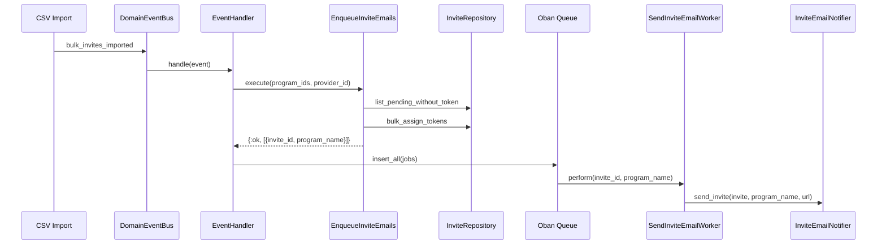

# Feature: Invite Email Pipeline

> **Context:** Enrollment | **Status:** Active
> **Last verified:** 6b9e769

## Purpose

After a provider imports enrollment invites via CSV, the system automatically generates secure invite tokens and sends invitation emails to guardians so they can register their children for programs.

## What It Does

- Listens for `bulk_invites_imported` domain events after CSV import
- Generates cryptographically secure URL-safe tokens for each pending invite
- Resolves human-readable program names for email subjects via the ProgramCatalog ACL
- Assigns tokens to invites in bulk (single DB update per invite)
- Enqueues one Oban job per invite for async email delivery
- Sends invitation emails to guardians with a registration link containing the invite token
- Transitions invite status from `pending` to `invite_sent` on successful delivery
- Transitions invite status to `failed` with error details on delivery failure
- Retries failed email deliveries up to 3 times (Oban built-in)

## What It Does NOT Do

| Out of Scope | Handled By |
|---|---|
| Parsing and validating CSV data | Enrollment / [CSV Bulk Import](import-enrollment-csv.md) |
| Handling the registration link when a guardian clicks it | Enrollment / [Invite Claim Saga](#) — `GET /invites/:token` triggers auto-registration |
| Creating real User/Child/Enrollment records from invite data | Enrollment / [Invite Claim Saga](#) — event-driven saga: `invite_claimed → family created → enrolled` |
| Sending reminder emails for unopened invites | [NEEDS INPUT] — no reminder mechanism exists |
| Email template customization per provider | Not implemented — all invites use the same template |

## Business Rules

```
GIVEN a CSV import completes successfully
WHEN  the bulk_invites_imported event is dispatched
THEN  all pending invites without tokens receive a unique token and an email job is enqueued
```

```
GIVEN an invite already has a token assigned
WHEN  the event is re-dispatched (e.g., retry)
THEN  the invite is skipped — no duplicate token, no duplicate email
```

```
GIVEN an Oban job executes for an invite
WHEN  the invite status is not "pending" (already processed)
THEN  the job returns :skipped without sending an email
```

```
GIVEN an Oban job executes for a pending invite
WHEN  email delivery succeeds
THEN  the invite transitions to "invite_sent" with a timestamp
```

```
GIVEN an Oban job executes for a pending invite
WHEN  email delivery fails
THEN  the invite transitions to "failed" with error details, and Oban retries (up to 3 attempts)
```

```
GIVEN an invite's program_id is not in the provider's catalog
WHEN  the email is prepared
THEN  the program name falls back to "Program" in the email subject
```

## How It Works



## Dependencies

| Direction | Context | What |
|---|---|---|
| Requires | ProgramCatalog (via ACL) | Program titles for email subjects (`list_program_titles_for_provider`) |
| Requires | Shared | DomainEventBus for event delivery, EventDispatchHelper |
| Requires | Infrastructure | Resend email service (via Swoosh adapter), Oban job queue |
| Provides to | Guardian (external) | Invitation email with registration link |

## Edge Cases

- **No pending invites exist** — use case returns `{:ok, []}`, handler does nothing, no Oban jobs created
- **Invite already has a token** — `list_pending_without_token` filters it out, preventing duplicate tokens
- **Program not in provider's catalog** — email uses fallback name "Program" instead of crashing
- **Invite not found when worker runs** — returns `{:ok, :not_found}` (no retry, invite may have been deleted)
- **Invite no longer pending when worker runs** — returns `{:ok, :skipped}` (another process already handled it)
- **Invite has no token when worker runs** — returns `{:error, "invite has no token"}` (Oban retries, token may not have been assigned yet)
- **Event dispatched twice** — idempotent: second call finds no pending-without-token invites, returns empty list

## Roles & Permissions

| Role | Can Do | Cannot Do |
|---|---|---|
| Provider | Triggers pipeline by uploading CSV import | Cannot manually send individual invite emails |
| Guardian | Receives invitation email | Cannot trigger or retry email sending |
| System | Automatically processes events and delivers emails | [NEEDS INPUT] — no admin UI to retry failed invites |

---

*Generated from code. Sections marked `[NEEDS INPUT]` require manual review.*
