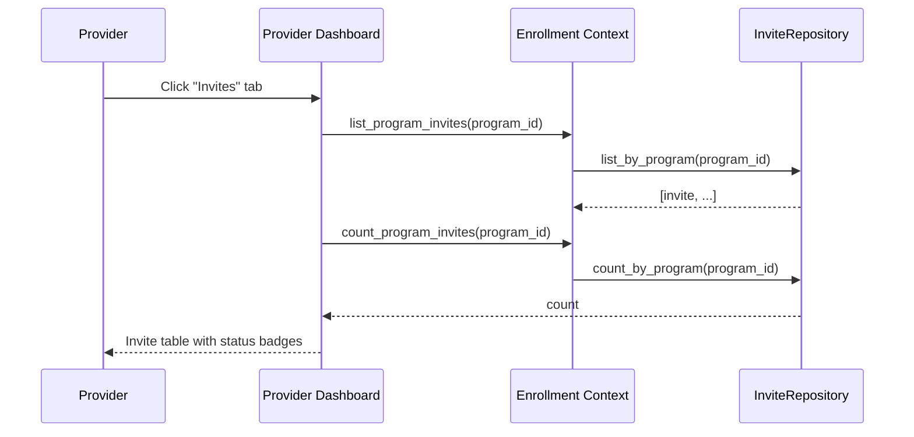
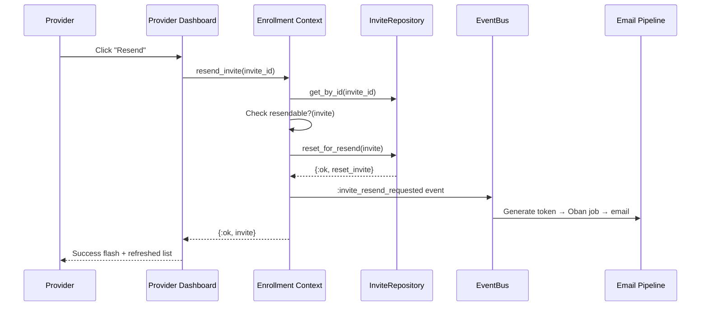
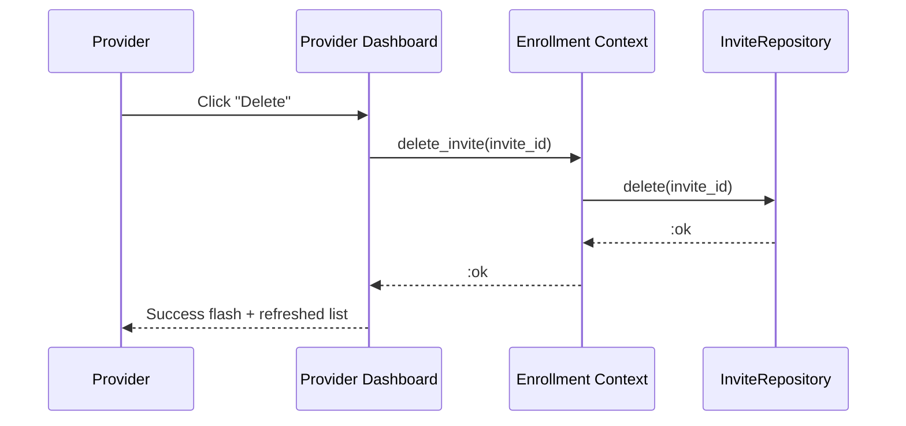

# Feature: Invite Management

> **Context:** Enrollment | **Status:** Active
> **Last verified:** e158c77

## Purpose

After a provider uploads a CSV of enrollment invites, they need to see what was imported, resend emails that failed or haven't been opened, and remove invites that are no longer needed. Invite management gives providers a dashboard tab where they can view all invites for a program, trigger resends, and delete individual records.

## What It Does

- **List invites per program.** Shows all bulk enrollment invites for a program, ordered by child last name then first name. Displayed in the provider dashboard's "Invites" tab with status badges and action buttons.
- **Count invites per program.** Returns the total invite count for a program. Used by the dashboard to show a count indicator on the "Invites" tab.
- **Resend an invite.** Resets a failed, pending, or already-sent invite back to `pending` status, clears its token and sent timestamp, and dispatches the email pipeline to generate a fresh token and send a new email.
- **Delete an invite.** Hard-deletes the invite record. If an email was already sent, the invite link becomes invalid (returns "not found" when clicked).
- **Display invite status.** Each invite shows a color-coded status badge: pending (yellow), sent (blue), registered (blue), enrolled (green), failed (red).
- **Guard against invalid actions.** Resend is only available for invites in `pending`, `invite_sent`, or `failed` status. Delete is only available for invites in `pending`, `invite_sent`, or `failed` status. Both buttons are hidden for `registered` and `enrolled` invites.

## What It Does NOT Do

| Out of Scope | Handled By |
|---|---|
| Importing invites from CSV | Enrollment / [CSV Bulk Import](import-enrollment-csv.md) |
| Sending the actual emails (token generation, Oban jobs, delivery) | Enrollment / [Invite Email Pipeline](invite-email-pipeline.md) |
| Handling the invite link when a guardian clicks it | Enrollment / Invite Claim Saga (`InviteClaimController`) |
| Editing invite details (child name, email, program) after import | Not implemented |
| Bulk resend or bulk delete | Not implemented |
| Filtering or searching invites within a program | Not implemented |
| Reminder emails for unopened invites | Not implemented |

## Business Rules

```
GIVEN a provider views a program in the dashboard
WHEN  they switch to the "Invites" tab
THEN  all invites for that program are loaded
  AND ordered alphabetically by child last name, then first name
  AND each invite shows: child name, guardian email, status badge, and action buttons
```

```
GIVEN an invite has status "pending", "invite_sent", or "failed"
WHEN  the provider clicks "Resend"
THEN  the invite is reset to "pending" with token and sent timestamp cleared
  AND an :invite_resend_requested domain event is dispatched
  AND the email pipeline generates a fresh token and sends a new email
```

```
GIVEN an invite has status "registered" or "enrolled"
WHEN  the provider views the invite
THEN  no resend or delete actions are shown
  AND the invite is read-only (the guardian has already acted on it)
```

```
GIVEN an invite exists
WHEN  the provider clicks "Delete"
THEN  the invite record is hard-deleted from the database
  AND if an email was already sent, the invite link returns "not found" when clicked
  AND the invite list refreshes with updated count
```

```
GIVEN the resend pipeline generates a new token
WHEN  the email is delivered
THEN  the old token (if any) is no longer valid
  AND only the new token resolves to this invite
```

```
GIVEN an invite has status "enrolled"
WHEN  someone attempts to resend it programmatically
THEN  the system returns {:error, :not_resendable}
```

## How It Works

### Listing Invites



### Resending an Invite



### Deleting an Invite



## Dependencies

| Direction | Context | What |
|---|---|---|
| Internal | Enrollment (Email Pipeline) | Resend dispatches `:invite_resend_requested` event, handled by `EnqueueInviteEmails` event handler |
| Internal | Enrollment (InviteRepository) | All operations delegate to `ForStoringBulkEnrollmentInvites` port |
| Provides to | Provider Dashboard (Web) | Invite list, count, resend, and delete operations |

## Edge Cases

- **No invites exist for program.** Dashboard shows empty state: "No invites yet. Upload a CSV to invite families."
- **Invite not found on resend.** Returns `{:error, :not_found}`. Dashboard shows error flash.
- **Invite not found on delete.** Returns `{:error, :not_found}`. Dashboard shows error flash.
- **Invite already enrolled.** `resendable?/1` returns false. Use case returns `{:error, :not_resendable}`. Dashboard shows "This invite cannot be resent" flash.
- **Invite already registered.** Same as enrolled — resend is blocked because the guardian has already claimed the link.
- **Delete after email sent.** The invite link (`/invites/:token`) becomes a dead link. `InviteClaimController` returns "invalid or expired" flash and redirects to home.
- **Delete with existing enrollment.** The enrollment itself is NOT cascade-deleted. Only the invite staging record is removed. The FK constraint from `enrollment_id` is handled gracefully — if delete fails due to FK, returns `{:error, :delete_failed}`.
- **Resend for pending invite (never sent).** Works correctly — the reset clears any partial state and the email pipeline sends the first email.
- **Concurrent resend clicks.** Second resend may find invite already reset to pending with no token. The email pipeline's `list_pending_without_token` query handles this — the invite gets one token and one email.
- **Resend for failed invite.** The `failed → pending` transition is explicitly allowed in the state machine. This is the primary recovery path for delivery failures.

## Roles & Permissions

| Role | Can Do | Cannot Do |
|---|---|---|
| Provider | View invites for their programs, resend failed/pending invites, delete invites | View invites for other providers' programs, edit invite details, bulk resend/delete |
| Parent | [NEEDS INPUT] Can parents see their pending invites? | Resend or delete invites |
| Admin | [NEEDS INPUT] | [NEEDS INPUT] |

---

*Generated from code. Sections marked `[NEEDS INPUT]` require manual review.*
