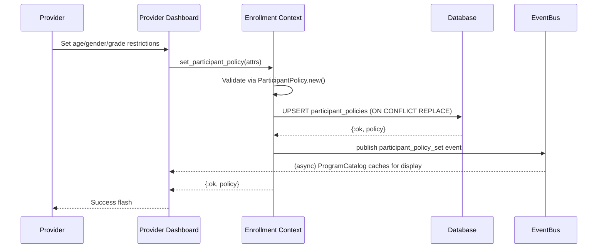
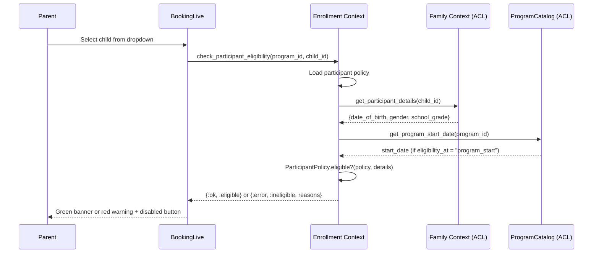

# Feature: Participant Restrictions

> **Context:** Enrollment | **Status:** Active
> **Last verified:** c2cbd53

## Purpose

Participant restrictions let providers set age, gender, and grade requirements on their programs. When a parent selects a child for enrollment, the system checks whether the child meets these requirements and shows clear feedback — either confirming eligibility or explaining exactly why the child doesn't qualify. This prevents mismatched enrollments and saves time for both parents and providers.

## What It Does

- **Set eligibility criteria per program.** Providers configure age range (in months), allowed genders, and grade range via the provider dashboard. Uses upsert — creating or updating in one operation.
- **Check child eligibility at booking time.** When a parent selects a child on the booking page, the system checks the child's age, gender, and school grade against the program's policy. Returns specific failure reasons.
- **Choose when to evaluate age.** Providers pick whether age is checked at registration time (today) or at program start date. This handles cases like "child must be 6 by the time camp starts."
- **Display requirements on program detail page.** ProgramCatalog subscribes to policy-change events and renders a "Participant Requirements" section showing age range, genders, and grades in human-readable format.
- **Block ineligible enrollments.** The booking page disables the enrollment button and shows a red warning when a child doesn't meet requirements.
- **Inline form validation.** Provider dashboard validates restriction fields in real-time before program creation.

## What It Does NOT Do

| Out of Scope | Handled By |
|---|---|
| Enforcing restrictions for already-enrolled children when policy changes | Not implemented |
| Waitlists for children who are "almost eligible" (e.g., turning 6 next month) | Not implemented |
| Provider-defined custom eligibility criteria beyond age/gender/grade | Not implemented |
| Displaying eligibility status on the program listing page (card view) | Not implemented |
| Notifying parents when a policy changes on a program they've bookmarked | Not implemented |

## Business Rules

```
GIVEN a provider is creating or editing a program
WHEN  they set participant restrictions
THEN  all fields are optional (no restriction = all children eligible)
  AND age values must be >= 0 months when set
  AND min age must not exceed max age when both are set
  AND grade values must be between 1 and 13 when set
  AND min grade must not exceed max grade when both are set
  AND gender values must be from: male, female, diverse, not_specified
```

```
GIVEN a program has a participant policy
WHEN  a parent selects a child on the booking page
THEN  the system loads the child's date_of_birth, gender, and school_grade
  AND determines the reference date (today or program start date)
  AND calculates the child's age in complete months
  AND checks all criteria (age, gender, grade)
  AND returns ALL failure reasons (not just the first one)
```

```
GIVEN a program has no participant policy
WHEN  eligibility is checked
THEN  the system returns :eligible (no restrictions)
```

```
GIVEN a participant policy allows no specific genders (empty list)
WHEN  eligibility is checked
THEN  all genders are allowed (empty = unrestricted)
```

```
GIVEN a provider sets restrictions on a program that already has a policy
WHEN  the policy is saved
THEN  the existing values are replaced (upsert via ON CONFLICT)
  AND a participant_policy_set integration event is published
```

```
GIVEN a parent submits an enrollment for an ineligible child
WHEN  the enrollment is created via the standard flow (with identity_id)
THEN  the system rejects with :ineligible before reaching capacity check
  AND returns specific reason messages
```

```
GIVEN a program is deleted
WHEN  the program record is removed
THEN  the participant policy is cascade-deleted automatically
```

## How It Works

### Setting Restrictions (Provider)



### Checking Eligibility (Booking)



## Dependencies

| Direction | Context | What |
|---|---|---|
| Requires | Family | Child details (date_of_birth, gender, school_grade) via ParticipantDetailsACL |
| Requires | ProgramCatalog | Program start_date via ProgramScheduleACL (for "at program start" age checks) |
| Provides to | ProgramCatalog | `participant_policy_set` integration event (for displaying requirements on program detail) |
| Provides to | Booking LiveView (Web) | Eligibility check result, ineligibility reasons, button disable state |
| Provides to | Provider Dashboard (Web) | Policy form validation, policy persistence |
| Internal | Enrollment (CreateEnrollment) | Eligibility gate before capacity check during enrollment creation |

## Edge Cases

- **No policy exists.** `check_participant_eligibility/2` returns `{:ok, :eligible}`. No restrictions are enforced.
- **Child not found.** ACL returns `{:error, :not_found}`. Use case propagates the error.
- **No program start date (nil).** Falls back to today's date for age calculation, even when `eligibility_at = "program_start"`.
- **Child has no gender set.** Gender field defaults to `"not_specified"`. Only passes the gender check if the policy explicitly includes `"not_specified"` or the allowed_genders list is empty.
- **Child has no school grade.** `school_grade` is nil. Grade checks are skipped for nil values — the child is not penalized for missing grade data.
- **Age boundary edge case.** Age is calculated in complete months using date arithmetic. A child born on Feb 29 uses Feb 28 in non-leap years.
- **Min equals max.** Both age and grade ranges support min == max (e.g., "exactly grade 3").
- **Empty allowed genders list.** Treated as "all genders allowed," not "no genders allowed."
- **Policy updated after program has enrollments.** Existing enrollments are not re-validated. The new policy only affects future eligibility checks.
- **Concurrent policy upserts.** `ON CONFLICT` ensures only one policy per program. Last write wins.

## Roles & Permissions

| Role | Can Do | Cannot Do |
|---|---|---|
| Provider | Set/update participant restrictions on their programs, choose eligibility timing | See which specific children were rejected by the policy |
| Parent | See program requirements, see eligibility feedback per child at booking time | Modify restrictions, enroll ineligible children |
| Admin | [NEEDS INPUT] | [NEEDS INPUT] |

---

*Generated from code. Sections marked `[NEEDS INPUT]` require manual review.*
