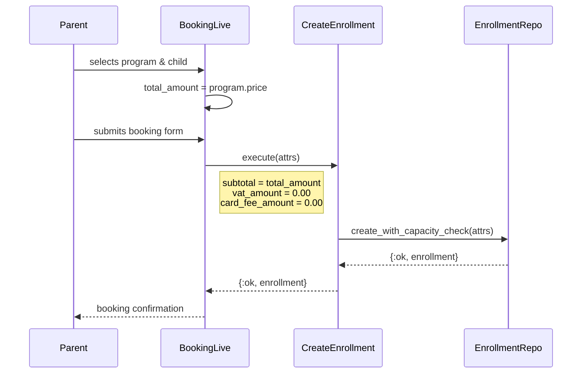

# Feature: Pricing

> **Context:** Enrollment | **Status:** Active
> **Last verified:** 17f796f3

## Purpose

Determines the fee amounts recorded on an enrollment so the parent knows what they owe and the system has an auditable price snapshot at the time of booking.

## What It Does

- Sets `total_amount` and `subtotal` equal to the program's price at enrollment time
- Sets `vat_amount` and `card_fee_amount` to zero (no derived fees yet)
- Records the chosen `payment_method` (`"card"` or `"transfer"`) on the enrollment
- Validates all fee fields are >= 0 at the persistence layer
- Formats prices for display via `ProgramPricing.format_price/1` (EUR only, symbol prefix)

## What It Does NOT Do

| Out of Scope | Handled By |
|---|---|
| Discount / promo code application | [NEEDS INPUT] |
| Sibling or multi-child discounts | [NEEDS INPUT] |
| VAT calculation | [NEEDS INPUT] - fields exist but are hardcoded to 0.00 |
| Card processing surcharge calculation | [NEEDS INPUT] - fields exist but are hardcoded to 0.00 |
| Refund processing | [NEEDS INPUT] |
| Payment collection / charging | [NEEDS INPUT] |
| Currency selection (non-EUR) | Not planned - EUR hardcoded |

## Business Rules

```
GIVEN a program with a price (Decimal, non-nil)
WHEN  a parent creates an enrollment
THEN  total_amount = program.price
  AND subtotal     = program.price
  AND vat_amount   = 0.00
  AND card_fee_amount = 0.00
```

```
GIVEN an enrollment being created
WHEN  the parent selects a payment method
THEN  payment_method is persisted as "card" or "transfer"
  AND no fee adjustment is applied based on payment method
```

```
GIVEN any fee field (subtotal, vat_amount, card_fee_amount, total_amount)
WHEN  a value is provided
THEN  it must be >= 0 (enforced by Ecto changeset validation)
```

```
GIVEN a program price
WHEN  it is formatted for display
THEN  it is prefixed with the EUR symbol and shown with two decimal places (e.g. "€45.00")
```

## How It Works



## Dependencies

| Direction | Context | What |
|---|---|---|
| Requires | Program Catalog | `program.price` - the provider-set price used as the enrollment total |
| Requires | Program Catalog | `ProgramPricing.format_price/1` - EUR price formatting for display |

## Edge Cases

- **Free program (price = 0):** All fee fields are set to `Decimal.new("0.00")`. The enrollment proceeds normally with no payment required.
- **Missing price (nil):** `program.price` is `NOT NULL` in the DB and `@enforce_keys` in the domain model. A nil price at booking time indicates a bug. `ProgramPricing.format_price(nil)` returns `"N/A"` as a display-layer safety net.
- **Duplicate enrollment:** The `enrollments_program_child_active_index` unique constraint prevents a second active enrollment for the same child + program pair, returning `{:error, :duplicate_resource}`.

## Roles & Permissions

| Role | Can Do | Cannot Do |
|---|---|---|
| Parent | View the calculated total during booking | Edit fee amounts directly |
| Provider | Set program price (in Program Catalog) | Override fee amounts on an individual enrollment |
| Admin | View fee fields on enrollment records | [NEEDS INPUT] - edit fees via admin panel? |
| System | Calculate and persist all fee fields at enrollment creation time | Apply dynamic fees (VAT, card surcharge, discounts) |

---

*Generated from code. Sections marked `[NEEDS INPUT]` require manual review.*
