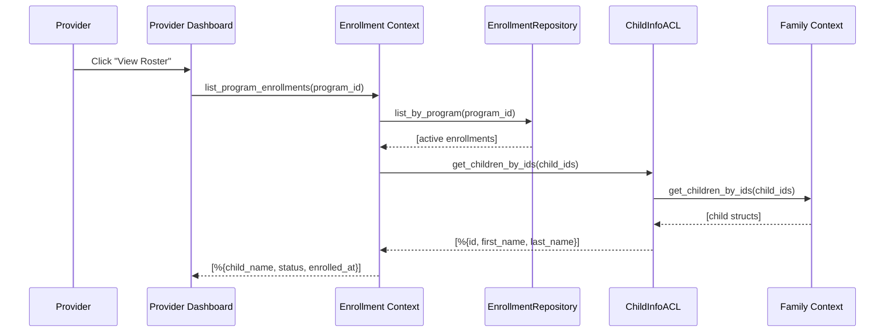

# Feature: Provider Enrollment Roster

> **Context:** Enrollment | **Status:** Active
> **Last verified:** e158c77

## Purpose

When a provider clicks "View Roster" on one of their programs, the system shows a modal with a list of enrolled children — their names, enrollment status, and enrollment date. This gives providers a quick at-a-glance view of who's signed up, without leaving the dashboard.

## What It Does

- **Show enrolled children for a program.** Fetches all active (pending/confirmed) enrollments for a program and resolves each child's name via the Family context. Displayed as a table inside a modal with columns: Child Name, Status, Enrolled date.
- **Display enrollment status badges.** Each enrollment shows a color-coded status pill: pending (yellow/warning), confirmed (green/success), other statuses (blue/info).
- **Format enrollment dates.** Shows enrolled_at as a human-readable date (e.g., "Feb 24, 2026"). Falls back to an em dash when no date is available.
- **Show enrollment count.** The "Enrolled" tab header displays a count of enrolled children (e.g., "Enrolled (5)").
- **Handle empty rosters.** When no children are enrolled, shows a centered empty state with a user-group icon and "No enrollments yet." message.
- **Resolve child names across context boundaries.** Uses the `ForResolvingChildInfo` ACL port to fetch child first/last names from the Family context, keeping Enrollment decoupled from Family domain types.

## What It Does NOT Do

| Out of Scope | Handled By |
|---|---|
| Showing invite records (pending CSV imports) | Enrollment / [Invite Management](invite-management.md) — displayed in the "Invites" tab of the same modal |
| Showing expired or cancelled enrollments | Not implemented — `list_by_program` filters to active (pending/confirmed) only |
| Sorting or filtering the roster | Not implemented — entries are shown in enrolled_at descending order |
| Editing or cancelling enrollments from the roster | Not implemented |
| Exporting the roster as CSV or PDF | Not implemented |
| Displaying child age, grade, or contact info | Not implemented — only name, status, and date are shown |
| Displaying parent/guardian info alongside child | Not implemented |

## Business Rules

```
GIVEN a provider clicks "View Roster" on a program
WHEN  the roster modal opens
THEN  all active enrollments (pending + confirmed) are fetched
  AND child names are resolved via the Family ACL
  AND entries are displayed ordered by enrolled_at descending (most recent first)
  AND the "Enrolled" tab is active by default
```

```
GIVEN a program has no active enrollments
WHEN  the roster modal opens
THEN  an empty state is shown: icon + "No enrollments yet."
  AND the enrolled count reads "Enrolled (0)"
  AND no ACL call is made to the Family context (skipped for empty lists)
```

```
GIVEN an enrollment references a child that no longer exists in Family
WHEN  child names are resolved
THEN  the child's name displays as "Unknown" instead of crashing
```

```
GIVEN the provider closes the roster modal (click overlay, X button, or Escape)
WHEN  the modal closes
THEN  all roster state is reset (entries, tab, program ID, counts)
  AND the modal is hidden
```

## How It Works



## Dependencies

| Direction | Context | What |
|---|---|---|
| Requires | Family (via ChildInfoACL) | Child first/last names for roster display. Returns lightweight maps, never Family domain types. |
| Requires | ProgramCatalog | Program title for the modal header ("Roster: Program Name"). Fetched via `ProgramCatalog.get_program_by_id/1`. |
| Internal | Enrollment (EnrollmentRepository) | Active enrollments via `list_by_program/1` (pending + confirmed, ordered by enrolled_at desc) |
| Provides to | Provider Dashboard (Web) | Roster entries list, enrollment count, modal state |

## Edge Cases

- **No enrollments exist.** Returns empty list. Dashboard shows empty state. The Family ACL is never called (short-circuit for empty enrollment list).
- **Child deleted from Family after enrollment.** `Map.get(child_map, child_id)` returns nil. Child name falls back to `"Unknown"` — the roster entry is still shown, not silently dropped.
- **Duplicate child IDs.** `Enum.uniq/1` deduplicates child IDs before the ACL call, so a child enrolled multiple times (shouldn't happen due to unique constraint, but defensive) only triggers one Family lookup.
- **Large roster.** No pagination — all active enrollments are loaded into memory. For programs with thousands of enrollments, this could be slow. [NEEDS INPUT] Is pagination needed?
- **Program not found when resolving name.** Dashboard catches `{:error, _}` from `ProgramCatalog.get_program_by_id/1` and falls back to "Program" as the modal title.
- **Modal close resets state.** All roster assigns (entries, tab, program_id, counts, import_errors) are reset to defaults on close. Re-opening a different program's roster starts fresh.
- **Active-only filter.** Completed and cancelled enrollments are excluded by `EnrollmentQueries.active_only()`. Providers only see children who are currently enrolled.

## Roles & Permissions

| Role | Can Do | Cannot Do |
|---|---|---|
| Provider | View roster for their own programs, see child names and enrollment status | View rosters for other providers' programs, edit or cancel enrollments from the roster |
| Parent | [NEEDS INPUT] Can parents see who else is enrolled? | Access the provider roster view |
| Admin | [NEEDS INPUT] | [NEEDS INPUT] |

---

*Generated from code. Sections marked `[NEEDS INPUT]` require manual review.*
