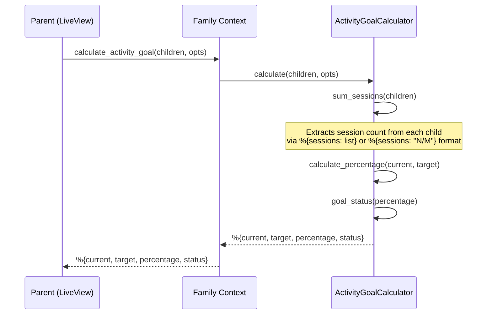

# Feature: Activity Goal

> **Context:** Family | **Status:** Active
> **Last verified:** 17f796f3

## Purpose

Calculates weekly activity goal progress for a family by aggregating session counts across all children, giving parents a simple view of how active their family is relative to a weekly target.

## What It Does

- Sums completed sessions across all children in a family for the current week
- Compares the total against a configurable weekly target (default: 5 activities)
- Returns a progress percentage capped at 100%
- Classifies goal status as `:in_progress`, `:almost_there` (>=80%), or `:achieved` (>=100%)

## What It Does NOT Do

| Out of Scope | Handled By |
|---|---|
| Tracking individual session attendance (check-in/out) | Participation context |
| Setting custom per-family goal targets | [NEEDS INPUT] -- not yet implemented |
| Persisting goal history or streaks | [NEEDS INPUT] -- no persistence layer exists |
| Progress analytics or trend reporting | [NEEDS INPUT] -- Progress Tracking context (planned) |

## Business Rules

```
GIVEN a family with children who have attended sessions this week
WHEN  the activity goal is calculated
THEN  the system sums all children's session counts and compares against the weekly target
```

```
GIVEN no weekly target is explicitly provided
WHEN  the activity goal is calculated
THEN  the default target of 5 activities per week is used
```

```
GIVEN the total sessions meet or exceed the target
WHEN  the percentage is calculated
THEN  the percentage is capped at 100% and status is :achieved
```

```
GIVEN the total sessions reach at least 80% of the target
WHEN  the goal status is determined
THEN  the status is :almost_there
```

```
GIVEN the total sessions are below 80% of the target
WHEN  the goal status is determined
THEN  the status is :in_progress
```

## How It Works



## Dependencies

| Direction | Context | What |
|---|---|---|
| Requires | Shared | `ActivityGoalCalculator` domain service (pure calculation, no DB) |
| Requires | Caller | Children list with session data pre-loaded by the calling context |
| Provides to | Web (Dashboard) | Goal progress map for rendering progress indicators |

## Edge Cases

- **Zero children** -- `sum_sessions([])` returns 0; result is `%{current: 0, target: 5, percentage: 0, status: :in_progress}`
- **Children with no session data** -- `extract_session_count/1` falls through to the catch-all clause, returning 0
- **Sessions as string format** -- Handles `"3/5"` strings by parsing the numerator; unparseable strings return 0
- **Target of zero** -- `calculate_percentage(_, 0)` returns 0 to avoid division by zero
- **Exceeding target** -- Percentage is capped at 100 via `min(100, ...)`; status is `:achieved`
- **Custom target override** -- Callers can pass `target: N` in opts to override the default of 5

## Roles & Permissions

| Role | Can Do | Cannot Do |
|---|---|---|
| Parent | View their own family's weekly activity goal progress | View other families' goals |
| Provider | [NEEDS INPUT] | [NEEDS INPUT] |
| Admin | [NEEDS INPUT] | [NEEDS INPUT] |

---

*Generated from code. Sections marked `[NEEDS INPUT]` require manual review.*
