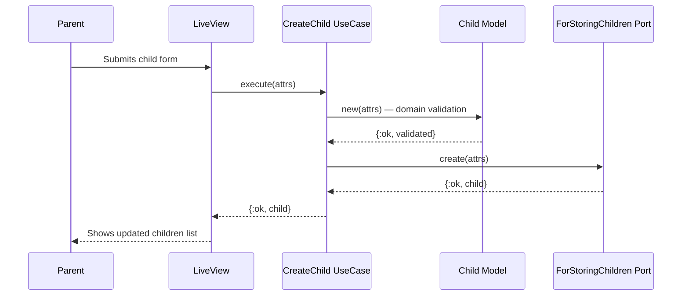

# Feature: Child Management

> **Context:** Family | **Status:** Active
> **Last verified:** abb0cf3

## Purpose

Lets parents add, edit, and remove their children's profiles. Each child record stores the information needed for program enrollment and participation — name, date of birth, emergency contact, support needs, and allergies.

## What It Does

- **Add a child** — parent fills in name, DOB, and optional details; system validates and saves
- **Edit a child** — parent updates any field; system re-validates the full child before saving
- **Delete a child** — removes the child and all associated consent records in a single transaction
- **List children** — returns all children for a parent, ordered by first name then last name
- **Get child by ID** — retrieves a single child record
- **Get children by IDs** — batch-retrieves multiple children (missing IDs silently excluded)
- **Check ownership** — verifies a child belongs to a specific parent (used by other features for authorization)
- **Form changeset** — provides LiveView-compatible changeset for real-time form validation

## What It Does NOT Do

| Out of Scope | Handled By |
|---|---|
| Consent management (photo, medical, etc.) | Family / [consent-management](consent-management.md) |
| Child attendance and session tracking | Participation context |
| Enrollment in programs | Enrollment context |
| GDPR anonymization of child data | Family / [gdpr-anonymization](gdpr-anonymization.md) |
| Child progress and achievements | Progress Tracking context (planned) |

## Business Rules

```
GIVEN a parent is creating a child
WHEN  first_name, last_name, or date_of_birth is missing
THEN  the system rejects with a validation error
```

```
GIVEN a parent is creating or editing a child
WHEN  the date of birth is today or in the future
THEN  the system rejects with "must be in the past"
```

```
GIVEN a parent is creating or editing a child
WHEN  first_name or last_name exceeds 100 characters
THEN  the system rejects with a length validation error
```

```
GIVEN a parent requests to delete a child
WHEN  the child has consent records
THEN  the system deletes all consents first, then the child (atomic transaction)
```

```
GIVEN any code checks if a child belongs to a parent
WHEN  the lookup fails for any reason (not found, DB error)
THEN  the check returns false (fail closed — never grant access on error)
```

## How It Works



## Dependencies

| Direction | Context | What |
|---|---|---|
| Requires | Accounts | Parent must be authenticated (`:authenticated` live_session) |
| Provides to | Participation | Child IDs referenced in attendance/session records |
| Provides to | Enrollment | Child data used during program enrollment |
| Provides to | Family (internal) | `child_belongs_to_parent?` used for authorization in consent management |

## Edge Cases

- **Duplicate child names** — allowed; no uniqueness constraint on child names within a parent
- **Invalid UUID for child_id** — `get_by_id` returns `{:error, :not_found}` (handled gracefully)
- **Delete non-existent child** — returns `{:error, :not_found}`; transaction is rolled back
- **Concurrent edit** — last write wins (no optimistic locking)
- **Emergency contact max length** — 255 characters, enforced at persistence layer
- **Empty optional fields** — `emergency_contact`, `support_needs`, `allergies` can be nil

## Roles & Permissions

| Role | Can Do | Cannot Do |
|---|---|---|
| Parent (authenticated) | Add, edit, delete own children; view own children list | Access another parent's children |
| Provider | Cannot access child management routes (redirected by `redirect_provider_from_parent_routes` hook) | Any child CRUD operations |
| Unauthenticated | Nothing — redirected to login | Any child operations |

---

*Generated from code. Sections marked `[NEEDS INPUT]` require manual review.*
