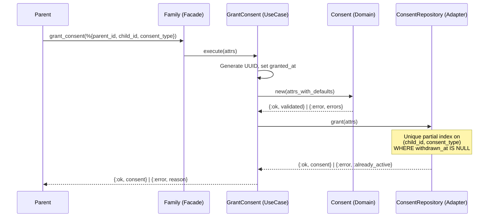
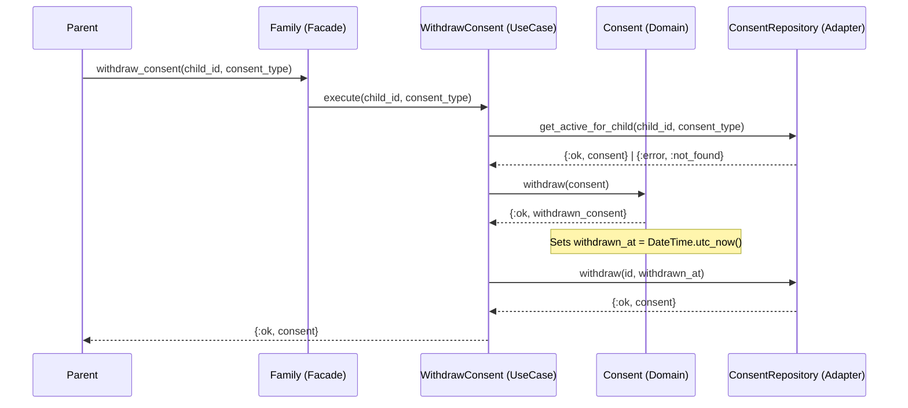

# Feature: Consent Management

> **Context:** Family | **Status:** Active
> **Last verified:** 17f796f3

## Purpose

Allows parents to grant and withdraw typed consents for their children, maintaining a full audit history of every consent change for GDPR compliance.

## What It Does

- Grant consent for a child by type (`photo_marketing`, `photo_social_media`, `medical`, `participation`, `provider_data_sharing`)
- Withdraw a previously granted consent (soft-delete via `withdrawn_at` timestamp)
- Check whether a child has an active consent of a given type
- List all active consents for a child
- Batch-check active consents of a specific type across multiple children (returns a `MapSet` of child IDs)
- List full consent history (including withdrawn) per child for GDPR data export
- Delete all consent records for a child during GDPR account anonymization

## What It Does NOT Do

| Out of Scope | Handled By |
|---|---|
| Enforce consent requirements before operations (e.g. block check-in without `provider_data_sharing`) | Consuming contexts (e.g. Participation) query the Family API |
| Define which consents are required for which operations | Each consuming context owns its own consent-gating logic |
| Notify parents about consent status changes | [NEEDS INPUT] |

## Business Rules

```
GIVEN a parent, a child, and a valid consent type
WHEN  the parent grants consent
THEN  a new consent record is created with granted_at set to now
```

```
GIVEN an active consent already exists for a (child, type) pair
WHEN  the parent grants the same consent type again
THEN  the operation returns {:error, :already_active}
      and no duplicate record is created
```

```
GIVEN an active consent exists for a (child, type) pair
WHEN  the parent withdraws consent
THEN  withdrawn_at is set to the current UTC time
      and the original record is preserved for audit history
```

```
GIVEN no active consent exists for a (child, type) pair
WHEN  the parent attempts to withdraw consent
THEN  the operation returns {:error, :not_found}
```

```
GIVEN a consent has already been withdrawn
WHEN  the domain model is asked to withdraw it again
THEN  the operation returns {:error, :already_withdrawn}
```

```
GIVEN a consent_type value not in the valid set
WHEN  a grant is attempted
THEN  domain validation rejects it with a descriptive error
```

```
GIVEN a child is being deleted (GDPR anonymization)
WHEN  anonymize_data_for_user runs
THEN  all consent records for that child are hard-deleted
      before the child's PII is anonymized
```

## How It Works

### Grant Consent



### Withdraw Consent



## Dependencies

| Direction | Context | What |
|---|---|---|
| Provides to | Participation | `children_with_active_consents/2` -- batch check for `provider_data_sharing` consent to gate child info visibility on attendance rosters |
| Provides to | GDPR (cross-cutting) | `export_data_for_user/1` includes full consent history per child; `anonymize_data_for_user/1` hard-deletes all consent records |
| Internal dep | Family / Children | Consent records reference `child_id` and `parent_id` via foreign keys |

## Edge Cases

- **Already active consent:** Granting a consent type that is already active for a child returns `{:error, :already_active}` (enforced by a unique partial index on `(child_id, consent_type) WHERE withdrawn_at IS NULL`)
- **Already withdrawn:** Calling `Consent.withdraw/1` on a consent where `withdrawn_at` is already set returns `{:error, :already_withdrawn}` at the domain level
- **No active consent to withdraw:** `WithdrawConsent` returns `{:error, :not_found}` when no active consent exists for the given child + type
- **Invalid consent type:** Domain validation rejects any `consent_type` not in `~w(provider_data_sharing photo_marketing photo_social_media medical participation)` with a descriptive error
- **Invalid UUID on withdraw lookup:** Repository returns `{:error, :not_found}` when `Ecto.UUID.dump/1` fails (malformed ID)
- **Corrupted persistence data:** `ConsentMapper.to_domain/1` raises if `@enforce_keys` are missing, crashing the process for supervisor restart (let-it-crash)
- **Child deletion cascade:** `delete_all_for_child/1` hard-deletes all consent records (active and withdrawn) to satisfy FK constraints before child anonymization

## Roles & Permissions

| Role | Can Do | Cannot Do |
|---|---|---|
| Parent | Grant and withdraw consents for their own children | Manage consents for children not in their family |
| Provider | Query consent status via Family API (e.g. `children_with_active_consents/2`) | Grant or withdraw consents |
| Admin | View consent records via Backpex admin (read-only, `ConsentSchema` exported) | Edit consent records through admin UI (no-op changeset enforced) |

---

*Generated from code. Sections marked `[NEEDS INPUT]` require manual review.*
