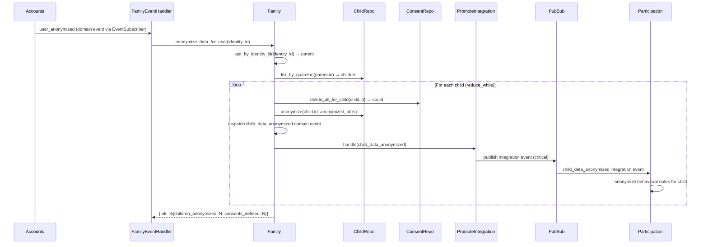
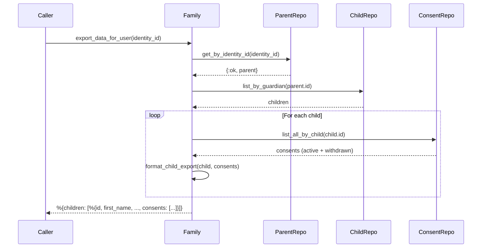

# Feature: GDPR Compliance

> **Context:** Family | **Status:** Active
> **Last verified:** 17f796f3

## Purpose

Ensures family data (children, consents) is properly anonymized on account deletion and exportable on request, fulfilling GDPR right-to-erasure and right-to-data-portability obligations within the Family bounded context.

## What It Does

- Anonymizes all child PII for a parent when their account is deleted (replaces names, clears medical/contact fields)
- Hard-deletes all consent records for each child during anonymization
- Publishes a `child_data_anonymized` critical event per child, cascading to downstream contexts
- Exports all family-owned personal data (children + consent history) as structured maps with ISO 8601 timestamps

## What It Does NOT Do

| Out of Scope | Handled By |
|---|---|
| User account anonymization (email, password, tokens) | Accounts (`AnonymizeUser` use case) |
| Participation data anonymization (behavioral notes) | Participation (`ParticipationEventHandler`) |
| Messaging data anonymization | Messaging (`MessagingEventHandler`) |
| Provider data anonymization | Provider (`ProviderEventHandler`) |
| Parent profile deletion/anonymization | [NEEDS INPUT] -- parent profile PII (display_name, phone, location) is not currently anonymized |

## Business Rules

```
GIVEN a user requests account deletion
WHEN  the Accounts context publishes a `user_anonymized` event
THEN  the FamilyEventHandler receives it and calls `Family.anonymize_data_for_user/1`
```

```
GIVEN a parent profile exists for the anonymized user
WHEN  `anonymize_data_for_user/1` runs
THEN  for EACH child belonging to that parent:
      1. All consent records are hard-deleted
      2. Child PII is replaced with anonymized placeholders
      3. A `child_data_anonymized` critical domain event is dispatched
      4. The domain event is promoted to an integration event via PubSub
```

```
GIVEN a parent profile exists for the anonymized user
WHEN  anonymization replaces child PII
THEN  the following fields are set:
      - first_name → "Anonymized"
      - last_name  → "Child"
      - date_of_birth, emergency_contact, support_needs,
        allergies, school_name, school_grade → nil
```

```
GIVEN a user has no parent profile
WHEN  `anonymize_data_for_user/1` is called
THEN  it returns {:ok, :no_data} with no side effects
```

```
GIVEN any child anonymization step fails
WHEN  processing the children list
THEN  the reduce_while loop halts and returns {:error, reason}
      (partially-processed children before the failure ARE anonymized)
```

```
GIVEN a user requests their data export
WHEN  `export_data_for_user/1` is called
THEN  all children and their full consent history (active + withdrawn)
      are returned as structured maps with ISO 8601 timestamps
```

## How It Works

### Anonymization Cascade



### Data Export



## Dependencies

| Direction | Context | What |
|---|---|---|
| Requires | Accounts | `user_anonymized` event triggers Family anonymization |
| Provides to | Participation | `child_data_anonymized` integration event triggers behavioral note anonymization |
| Provides to | [NEEDS INPUT] | Any other context holding child-keyed PII should subscribe to `child_data_anonymized` |

## Edge Cases

- **No parent profile for user** -- returns `{:ok, :no_data}`, no events published
- **Parent has no children** -- returns `{:ok, %{children_anonymized: 0, consents_deleted: 0}}`, no events published
- **Child has no consents** -- `delete_all_for_child` returns `{:ok, 0}`, anonymization proceeds normally
- **Anonymization fails mid-loop** -- `reduce_while` halts on first error; children already processed before the failure remain anonymized (no rollback). The error is returned to the event handler, which logs and propagates it
- **Event handler retry** -- `RetryHelpers.retry_and_normalize/2` retries once with 100ms backoff on transient failures; already-anonymized children are safe to re-anonymize (idempotent update)
- **Integration event publish failure** -- `dispatch_or_error` propagates the error, halting the reduce_while loop so the event handler can retry the entire operation
- **Export after anonymization** -- returns anonymized placeholder values ("Anonymized Child", nil fields) since the data was overwritten, not deleted
- **Parent profile PII not anonymized** -- [NEEDS INPUT] display_name, phone, and location on the parent profile are not currently cleared during anonymization

## Roles & Permissions

| Role | Can Do | Cannot Do |
|---|---|---|
| Automated (system) | Trigger anonymization via `user_anonymized` event | -- |
| Parent | Request account deletion (triggers cascade via Accounts) | Directly call `anonymize_data_for_user` |
| Parent | Request data export (via [NEEDS INPUT] -- no web endpoint yet) | Export other users' data |
| Admin | [NEEDS INPUT] | [NEEDS INPUT] |

## Key Files

| File | Role |
|---|---|
| `lib/klass_hero/family.ex` | Public API: `anonymize_data_for_user/1`, `export_data_for_user/1` |
| `lib/klass_hero/family/domain/models/child.ex` | `anonymized_attrs/0` defines PII replacement values |
| `lib/klass_hero/family/domain/events/family_events.ex` | `child_data_anonymized/3` domain event factory |
| `lib/klass_hero/family/domain/events/family_integration_events.ex` | `child_data_anonymized/3` integration event factory |
| `lib/klass_hero/family/adapters/driven/events/family_event_handler.ex` | Subscribes to `user_anonymized`, calls `anonymize_data_for_user/1` |
| `lib/klass_hero/family/adapters/driven/events/event_handlers/promote_integration_events.ex` | Promotes domain events to integration events via PubSub |
| `lib/klass_hero/family/adapters/driven/persistence/repositories/child_repository.ex` | `anonymize/2` updates child with anonymized attrs |
| `lib/klass_hero/family/adapters/driven/persistence/repositories/consent_repository.ex` | `delete_all_for_child/1` hard-deletes all consent records |

---

*Generated from code. Sections marked `[NEEDS INPUT]` require manual review.*
