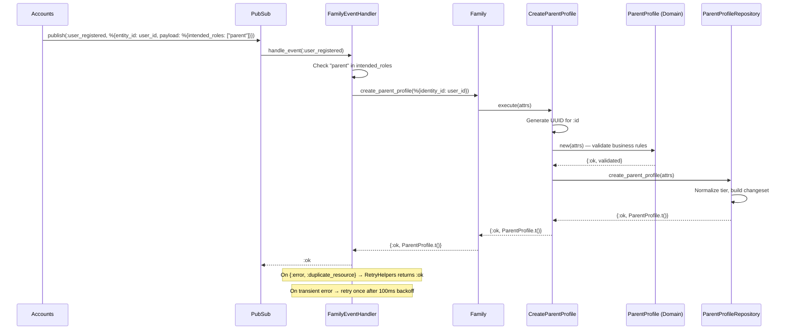

# Feature: Parent Profile Creation

> **Context:** Family | **Status:** Active
> **Last verified:** 17f796f3

## Purpose

Automatically creates a parent profile when a new user registers with the "parent" role, including generating a unique referral code. This eliminates manual profile setup and ensures every parent has a profile ready immediately after registration.

## What It Does

- Reacts to `user_registered` events from the Accounts context
- Creates a parent profile linked to the user via `identity_id` correlation (not a foreign key)
- Assigns the default subscription tier (`:explorer`)
- Generates a referral code in `FIRSTNAME-LOCATION-YY` format (e.g., `MARIA-BERLIN-26`)
- Handles duplicate creation idempotently (returns `:ok` if profile already exists)
- Retries once with backoff on transient failures

## What It Does NOT Do

| Out of Scope | Handled By |
|---|---|
| Updating an existing parent profile | [NEEDS INPUT] |
| Managing children under a parent | Family / Child Management |
| Consent and GDPR data management | Family / Consent Management |
| User registration and authentication | Accounts |
| Referral code redemption or reward tracking | [NEEDS INPUT] |

## Business Rules

```
GIVEN a user_registered event with "parent" in intended_roles
WHEN  the Family event handler receives the event
THEN  a new parent profile is created with identity_id = user_id
  AND subscription_tier defaults to :explorer
```

```
GIVEN a user_registered event WITHOUT "parent" in intended_roles
WHEN  the Family event handler receives the event
THEN  no parent profile is created (event is ignored)
```

```
GIVEN a parent profile already exists for identity_id
WHEN  a duplicate creation is attempted
THEN  the repository returns {:error, :duplicate_resource}
  AND RetryHelpers normalizes this to :ok (idempotent)
```

```
GIVEN a user name (e.g., "Maria Schmidt")
WHEN  a referral code is generated
THEN  the code follows FIRSTNAME-LOCATION-YY format
  AND the first name is extracted (split on first space)
  AND the first name is uppercased
  AND location defaults to "BERLIN" when not provided
  AND YY is the last two digits of the current UTC year
```

```
GIVEN a parent profile
WHEN  it is persisted to the database
THEN  identity_id must be present, non-empty, and unique (DB constraint)
  AND display_name, if present, must be 1-100 characters
  AND phone, if present, must be 1-20 characters
  AND location, if present, must be 1-200 characters
  AND subscription_tier must be "explorer" or "active"
```

## How It Works



## Dependencies

| Direction | Context | What |
|---|---|---|
| Requires | Accounts | `user_registered` domain event (entity_id = user_id, payload.intended_roles) |
| Requires | Shared | `RetryHelpers` for retry-with-backoff and idempotent duplicate handling |
| Requires | Shared | `SubscriptionTiers` for valid parent tier validation |
| Provides to | [NEEDS INPUT] | Referral code (currently generated but not persisted on the profile) |

## Edge Cases

- **Duplicate creation**: If a profile already exists for the `identity_id`, the repository returns `{:error, :duplicate_resource}`. `RetryHelpers.retry_with_backoff/2` treats this as idempotent success (`:ok`).
- **Non-parent registration**: When `intended_roles` does not include `"parent"`, the handler returns `:ignore` and no profile is created.
- **Missing intended_roles**: If the event payload has no `intended_roles` key, `Map.get/3` defaults to `[]`, so no profile is created.
- **Missing user name for referral code**: `ReferralCodeGenerator.generate/2` requires a binary `name` argument (guarded). If an empty or non-binary name is passed, it will fail. The current event handler does not pass name to the generator — referral codes are generated separately. [NEEDS INPUT: where/when is the referral code actually persisted?]
- **Transient DB failure**: The handler retries the operation once with a 100ms backoff before returning the error.
- **Validation failure**: If domain validation fails (e.g., empty `identity_id`), the use case returns `{:error, {:validation_error, errors}}` without persisting.

## Roles & Permissions

| Role | Can Do | Cannot Do |
|---|---|---|
| System (event-driven) | Auto-create parent profile on registration | — |
| Parent | Has profile created automatically | Directly invoke profile creation |
| Provider | N/A | Create parent profiles |
| Admin | [NEEDS INPUT] | [NEEDS INPUT] |

## Key Files

| Layer | File |
|---|---|
| Domain Model | `lib/klass_hero/family/domain/models/parent_profile.ex` |
| Domain Port | `lib/klass_hero/family/domain/ports/for_storing_parent_profiles.ex` |
| Domain Service | `lib/klass_hero/family/domain/services/referral_code_generator.ex` |
| Use Case | `lib/klass_hero/family/application/use_cases/parents/create_parent_profile.ex` |
| Ecto Schema | `lib/klass_hero/family/adapters/driven/persistence/schemas/parent_profile_schema.ex` |
| Repository | `lib/klass_hero/family/adapters/driven/persistence/repositories/parent_profile_repository.ex` |
| Mapper | `lib/klass_hero/family/adapters/driven/persistence/mappers/parent_profile_mapper.ex` |
| Event Handler | `lib/klass_hero/family/adapters/driven/events/family_event_handler.ex` |
| Public API | `lib/klass_hero/family.ex` |

---

*Generated from code. Sections marked `[NEEDS INPUT]` require manual review.*
