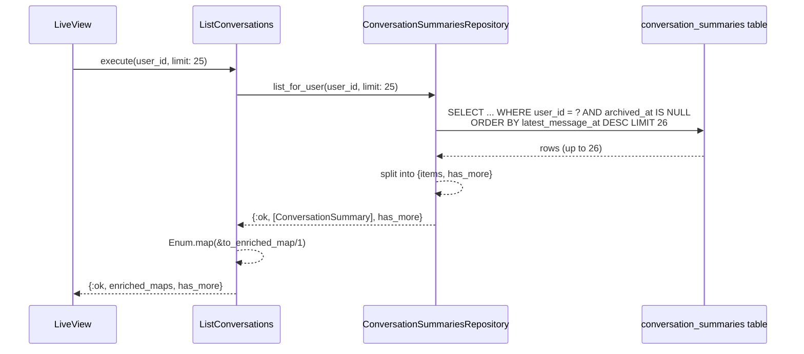
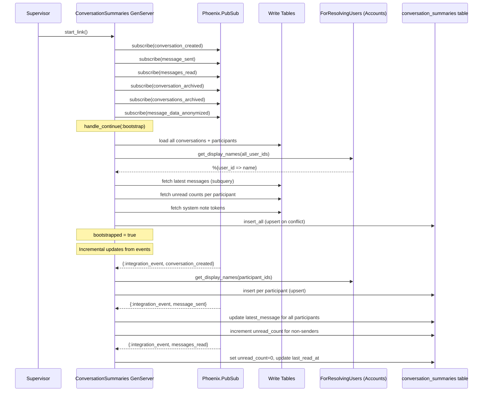

# Feature: Conversation Listing and CQRS

> **Context:** Messaging | **Status:** Active
> **Last verified:** 17f796f3

## Purpose

Provides users with a fast, paginated inbox of their conversations by maintaining a denormalized read model (CQRS projection). Instead of joining write-side tables on every page load, the system keeps a pre-computed `conversation_summaries` table that is updated asynchronously via integration events and bootstrapped from write tables on cold start.

## What It Does

- **List conversations for a user** -- the `ListConversations` use case reads from the `conversation_summaries` read table, returning an enriched map per conversation with unread count, latest message preview, and the other participant's display name.
- **Maintain a CQRS read model** -- a `ConversationSummaries` GenServer projection subscribes to six Messaging integration event topics and incrementally updates the read table (one row per user-per-conversation).
- **Bootstrap on cold start** -- on init the projection rebuilds the entire read table from the write-side tables (`conversations`, `conversation_participants`, `messages`, `users`) using upsert semantics.
- **Subscribe-before-bootstrap** -- PubSub subscriptions are registered in `init/1` *before* the bootstrap runs in `handle_continue/2`, ensuring no events are lost between bootstrap completion and subscription.
- **Resolve display names** -- the projection calls the `ForResolvingUsers` port (backed by the Accounts context) to look up participant names during bootstrap and on `conversation_created` events.
- **Limit-plus-one pagination** -- the repository fetches `limit + 1` rows and derives a `has_more` boolean, avoiding a separate COUNT query.
- **Total unread count** -- `get_total_unread_count/1` sums `unread_count` across all non-archived summaries for a user (used for badge/notification counts).
- **System note token tracking** -- stores broadcast tokens in a `system_notes` JSONB column for idempotent deduplication of system messages, with both synchronous write-through and asynchronous event projection paths.

## What It Does NOT Do

| Out of Scope | Handled By |
|---|---|
| Sending messages | `SendMessage` / `SendBroadcast` use cases |
| Archiving conversations | `ArchiveConversation` use case, projects via `:conversation_archived` / `:conversations_archived` events |
| Message pagination within a conversation | `GetConversation` use case |
| Marking messages as read | `MarkAsRead` use case (projects via `:messages_read` event) |
| Full-text search of messages | Not yet implemented |
| Real-time LiveView push of new messages to the inbox | [NEEDS INPUT] |

## Business Rules

```
GIVEN a user has conversations they participate in
WHEN  ListConversations.execute/2 is called with their user_id
THEN  only non-archived summaries for that user are returned,
      ordered by latest_message_at descending (most recent first)
```

```
GIVEN a conversation_created integration event is published
WHEN  the ConversationSummaries projection receives it
THEN  one summary row is inserted per active participant,
      with other_participant_name resolved for direct conversations
      and nil for broadcast conversations
```

```
GIVEN a message_sent integration event is published
WHEN  the projection processes it
THEN  latest_message_content, latest_message_sender_id, and latest_message_at
      are updated for ALL participants,
      AND unread_count is incremented by 1 for non-sender participants only
```

```
GIVEN a messages_read integration event is published
WHEN  the projection processes it
THEN  unread_count is set to 0 and last_read_at is updated
      for the specific {conversation_id, user_id} row
```

```
GIVEN the GenServer starts (cold start or supervisor restart)
WHEN  init/1 runs
THEN  PubSub subscriptions are established FIRST,
      THEN handle_continue(:bootstrap) rebuilds all summary rows
      from the write tables using upsert (on_conflict replace)
```

```
GIVEN bootstrap fails due to a transient DB error
WHEN  the retry count is <= 3
THEN  a retry is scheduled with exponential backoff (5s * retry_count)
```

```
GIVEN bootstrap fails and retry count exceeds 3
WHEN  the next retry would be attempt 4
THEN  the GenServer crashes, delegating restart to its supervisor
```

```
GIVEN a message_data_anonymized event is published (GDPR)
WHEN  the projection processes it
THEN  other_participant_name is set to "Deleted User"
      on all summary rows where the anonymized user was the other participant
```

```
GIVEN a system message with a broadcast token is sent
WHEN  the projection processes the message_sent event
THEN  the token is merged into the system_notes JSONB column
      using idempotent JSONB || merge (safe for replays)
```

## How It Works

### Inbox Listing Flow



### Projection Bootstrap and Event Flow



## Dependencies

| Direction | Context | What |
|---|---|---|
| Requires | Accounts (via `ForResolvingUsers` port) | Display names for participant resolution (`get_display_names/1`) |
| Requires | Shared (`IntegrationEvent`) | Standardized event struct for PubSub messaging |
| Requires | Phoenix.PubSub | Subscription to six `integration:messaging:*` topics |
| Self-subscribes | Messaging (own context) | The projection consumes events emitted by the same bounded context's write-side use cases |
| Provides to | Messaging Web Layer | Enriched conversation list maps and `has_more` pagination flag for LiveView inbox |

## Edge Cases

- **Bootstrap failure (transient DB outage)** -- retries up to 3 times with exponential backoff (5s, 10s, 15s). After 3 failures the GenServer crashes, letting its supervisor handle restart with its own strategy.
- **Events arriving during bootstrap** -- subscribe-before-bootstrap guarantees no events are missed. Events that arrive during the bootstrap window are queued in the GenServer mailbox and processed after `handle_continue` completes. Upsert semantics prevent duplicate rows.
- **Stale summaries after crash** -- if the projection process crashes mid-update, the next bootstrap will rebuild all rows from the authoritative write tables, correcting any staleness.
- **Deleted / anonymized users (GDPR)** -- `message_data_anonymized` event replaces `other_participant_name` with "Deleted User" for all rows where the anonymized user was the counterpart. The anonymized user's own summary rows are not modified (they will be inaccessible after account deletion).
- **Unknown conversation_type in read model** -- `ListConversations` logs a warning and defaults to `:direct` to prevent crashes in downstream templates.
- **Write-through races with projection** -- `write_system_note_token/2` may execute before the projection creates summary rows. If `update_all` affects 0 rows, it seeds minimal summary rows carrying the token. The projection's subsequent upsert merges the remaining fields via JSONB `||` merge, preserving tokens from both paths.
- **Duplicate system note tokens on replay** -- system note projection uses JSONB `||` merge with deterministic event timestamps, making repeated event processing truly idempotent.
- **Empty inbox** -- if a user has no conversations, the repository returns `{:ok, [], false}`.

## Roles & Permissions

| Role | Can Do | Cannot Do |
|---|---|---|
| Any authenticated user | List their own conversations; see their own unread counts | List another user's conversations; see another user's unread counts |
| Parent | See conversations where they are a participant | See provider-only or admin conversations |
| Provider | See conversations where they are a participant | See other providers' conversations |
| Admin | [NEEDS INPUT] | [NEEDS INPUT] |

The `ListConversations` use case scopes all queries by `user_id` -- the repository's `WHERE user_id = ?` clause is the fundamental access control gate. There is no admin override path in the current implementation.

---

*Generated from code. Sections marked `[NEEDS INPUT]` require manual review.*
