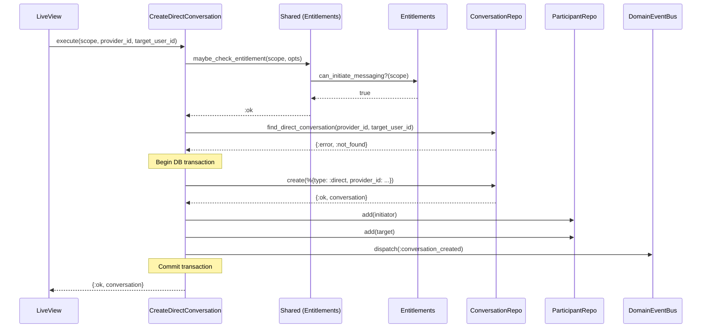
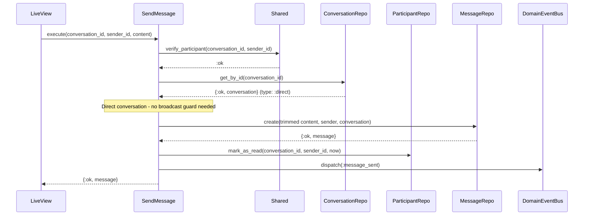

# Feature: Direct Conversations

> **Context:** Messaging | **Status:** Active
> **Last verified:** 29282b56

## Purpose

Direct conversations let providers and parents exchange private 1-on-1 messages about a child's activities, scheduling, or other individual concerns. The feature ensures that only users on a qualifying subscription tier can start a conversation, while still allowing free-tier parents to reply when a provider reaches out first.

## What It Does

- Creates a private 1-on-1 conversation between a provider and a parent
- Returns the existing conversation if one already exists between the same pair (idempotent creation)
- Gates conversation initiation behind a subscription-tier entitlement check
- Allows the entitlement check to be bypassed when a parent replies privately to a broadcast (provider already initiated contact)
- Adds both parties as participants inside a database transaction
- Sends text messages within a conversation after verifying the sender is a participant
- Blocks non-provider users from sending messages in broadcast conversations (privacy guard)
- Trims whitespace from message content before persisting
- Updates the sender's `last_read_at` on send (they have seen what they wrote)
- Publishes `conversation_created` and `message_sent` domain events for real-time LiveView updates
- Publishes corresponding integration events for cross-context consumers (CQRS projections)

## What It Does NOT Do

| Out of Scope | Handled By |
|---|---|
| Program broadcast creation and enrollment-based participant sync | `program-broadcasts` feature |
| Archiving conversations when programs end | `lifecycle-and-retention` feature |
| Retention policy enforcement and hard deletion | `lifecycle-and-retention` feature |
| Read receipts and unread count tracking | `read-tracking` feature (ForManagingParticipants port) |
| GDPR message anonymization and participant removal | `gdpr-anonymization` feature |
| User display name resolution for UI rendering | ForResolvingUsers port / Accounts context adapter |

## Business Rules

```
GIVEN a user with an "active" parent tier OR "professional"/"business_plus" provider tier
WHEN  they request a direct conversation with another user
THEN  the conversation is created (or the existing one is returned)
```

```
GIVEN a user with an "explorer" parent tier and no qualifying provider tier
WHEN  they request a direct conversation
THEN  the request is rejected with :not_entitled
```

```
GIVEN a provider previously sent a broadcast to enrolled parents
WHEN  a free-tier parent replies privately to that broadcast
THEN  the entitlement check is skipped (skip_entitlement_check: true)
  AND a direct conversation is created between the provider and the parent
```

```
GIVEN a direct conversation already exists between a provider and a user
WHEN  a new direct conversation is requested for the same pair
THEN  the existing conversation is returned without creating a duplicate
```

```
GIVEN a user is a participant in a direct conversation
WHEN  they send a message with non-empty content (max 10,000 characters)
THEN  the message is created, their last_read_at is updated, and a message_sent event is published
```

```
GIVEN a user is NOT a participant in a conversation
WHEN  they attempt to send a message
THEN  the request is rejected with :not_participant
```

```
GIVEN a conversation is of type :program_broadcast
WHEN  a non-provider user attempts to send a message
THEN  the request is rejected with :broadcast_reply_not_allowed
```

```
GIVEN message content is empty or exceeds 10,000 characters
WHEN  a message is validated
THEN  the message is rejected with a validation error
```

## How It Works

### Create Direct Conversation (happy path)



### Send Message (happy path)



## Dependencies

| Direction | Context | What |
|---|---|---|
| Requires | Entitlements | `can_initiate_messaging?/1` -- checks subscription tier before allowing conversation creation |
| Requires | Accounts | `Scope` struct used to identify the current user and carry profile data for entitlement checks |
| Requires | Accounts (via ForResolvingUsers port) | `get_user_id_for_provider/1` -- resolves provider profile ID to user ID for broadcast send-permission checks |
| Provides to | Any (via DomainEventBus) | `conversation_created` and `message_sent` domain events for real-time PubSub |
| Provides to | Any (via IntegrationEvents) | `conversation_created` and `message_sent` integration events for CQRS projections |

## Edge Cases

- **Idempotent creation**: If `find_direct_conversation` returns an existing conversation, it is returned immediately; no duplicate is created and no event is published.
- **Transaction rollback on participant failure**: Both participants are added inside a single Ecto transaction. If either `add` fails, the entire conversation creation rolls back.
- **Broadcast send guard with pre-fetched conversation**: `SendMessage` accepts an optional pre-fetched `conversation` in opts to skip a DB round-trip, but validates that `conversation.id == conversation_id` before trusting it. A mismatched struct is discarded and the conversation is fetched from DB instead.
- **Sender read-status failure is non-fatal**: If `mark_as_read` fails after a message is sent, the failure is logged as a warning but the message send still succeeds.
- **Message content trimmed before persist**: Leading and trailing whitespace is stripped from message content. An all-whitespace message fails validation ("content cannot be empty").
- **Message content length**: Content exceeding 10,000 characters is rejected at the domain model validation layer.
- **Missing required fields**: The domain model constructors (`Conversation.new/1`, `Message.new/1`, `Participant.new/1`) return `{:error, [reasons]}` for missing or invalid fields.
- **Provider ID resolution failure**: If `get_user_id_for_provider` returns `{:error, :not_found}` during the broadcast send-permission check, the send is rejected with `:broadcast_reply_not_allowed`.

## Roles & Permissions

| Role | Can Do | Cannot Do |
|---|---|---|
| Provider (professional / business_plus) | Initiate direct conversations; send messages in any conversation they participate in; send messages in their own broadcast conversations | Reply to another provider's broadcast |
| Provider (starter) | Send messages in conversations they already participate in | Initiate new direct conversations (blocked by entitlement check) |
| Parent (active) | Initiate direct conversations; send messages in conversations they participate in | Send messages in broadcast conversations (read-only for parents) |
| Parent (explorer / free) | Reply privately to a broadcast (entitlement check skipped); send messages in existing direct conversations they participate in | Initiate new direct conversations (blocked by entitlement check); send messages in broadcast conversations |

---

*Generated from code. Sections marked `[NEEDS INPUT]` require manual review.*
