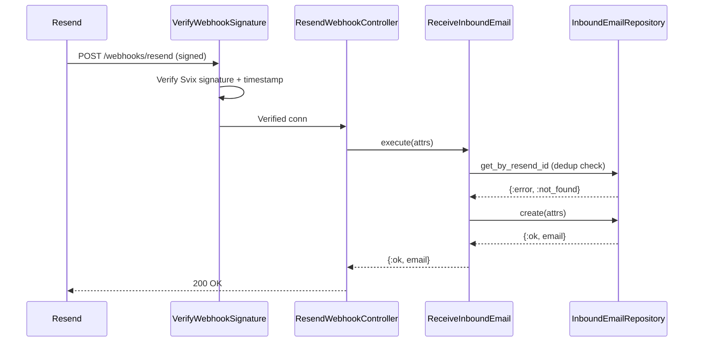
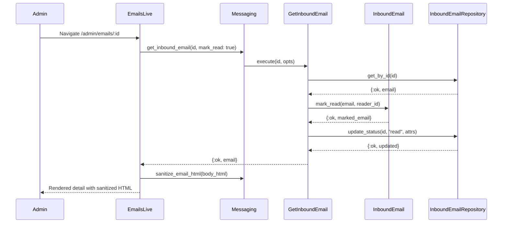

# Feature: Inbound Email Receiving

> **Context:** Messaging | **Status:** Active
> **Last verified:** 08f77b6c

## Purpose

Allows admins to receive, view, and reply to inbound emails sent to the platform's shared address (via Resend webhooks). Provides a secure admin inbox with HTML sanitization, status tracking, and email threading.

## What It Does

- Receives inbound emails via Resend webhook (`POST /webhooks/resend`) with Svix-protocol signature verification
- Deduplicates webhook deliveries by `resend_id` (idempotent, handles concurrent retries)
- Stores email metadata, HTML body, plain text body, and headers
- Provides an admin inbox UI at `/admin/emails` with status filtering (unread/read/archived)
- Renders sanitized email HTML: strips `<script>`, event handlers, and `<iframe>` tags; blocks external images (tracking pixel protection); adds `target="_blank"` and `rel="noopener noreferrer"` to links
- Supports "Load images" toggle to opt-in to external image display
- Auto-marks emails as read when an admin opens the detail view
- Allows archiving emails and marking them back as unread
- Sends replies via Swoosh/Resend with proper `In-Reply-To` and `References` headers for email threading
- Shows unread count badge in the admin sidebar

## What It Does NOT Do

| Out of Scope | Handled By |
|---|---|
| Routing inbound emails to specific providers or parents | Manual admin triage (future feature) |
| Automated email responses or auto-replies | Not implemented |
| Attachment storage or display | Not implemented — only HTML/text body stored |
| Email-to-conversation threading (linking inbound emails to existing Messaging conversations) | Separate feature (inbound emails are standalone) |
| Email forwarding or delegation | Not implemented |

## Business Rules

```
GIVEN a Resend webhook delivers an email.received event
WHEN  the resend_id has not been seen before
THEN  the email is stored with status :unread
```

```
GIVEN a Resend webhook delivers an email.received event
WHEN  the resend_id already exists (or a concurrent insert hits the unique constraint)
THEN  the webhook returns 200 OK without creating a duplicate
```

```
GIVEN an admin opens an unread email detail
WHEN  mark_read: true is passed with a reader_id
THEN  the domain model transitions the email to :read (idempotent — already-read emails are unchanged)
```

```
GIVEN an admin opens an archived email
WHEN  mark_read: true is passed
THEN  the email status remains :archived (archived emails cannot transition to :read)
```

```
GIVEN an admin submits a reply to an inbound email
WHEN  the original email has a Message-ID header
THEN  the reply includes In-Reply-To and References headers for email threading
```

```
GIVEN inbound email HTML contains <script>, event handlers, or <iframe> tags
WHEN  the email is rendered in the admin detail view
THEN  dangerous content is stripped; only safe HTML survives
```

```
GIVEN inbound email HTML contains external images
WHEN  the admin has not clicked "Load images"
THEN  images are replaced with [image blocked] placeholder
```

## How It Works

### Webhook Receiving



### Admin Inbox Flow



## Dependencies

| Direction | Context | What |
|---|---|---|
| Requires | Accounts | Admin role check via `:require_admin` on_mount hook |
| Requires | External (Resend) | Webhook delivery of `email.received` events |
| Requires | External (Resend/Swoosh) | Email sending for replies via `KlassHero.Mailer` |
| Requires | hex: html_sanitize_ex | HTML sanitization (strips dangerous tags and attributes) |

## Edge Cases

- **Concurrent webhook retries**: Two simultaneous deliveries of the same email both pass the `get_by_resend_id` check. The second `create` hits the unique constraint on `resend_id` and is caught as `{:ok, :duplicate}` rather than failing.
- **Malformed webhook secret**: If `RESEND_WEBHOOK_SECRET` is not valid base64, the plug returns 401 instead of crashing with `ArgumentError`.
- **Missing webhook headers**: If any Svix header (`svix-id`, `svix-timestamp`, `svix-signature`) is absent, the plug returns 401.
- **Replay attack**: Webhook timestamps older than 5 minutes are rejected.
- **Large email bodies**: `CacheRawBody` plug handles chunked body reads via recursive accumulation.
- **Invalid UUID in URL**: `/admin/emails/not-a-uuid` redirects to index with error flash (UUID validated before repo query).
- **Nil body_html**: Sanitizer returns empty string for nil input; detail view falls back to plain text body.
- **Non-matching status filter**: Tampered `phx-value-status` params are silently ignored (parse returns nil, showing all emails).

## Roles & Permissions

| Role | Can Do | Cannot Do |
|---|---|---|
| Admin | View inbox, read emails, reply, archive, mark unread, load images | — |
| Provider | — | Access `/admin/emails` (redirected to login) |
| Parent | — | Access `/admin/emails` (redirected to login) |
| Unauthenticated | — | Access any admin route |

---

*Generated from code. Sections marked `[NEEDS INPUT]` require manual review.*
