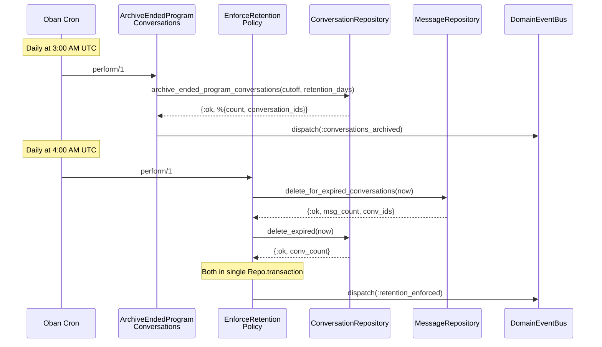
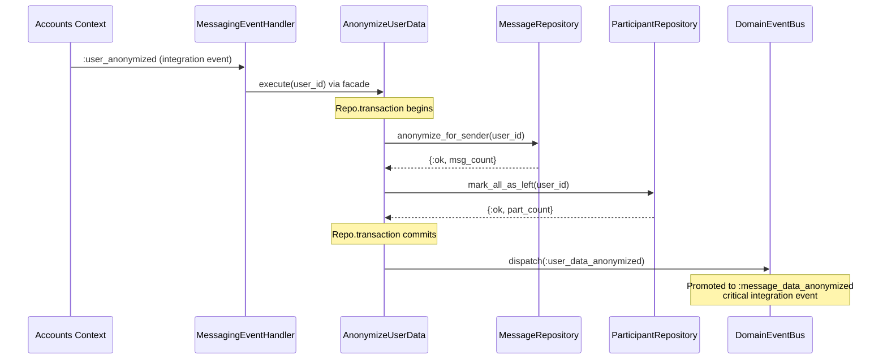

# Feature: Lifecycle and Retention

> **Context:** Messaging | **Status:** Active
> **Last verified:** 17f796f3

## Purpose

Manages the end-of-life pipeline for messaging data: automatically archiving conversations when their associated program ends, permanently deleting expired data after a retention window, and anonymizing a user's messaging footprint for GDPR compliance.

## What It Does

- Archives `program_broadcast` conversations once their program has ended for a configurable number of days (default 30)
- Sets a `retention_until` deadline on each archived conversation (default 30 days after archival)
- Permanently deletes messages and conversations that have exceeded their retention period
- Anonymizes a user's message content to `"[deleted]"` and marks all their participations as left, triggered by a cross-context `user_anonymized` event from Accounts
- Publishes domain events (`conversations_archived`, `retention_enforced`, `user_data_anonymized`) for auditability and cross-context notification
- Promotes `user_data_anonymized` to a `message_data_anonymized` critical integration event for downstream contexts

## What It Does NOT Do

| Out of Scope | Handled By |
|---|---|
| Creating, sending, or reading messages | Messaging context core features (Direct Conversations, Program Broadcasts) |
| Deciding when a program has ended | Program Catalog context (provides program end dates) |
| Initiating GDPR account deletion | Accounts context (`AnonymizeUser` use case emits `user_anonymized`) |
| Archiving or deleting individual messages on demand | Not currently supported |
| Manual conversation archival by users | Not currently supported |

## Business Rules

```
GIVEN a program_broadcast conversation exists for a program
WHEN  the program ended more than 30 days ago (configurable via :days_after_program_end)
THEN  the conversation is archived (archived_at set to now)
  AND retention_until is set to 30 days from now (configurable via :retention_period_days)
  AND a conversations_archived domain event is published with reason :program_ended
```

```
GIVEN an archived conversation whose retention_until is in the past
WHEN  the retention policy worker runs
THEN  all messages belonging to that conversation are permanently deleted
  AND the conversation record itself is permanently deleted
  AND both deletions happen inside a single database transaction
  AND a retention_enforced domain event is published
```

```
GIVEN a user whose account is being anonymized (GDPR)
WHEN  the Messaging context receives a :user_anonymized integration event
THEN  all messages sent by that user have their content replaced with "[deleted]"
  AND all active participations for that user are marked as left (left_at set)
  AND both operations happen inside a single database transaction
  AND a user_data_anonymized domain event is published
  AND that event is promoted to a message_data_anonymized critical integration event
```

```
GIVEN no programs have ended within the archival window
WHEN  the archive worker runs
THEN  zero conversations are archived and no event is published
```

```
GIVEN a GDPR anonymization transaction where message anonymization succeeds
WHEN  the participant mark-as-left step fails
THEN  the entire transaction is rolled back (no partial anonymization)
  AND an error is returned with the failing step tagged (e.g. {:mark_as_left, reason})
```

## How It Works





## Dependencies

| Direction | Context | What |
|---|---|---|
| Requires | Program Catalog | Program end dates used to determine archival cutoff (queried via `archive_ended_program_conversations` repository method) |
| Requires | Accounts | `user_anonymized` critical integration event triggers GDPR anonymization |
| Provides to | Any subscriber | `message_data_anonymized` critical integration event signals messaging data has been anonymized |
| Provides to | Internal | `conversations_archived`, `retention_enforced`, `user_data_anonymized` domain events for audit/observability |

## Edge Cases

- **No ended programs**: Archive worker completes with `count: 0`, logs a debug message, no domain event is published
- **No expired conversations**: Retention worker still runs the transaction but deletes zero rows; the `retention_enforced` event is published with zeroed counters
- **Partial anonymization prevented**: Message anonymization and participant updates run in a single `Repo.transaction`; if either step fails, the entire transaction rolls back. Errors are tagged with the failing step name (`:anonymize_messages` or `:mark_as_left`) for traceability
- **Retry on transient failure**: The event handler wraps `anonymize_data_for_user` in `RetryHelpers.retry_and_normalize/2` with 100ms backoff for transient database errors
- **Worker failure**: Both Oban workers are configured with `max_attempts: 3` on the `:cleanup` queue (concurrency 2), so transient failures are retried automatically
- **Configurable windows**: Both `days_after_program_end` and `retention_period_days` are read from application config (`:klass_hero, :messaging, :retention`) with hardcoded fallback defaults of 30 days each
- **Already-archived conversations**: The archive query targets only non-archived `program_broadcast` conversations, so re-running the worker is idempotent

## Roles & Permissions

| Role | Can Do | Cannot Do |
|---|---|---|
| System (Oban workers) | Archive ended program conversations, delete expired data | N/A -- automated, no user trigger |
| System (Event handler) | Anonymize user messaging data in response to `user_anonymized` event | N/A -- triggered by Accounts context |
| Parent / Provider / Admin | No direct interaction with lifecycle or retention | Trigger archival, deletion, or anonymization manually |

All lifecycle and retention operations are fully automated. There are no user-facing actions or API endpoints for this feature.

---

*Generated from code. Sections marked `[NEEDS INPUT]` require manual review.*
