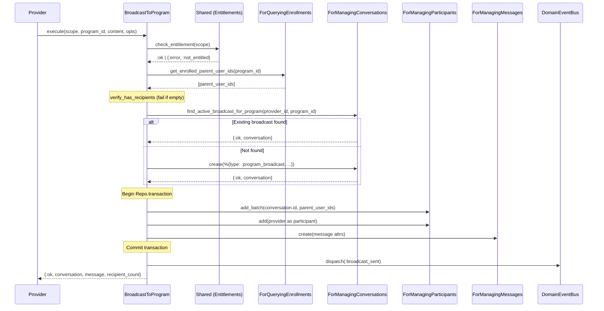
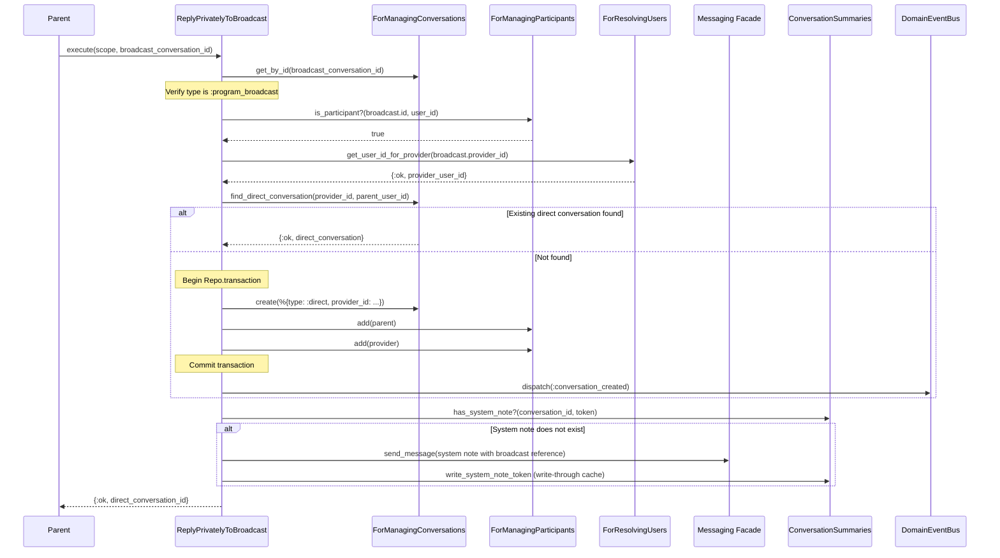

# Feature: Program Broadcasts

> **Context:** Messaging | **Status:** Active
> **Last verified:** 17f796f3

## Purpose

Program Broadcasts let providers send a single message to every parent enrolled in a program, and let parents reply privately to the provider without exposing the conversation to other recipients.

## What It Does

- Creates (or reuses) a `:program_broadcast` conversation tied to a specific program
- Queries the Enrollment context for all parents with active enrollments (`pending` or `confirmed`) and adds them as participants in batch
- Delivers the provider's message to all enrolled parents in one operation
- Allows any parent who is a participant in the broadcast to initiate a private `:direct` conversation with the provider
- Inserts an idempotent system note (`[broadcast:<id>] Re: <subject>`) in the direct conversation so the provider sees which broadcast prompted the reply
- Publishes `broadcast_sent` and `conversation_created` domain events for real-time LiveView updates
- Gates broadcast creation behind the provider's subscription tier entitlement (`can_initiate_messaging?`)

## What It Does NOT Do

| Out of Scope | Handled By |
|---|---|
| Direct 1-on-1 conversations initiated by provider | `CreateDirectConversation` use case |
| Sending follow-up messages in existing conversations | `SendMessage` (Messaging facade) |
| Archival of broadcast conversations when programs end | `ArchiveEndedProgramConversations` use case + retention scheduler |
| Retention policy enforcement and hard deletion | `EnforceRetention` use case |
| Push notifications / email delivery of messages | [NEEDS INPUT] - Notification delivery system |
| Editing or deleting a sent broadcast message | Not supported |

## Business Rules

```
GIVEN a provider with a `professional` or `business_plus` subscription tier
WHEN  the provider sends a broadcast to a program
THEN  the system creates a program_broadcast conversation (or reuses the existing active one)
  AND adds all enrolled parents plus the provider as participants
  AND delivers the message to the conversation
  AND publishes a broadcast_sent event with the recipient count
```

```
GIVEN a provider with a `starter` subscription tier
WHEN  the provider attempts to send a broadcast
THEN  the system returns {:error, :not_entitled}
  AND no conversation or message is created
```

```
GIVEN a program with zero active enrollments
WHEN  a provider sends a broadcast to that program
THEN  the system returns {:error, :no_enrollments}
  AND no conversation or message is created
```

```
GIVEN an active broadcast conversation already exists for a provider + program pair
WHEN  the provider sends another broadcast to the same program
THEN  the system reuses the existing conversation (no duplicate created)
  AND adds any newly enrolled parents as participants
  AND delivers the new message to that conversation
```

```
GIVEN a race condition where two broadcast requests arrive simultaneously
WHEN  both try to create a conversation for the same provider + program
THEN  one succeeds with create, the other hits :duplicate_broadcast
  AND the loser re-queries and reuses the winner's conversation
```

```
GIVEN a parent who is a participant in a broadcast conversation
WHEN  the parent taps "Reply privately"
THEN  the system finds or creates a :direct conversation between that parent and the broadcast's provider
  AND inserts exactly one system note referencing the broadcast (deduplicated by [broadcast:<id>] token)
  AND returns the direct conversation ID for navigation
```

```
GIVEN a parent who taps "Reply privately" multiple times on the same broadcast
WHEN  the system checks for an existing system note token
THEN  no duplicate system note is inserted (idempotent)
```

```
GIVEN a user who is NOT a participant in the broadcast conversation
WHEN  that user attempts to reply privately
THEN  the system returns {:error, :not_participant}
```

```
GIVEN a conversation ID that does not correspond to a :program_broadcast type
WHEN  a user attempts to reply privately to it
THEN  the system returns {:error, :not_broadcast}
```

```
GIVEN a message content string
WHEN  it is empty or whitespace-only
THEN  the domain model rejects it with a validation error
```

```
GIVEN a message content string longer than 10,000 characters
WHEN  validation runs
THEN  the domain model rejects it with "content cannot exceed 10000 characters"
```

## How It Works

### Broadcast to Program



### Reply Privately to Broadcast



## Dependencies

| Direction | Context | What |
|---|---|---|
| Requires | Enrollment | `ForQueryingEnrollments` port -- fetches enrolled parent user IDs and checks enrollment status |
| Requires | Entitlements | `can_initiate_messaging?/1` -- gates broadcast creation by subscription tier |
| Requires | Accounts | `Scope` struct for authentication identity; user ID resolution for provider |
| Provides to | LiveView (Web) | `broadcast_sent` and `conversation_created` domain events via PubSub |
| Provides to | CQRS Projections | `conversation_created` and `message_sent` integration events for read-model updates |

## Edge Cases

- **Empty enrollment list**: Returns `{:error, :no_enrollments}` before creating any conversation or message. No side effects.
- **Duplicate broadcast race condition**: If two requests race to create a broadcast for the same provider+program, the loser receives `:duplicate_broadcast` from the unique constraint and gracefully re-queries to reuse the winner's conversation.
- **Non-participant attempting private reply**: Returns `{:error, :not_participant}` via `Shared.verify_participant/3`.
- **Non-broadcast conversation ID passed to reply**: Pattern-matched and rejected with `{:error, :not_broadcast}`.
- **Repeated "Reply privately" taps**: System note insertion is deduplicated via `[broadcast:<id>]` token lookup in the conversation summaries read model. A write-through cache ensures the token is immediately visible even before async projection catches up.
- **Write-through cache failure**: Caught by `try/rescue`; logged as warning. The async projection will eventually catch up and prevent future duplicates.
- **Conversation lookup outside transaction**: The get-or-create for the broadcast conversation runs outside `Repo.transaction` to avoid Postgres `25P02` (in_failed_sql_transaction) errors from unique constraint violations aborting the transaction.
- **Message content validation**: Content must be non-empty, non-whitespace, and at most 10,000 characters. Enforced at the domain model level.
- **Provider added as participant**: The provider is added as a participant alongside enrolled parents so they appear in the conversation participant list.

## Roles & Permissions

| Role | Can Do | Cannot Do |
|---|---|---|
| Provider (`professional`, `business_plus`) | Send broadcasts to any of their programs; view broadcast conversations; send follow-up messages | N/A |
| Provider (`starter`) | View broadcast conversations they somehow participate in | Send broadcasts (blocked by entitlement check) |
| Parent (enrolled) | Receive broadcast messages; reply privately to the broadcasting provider | Send broadcasts; reply to other parents; see other parents' private replies |
| Parent (not enrolled) | N/A | Receive broadcasts; reply privately (not a participant) |
| Admin | [NEEDS INPUT] | [NEEDS INPUT] |

---

*Generated from code. Sections marked `[NEEDS INPUT]` require manual review.*
