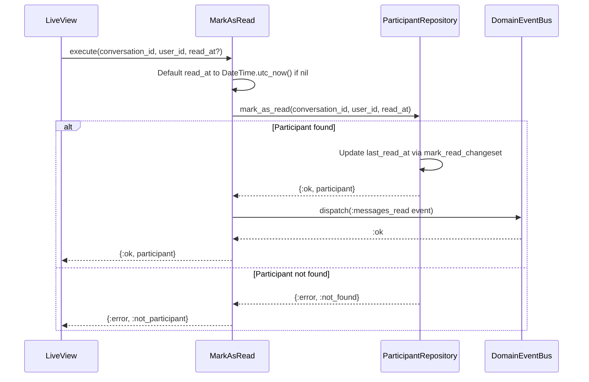
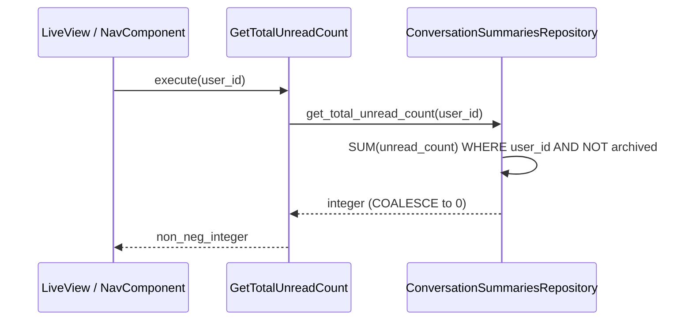

# Feature: Read Receipts and Unread Count

> **Context:** Messaging | **Status:** Active
> **Last verified:** 17f796f3

## Purpose

Lets users know which messages they have already seen and how many new messages are waiting across all their conversations. The system tracks a per-conversation "last read" watermark and exposes a global unread badge count so the UI can highlight new activity.

## What It Does

- Marks all messages in a conversation as read up to a given timestamp by updating the participant's `last_read_at` watermark
- Publishes a `:messages_read` domain event (and corresponding integration event) so LiveView subscribers and CQRS projections can react in real time
- Returns the total unread message count across all non-archived conversations for a user, read from the denormalized `conversation_summaries` table (CQRS read side)

## What It Does NOT Do

| Out of Scope | Handled By |
|---|---|
| Delivering or persisting messages | `SendMessage` use case / `ForManagingMessages` port |
| Creating or archiving conversations | `CreateConversation` / `ArchiveConversation` use cases |
| Per-message read receipts (individual message status) | Not implemented -- watermark-based only |
| Projecting unread counts into the read model | `ConversationSummaries` projection GenServer |
| Push notifications for unread messages | [NEEDS INPUT] |

## Business Rules

```
GIVEN a user is an active participant in a conversation
WHEN  the user marks messages as read (with an optional timestamp, defaulting to now)
THEN  the participant's last_read_at is updated to that timestamp
  AND a :messages_read domain event is dispatched to the Messaging context event bus
  AND a :messages_read integration event is available for cross-context consumers
```

```
GIVEN a user is NOT a participant in the conversation (or the participant record does not exist)
WHEN  the user attempts to mark messages as read
THEN  the operation returns {:error, :not_participant}
  AND no event is published
```

```
GIVEN a user has conversations with unread messages
WHEN  the system queries total unread count
THEN  it sums unread_count across all non-archived conversation_summaries rows for that user
  AND returns a non-negative integer (0 when no unread messages exist)
```

```
GIVEN a user has no conversations or all conversations are archived
WHEN  the system queries total unread count
THEN  it returns 0 (via SQL COALESCE on the SUM)
```

## How It Works

### Mark as Read



### Get Total Unread Count



## Dependencies

| Direction | Context | What |
|---|---|---|
| Internal | Messaging (Shared) | `DomainEventBus.dispatch/2` for publishing `:messages_read` events |
| Internal | Messaging (CQRS) | `ConversationSummaries` projection keeps `unread_count` in sync |
| Provides to | Any (via integration event) | `:messages_read` integration event for cross-context listeners |
| Provides to | Web (LiveView) | Real-time unread badge via `GetTotalUnreadCount` |

## Edge Cases

- **Non-participant user** -- `MarkAsRead` returns `{:error, :not_participant}` when the participant record does not exist. No event is published and no state changes.
- **Already read (idempotent)** -- Calling `mark_as_read` with a timestamp equal to or earlier than the current `last_read_at` still succeeds and overwrites the value. The domain model does not guard against backward timestamps; the repository simply sets the new value.
- **Concurrent marks from same user** -- Last-write-wins at the database level. No optimistic locking is applied to `last_read_at` since a stale read timestamp is harmless (the next mark-as-read corrects it).
- **Left participant** -- A participant who has `left_at` set still has their record in the database. `mark_as_read` queries by `conversation_id + user_id` without filtering on `left_at`, so a left participant can technically still mark as read. [NEEDS INPUT] -- should left participants be blocked?
- **No messages in conversation** -- `get_total_unread_count` returns `0` via `COALESCE(SUM(...), 0)` when no summary rows exist or all counts are zero.
- **Archived conversations** -- Both `get_total_unread_count` and `list_for_user` filter out rows where `archived_at IS NOT NULL`, so archived conversations never contribute to the badge count.

## Roles & Permissions

| Role | Can Do | Cannot Do |
|---|---|---|
| Any authenticated participant | Mark their own messages as read in conversations they belong to | Mark as read for other users |
| Any authenticated user | Query their own total unread count | Query another user's unread count |
| Non-participant | -- | Mark as read (returns `:not_participant` error) |

---

*Generated from code. Sections marked `[NEEDS INPUT]` require manual review.*
