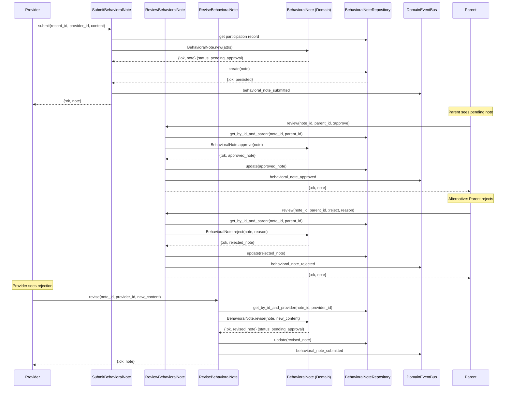

# Feature: Behavioral Notes

> **Context:** Participation | **Status:** Active
> **Last verified:** 17f796f3

## Purpose

Allows providers to write observational notes about a child's behavior during a session, and gives parents the ability to approve or reject those notes before they become part of the child's visible history.

## What It Does

- Providers submit a behavioral note tied to a specific participation record
- Parents review pending notes and approve or reject them (with optional rejection reason)
- Providers revise rejected notes with updated content, resubmitting for approval
- Parents list all notes awaiting their review (pending notes)
- Parents and roster views retrieve approved notes for a child
- Providers look up their existing note for a given participation record (single or batch)
- GDPR anonymization of all notes for a child on account deletion

## What It Does NOT Do

| Out of Scope | Handled By |
|---|---|
| Session scheduling and lifecycle management | Participation context (ProgramSession) |
| Attendance tracking (check-in/check-out) | Participation context (ParticipationRecord) |
| Child profile management | Family context |
| Provider profile and staff management | Provider context |

## Business Rules

```
GIVEN a participation record in :checked_in or :checked_out status
WHEN  a provider submits a note with non-blank content (<= 1000 chars)
THEN  the note is created in :pending_approval status
      AND a behavioral_note_submitted event is published
```

```
GIVEN a provider has already submitted a note for a participation record
WHEN  the same provider attempts to submit another note for that record
THEN  the submission is rejected with :duplicate_note error
```

```
GIVEN a pending note exists for a parent's child
WHEN  the parent approves the note
THEN  the note transitions to :approved status (final)
      AND a behavioral_note_approved event is published
```

```
GIVEN a pending note exists for a parent's child
WHEN  the parent rejects the note (with optional reason)
THEN  the note transitions to :rejected status
      AND a behavioral_note_rejected event is published
```

```
GIVEN a rejected note exists
WHEN  the original provider revises it with new content (<= 1000 chars)
THEN  the note resets to :pending_approval status
      AND rejection_reason is cleared, submitted_at is refreshed
      AND a behavioral_note_submitted event is published
```

```
GIVEN a participation record in :registered or :absent status
WHEN  a provider attempts to submit a note
THEN  the submission is rejected with :invalid_record_status error
```

```
GIVEN submitted content is blank or whitespace-only
WHEN  a provider submits or revises a note
THEN  the operation is rejected with :blank_content error
      (checked before any database call)
```

## How It Works



### Status Lifecycle

```
:pending_approval --approve--> :approved (final)
:pending_approval --reject---> :rejected --revise--> :pending_approval
```

## Dependencies

| Direction | Context | What |
|---|---|---|
| Requires | Participation (internal) | ParticipationRecord - must exist and be in :checked_in or :checked_out status |
| Requires | Shared | DomainEventBus for publishing domain events |
| Provides to | [NEEDS INPUT] | Approved notes for child progress/history views |

## Edge Cases

- **Note for absent child**: Submission blocked at use case level; `ParticipationRecord.allows_behavioral_note?/1` returns `false` for `:registered` or `:absent` records, returning `{:error, :invalid_record_status}`
- **Duplicate submission**: Unique constraint on `[participation_record_id, provider_id]` at DB level; repository translates the constraint violation to `{:error, :duplicate_note}`
- **Rejection without reason**: Reason is optional (`String.t() | nil`); `BehavioralNote.reject/2` accepts `nil` as the reason
- **Blank or whitespace-only content**: `Shared.normalize_notes/1` converts whitespace-only strings to `nil`, caught before any DB call with `{:error, :blank_content}`
- **Content exceeds 1000 characters**: Domain model validates via `validate_content/1`, returns `{:error, :content_too_long}`
- **Approving an already-approved note**: Domain model returns `{:error, :invalid_status_transition}` since `:approved` is a terminal state
- **Revising a non-rejected note**: Domain model pattern-matches on `status: :rejected`; all other statuses return `{:error, :invalid_status_transition}`
- **Parent reviewing note of another parent's child**: `get_by_id_and_parent/2` scopes the query to the parent's ID; returns `{:error, :not_found}` if the note belongs to a different parent
- **Provider revising another provider's note**: `get_by_id_and_provider/2` scopes the query to the provider's ID; returns `{:error, :not_found}` if the note belongs to a different provider
- **GDPR anonymization**: `anonymize_all_for_child/2` replaces content with `"[Removed - account deleted]"`, sets status to `:rejected`, clears `rejection_reason`; domain model owns the anonymized values via `BehavioralNote.anonymized_attrs/0`

## Roles & Permissions

| Role | Can Do | Cannot Do |
|---|---|---|
| Provider | Submit notes for children they tracked (checked_in/checked_out records); revise their own rejected notes; look up their notes for records | Approve or reject notes; revise notes from other providers; submit notes for absent/registered children |
| Parent | Approve or reject pending notes for their children; list pending notes awaiting review; view approved notes | Submit notes; revise notes; view or act on notes for other parents' children |
| Admin | [NEEDS INPUT] | [NEEDS INPUT] |

---

*Generated from code. Sections marked `[NEEDS INPUT]` require manual review.*
