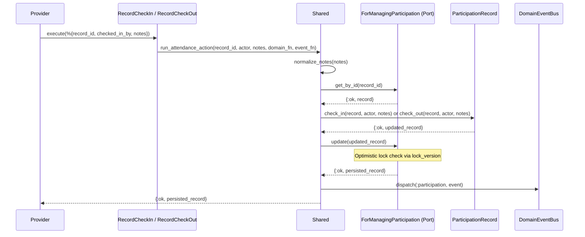
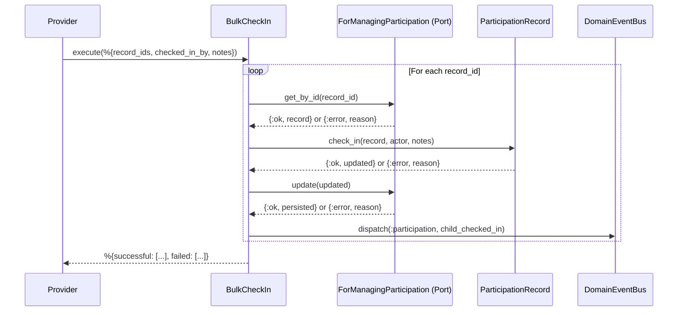
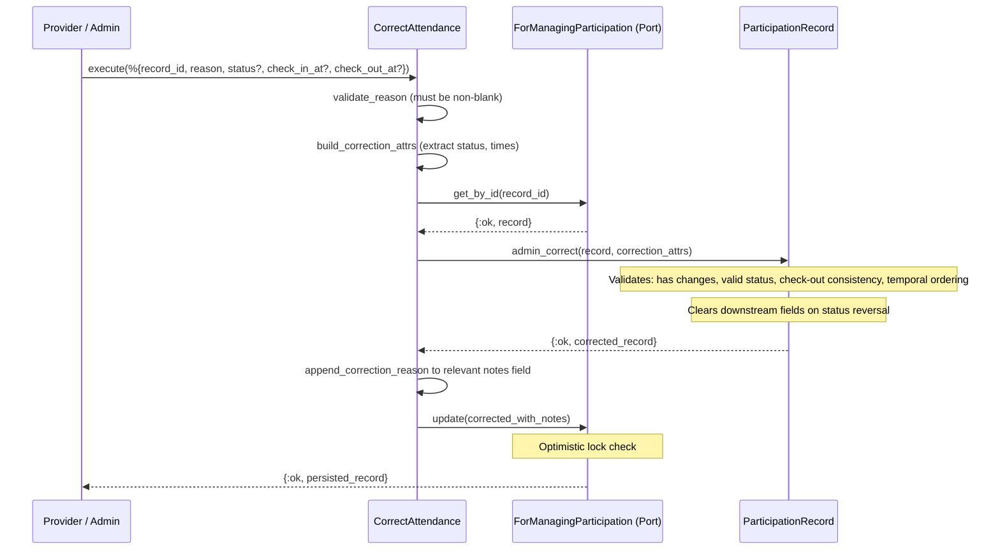

# Feature: Check-In and Check-Out

> **Context:** Participation | **Status:** Active
> **Last verified:** 17f796f3

## Purpose

Lets providers track child attendance during program sessions by recording individual and bulk check-ins, check-outs, and administrative corrections to attendance records.

## What It Does

- Records an individual child check-in with actor ID, timestamp, and optional notes
- Records an individual child check-out with actor ID, timestamp, and optional notes
- Bulk-checks-in multiple children to a session in a single operation, returning per-record success/failure results
- Allows administrative correction of attendance status and timestamps, requiring a mandatory reason that is appended to notes
- Enforces a forward-only status lifecycle: `registered -> checked_in -> checked_out` (or `registered -> absent`)
- Uses optimistic locking (`lock_version`) to prevent concurrent update conflicts
- Publishes `child_checked_in` and `child_checked_out` domain events via `DomainEventBus`

## What It Does NOT Do

| Out of Scope | Handled By |
|---|---|
| Creating or scheduling program sessions | Session management (Participation context, separate feature) |
| Recording behavioral observations about children | Behavioral notes (Participation context, separate feature) |
| Registering children for sessions (creating participation records) | Session roster management [NEEDS INPUT] |
| Notifying parents of check-in/out events | [NEEDS INPUT] |

## Business Rules

```
GIVEN a participation record in :registered status
WHEN  a provider submits a check-in with their user ID
THEN  status transitions to :checked_in, check_in_at is set to UTC now,
      check_in_by records the actor, and a child_checked_in event is published
```

```
GIVEN a participation record in :checked_in status
WHEN  a provider submits a check-out with their user ID
THEN  status transitions to :checked_out, check_out_at is set to UTC now,
      check_out_by records the actor, and a child_checked_out event is published
```

```
GIVEN a participation record NOT in :registered status
WHEN  a check-in is attempted
THEN  the operation fails with :invalid_status_transition
```

```
GIVEN a participation record NOT in :checked_in status
WHEN  a check-out is attempted
THEN  the operation fails with :invalid_status_transition
```

```
GIVEN a list of participation record IDs
WHEN  a bulk check-in is executed
THEN  each record is processed independently; results are partitioned into
      successful (list of records) and failed (list of {record_id, reason} tuples)
```

```
GIVEN a participation record and an admin correction request
WHEN  the correction includes a non-blank reason and at least one field change
      (status, check_in_at, or check_out_at)
THEN  the record is updated, the reason is appended to the relevant notes field
      prefixed with "[Admin correction]", and downstream fields are cleared
      when status is reversed (e.g. checked_out -> checked_in clears check-out data)
```

```
GIVEN an admin correction that sets check_out_at or transitions to :checked_out
WHEN  no check_in_at exists on the record or in the correction
THEN  the operation fails with :check_out_requires_check_in
```

```
GIVEN an admin correction that sets both check_in_at and check_out_at
WHEN  check_in_at is later than check_out_at
THEN  the operation fails with :check_in_must_precede_check_out
```

```
GIVEN a participation record with lock_version N
WHEN  two concurrent updates are attempted
THEN  the first succeeds and increments lock_version to N+1;
      the second fails with :stale_data
```

```
GIVEN a session and a child
WHEN  a duplicate participation record is inserted for the same session+child
THEN  the operation fails with :duplicate_record (enforced by unique DB constraint)
```

## How It Works

### Individual Check-In / Check-Out



### Bulk Check-In



### Correct Attendance (Admin)



## Dependencies

| Direction | Context | What |
|---|---|---|
| Internal | Shared | `DomainEventBus` for publishing domain events, `DomainEvent` struct, `RepositoryHelpers` for get_by_id |
| Provides to | [NEEDS INPUT] | `child_checked_in` and `child_checked_out` events (available for subscription by other contexts) |

## Edge Cases

- **Already checked in:** Attempting to check in a record already in `:checked_in` or `:checked_out` status returns `{:error, :invalid_status_transition}`.
- **Check-out without check-in:** Attempting to check out a record not in `:checked_in` status returns `{:error, :invalid_status_transition}`. Admin correction to `:checked_out` without a `check_in_at` returns `{:error, :check_out_requires_check_in}`.
- **Concurrent updates (optimistic locking):** Two simultaneous updates to the same record: the first succeeds, the second gets `{:error, :stale_data}` from the `Ecto.StaleEntryError` raised by the `optimistic_lock` check.
- **Bulk partial failure:** `BulkCheckIn` processes each record independently. A failure on one record does not roll back others; the caller receives both `successful` and `failed` lists.
- **Admin correction with no actual changes:** If the provided attrs match the existing record values (no status or time changes), returns `{:error, :no_changes}`.
- **Admin correction reverses status:** Reverting from `:checked_out` to `:checked_in` clears `check_out_at`, `check_out_by`, and `check_out_notes`. Reverting to `:registered` or `:absent` clears all check-in and check-out fields.
- **Impossible timeline in correction:** Setting `check_in_at` after `check_out_at` returns `{:error, :check_in_must_precede_check_out}`.
- **Missing correction reason:** Omitting or providing a blank reason returns `{:error, :reason_required}`.
- **Record not found:** All operations return `{:error, :not_found}` if the participation record ID does not exist.
- **Notes normalization:** Whitespace-only notes are normalized to `nil` by `Shared.normalize_notes/1` before being stored.

## Roles & Permissions

| Role | Can Do | Cannot Do |
|---|---|---|
| Provider | Record check-in, record check-out, bulk check-in, correct attendance with reason | [NEEDS INPUT] |
| Parent | [NEEDS INPUT] | Record attendance directly [NEEDS INPUT] |
| Admin | [NEEDS INPUT] | [NEEDS INPUT] |

> **Note:** Role-based authorization enforcement is not visible in the use case layer. Access control is expected to be handled at the web adapter / LiveView layer. Specific permission boundaries per role require clarification.

---

*Generated from code. Sections marked `[NEEDS INPUT]` require manual review.*
