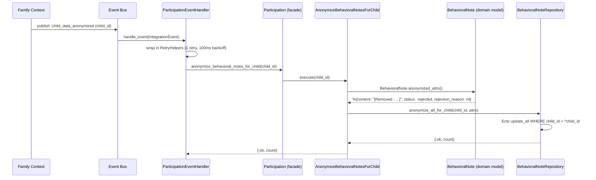

# Feature: GDPR Anonymization

> **Context:** Participation | **Status:** Active
> **Last verified:** 17f796f3

## Purpose

Ensures child-related behavioral notes are irreversibly anonymized when a child's account is deleted, satisfying GDPR data erasure obligations within the Participation context.

## What It Does

- Replaces all behavioral note content for a deleted child with `"[Removed - account deleted]"`
- Clears any rejection reasons stored on those notes
- Overrides each note's status to `:rejected` so anonymized notes are permanently excluded from active views and approval workflows
- Executes as a bulk `update_all` operation for efficiency (no per-row load/save cycle)
- Retries once with 100ms backoff on transient failures

## What It Does NOT Do

| Out of Scope | Handled By |
|---|---|
| Deleting the child record itself | Family context |
| Publishing the `child_data_anonymized` integration event | Family context |
| Anonymizing user-level data (email, name, auth tokens) | Accounts context |
| Anonymizing participation records (check-in/out timestamps) | Not yet implemented — participation records retain structural data without PII |
| Deleting behavioral notes entirely | By design, notes are anonymized rather than deleted to preserve referential integrity |

## Business Rules

```
GIVEN a child has one or more behavioral notes in any status
WHEN  the Family context publishes a :child_data_anonymized integration event
THEN  every behavioral note for that child has its content replaced with
      "[Removed - account deleted]", its rejection_reason set to nil,
      and its status set to :rejected
```

```
GIVEN a child has no behavioral notes
WHEN  the :child_data_anonymized event is received
THEN  the operation completes successfully with count = 0 (no-op)
```

```
GIVEN one or more notes for the child are already anonymized
WHEN  the :child_data_anonymized event is received (e.g., retry or duplicate delivery)
THEN  the bulk update is idempotent — fields are overwritten with the same values
```

## How It Works



### Key design decisions

- **Domain owns anonymization definition.** `BehavioralNote.anonymized_attrs/0` defines what "anonymized" means, keeping the business rule out of the persistence layer.
- **Status set to `:rejected`.** This ensures anonymized notes are excluded from any query filtering on `:approved` or `:pending_approval`, making them permanently inert without requiring a new status value.
- **Bulk `update_all`.** Bypasses Ecto changeset lifecycle for efficiency. The repository manually converts the `:status` atom to a string because `update_all` skips `Ecto.Enum` casting.

## Dependencies

| Direction | Context | What |
|---|---|---|
| Requires | Family | `:child_data_anonymized` integration event (carries `child_id` as `entity_id`) |
| Requires | Shared | `IntegrationEvent` struct, `RetryHelpers` for retry-with-backoff |
| Provides to | — | No downstream events are emitted after anonymization |

## Edge Cases

- **No notes exist for child** — `update_all` returns `{0, nil}`, use case returns `{:ok, 0}`. No error raised.
- **Already anonymized notes** — Operation is idempotent. Re-running sets the same values again.
- **Duplicate event delivery** — Safe due to idempotency. The retry wrapper handles transient DB errors with one retry at 100ms backoff.
- **Enum casting on `update_all`** — The repository converts `:rejected` atom to `"rejected"` string because `Repo.update_all` bypasses Ecto.Enum casting that would normally handle this in changeset-based flows.

## Roles & Permissions

| Role | Can Do | Cannot Do |
|---|---|---|
| System (automated) | Triggered automatically by `:child_data_anonymized` event | — |
| Parent | Indirectly triggers by deleting child account (via Family context) | Cannot manually invoke anonymization |
| Provider | — | Cannot trigger or bypass anonymization |
| Admin | — | No manual anonymization endpoint exists |

---

*Generated from code. Sections marked `[NEEDS INPUT]` require manual review.*
