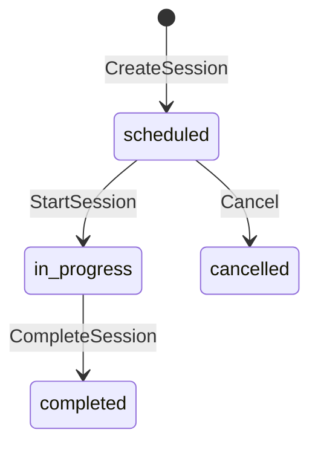
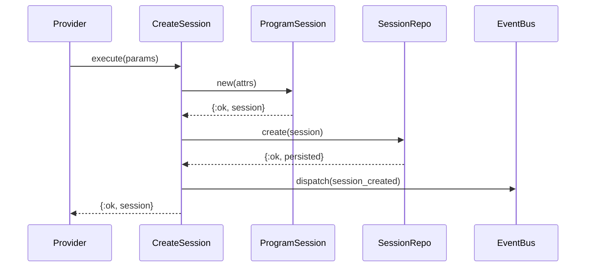
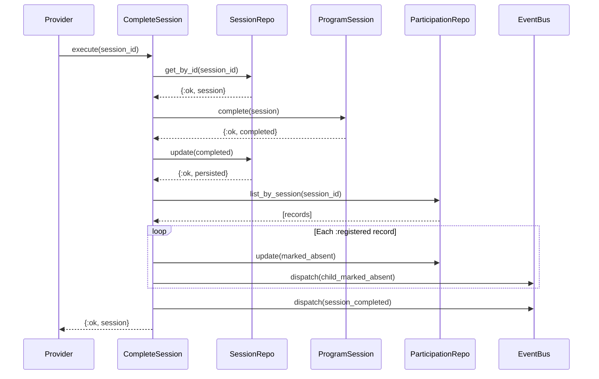

# Feature: Session Management

> **Context:** Participation | **Status:** Active
> **Last verified:** 17f796f3

## Purpose

Allows providers to schedule, start, and complete program sessions, forming the backbone of the Participation context's session lifecycle. Each session tracks when and where a program occurrence takes place, and automatically resolves attendance gaps when the session ends.

## What It Does

- **Create sessions** -- schedule a new session for a program with date, time range, optional location, notes, and max capacity
- **Start sessions** -- transition a scheduled session to in-progress so attendance tracking can begin
- **Complete sessions** -- transition an in-progress session to completed and auto-mark remaining registered participants as absent
- **Cancel sessions** -- cancel a scheduled session before it starts
- **List sessions** -- filter by program, by date, by provider, or for the admin dashboard (enriched with program name, provider name, attendance tallies)
- **Optimistic locking** -- `lock_version` prevents lost updates from concurrent modifications
- **Domain events** -- publishes `session_created`, `session_started`, `session_completed`, and `child_marked_absent` events via `DomainEventBus`

## What It Does NOT Do

| Out of Scope | Handled By |
|---|---|
| Recording individual child check-in / check-out | Check-In/Check-Out feature (ParticipationRecord use cases) |
| Behavioral notes on children | Behavioral Notes feature (BehavioralNote model & use cases) |
| Program definition and catalog management | Program Catalog context |
| Provider profile or staff management | Provider context |

## Business Rules

```
GIVEN a valid program_id, date, start_time, and end_time (end > start)
WHEN  a provider creates a session
THEN  a new session is persisted in :scheduled status
  AND a session_created event is published
```

```
GIVEN a session already exists for the same (program_id, session_date, start_time)
WHEN  a provider attempts to create another session with those same values
THEN  the operation fails with :duplicate_session
```

```
GIVEN a session in :scheduled status
WHEN  a provider starts the session
THEN  the session transitions to :in_progress
  AND a session_started event is published
```

```
GIVEN a session NOT in :scheduled status
WHEN  a provider attempts to start it
THEN  the operation fails with :invalid_status_transition
```

```
GIVEN a session in :in_progress status
WHEN  a provider completes the session
THEN  the session transitions to :completed
  AND all participation records still in :registered status are marked :absent
  AND a session_completed event is published
  AND a child_marked_absent event is published for each absence
```

```
GIVEN a session NOT in :in_progress status
WHEN  a provider attempts to complete it
THEN  the operation fails with :invalid_status_transition
```

```
GIVEN a session in :scheduled status
WHEN  a provider cancels the session
THEN  the session transitions to :cancelled
```

```
GIVEN a session in :in_progress or :completed or :cancelled status
WHEN  a provider attempts to cancel it
THEN  the operation fails with :invalid_status_transition
```

```
GIVEN an end_time that is less than or equal to start_time
WHEN  a session is created
THEN  the operation fails with :invalid_time_range
```

## How It Works

### Session Lifecycle



### Create Session Flow



### Complete Session Flow (with auto-absence)



## Dependencies

| Direction | Context | What |
|---|---|---|
| Internal | Participation (ParticipationRecord) | CompleteSession reads participation records to auto-mark absences |
| Reads | Program Catalog (programs table) | SessionRepository joins `programs` table for provider filtering and admin session enrichment |
| Reads | Provider (providers table) | SessionRepository joins `providers` table for admin session enrichment |
| Provides to | Participation (Check-In/Check-Out) | Sessions are the parent entity that participation records belong to |

## Edge Cases

- **Duplicate session** -- a unique constraint on `(program_id, session_date, start_time)` at the database level prevents two sessions at the same slot; the repository translates the constraint violation into `{:error, :duplicate_session}`
- **Invalid time range** -- both the domain model (`ProgramSession.new/1`) and the Ecto schema (`validate_time_range/1`) reject sessions where `end_time <= start_time`
- **Concurrent updates (optimistic locking)** -- `lock_version` is checked on every update; if another process modified the session first, the update fails with `{:error, :stale_data}`
- **Session not found** -- `get_by_id/1` returns `{:error, :not_found}`, which short-circuits the `with` chain in StartSession and CompleteSession
- **No registered participants on completion** -- the absence-marking loop is a no-op; the session still completes successfully
- **Absence marking partial failure** -- each record is marked individually; if one fails, subsequent records are still attempted (no transaction wrapping the batch) `[NEEDS INPUT]` -- confirm whether this should be wrapped in a transaction

## Roles & Permissions

| Role | Can Do | Cannot Do |
|---|---|---|
| Provider | Create, start, complete, cancel sessions for their own programs; list their sessions | `[NEEDS INPUT]` -- manage sessions for other providers' programs |
| Admin | List all sessions via admin dashboard (enriched view with attendance tallies) | `[NEEDS INPUT]` -- create/modify sessions directly (currently no admin use cases) |
| Parent | View sessions they are enrolled in (via other features) | Create, start, complete, or cancel sessions |

---

*Generated from code. Sections marked `[NEEDS INPUT]` require manual review.*
