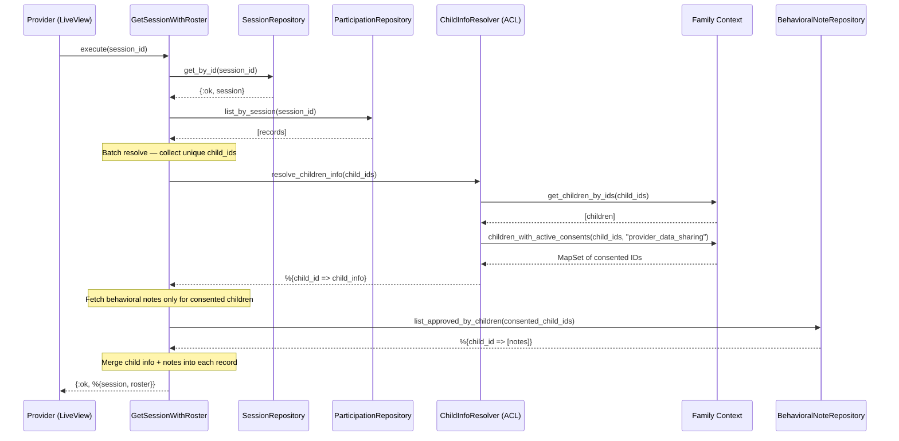
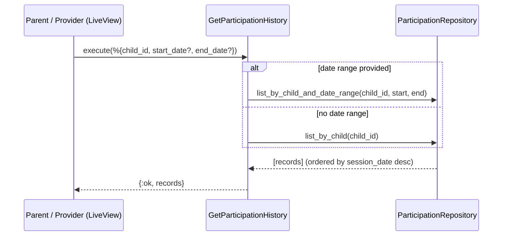

# Feature: Session Roster and History

> **Context:** Participation | **Status:** Active
> **Last verified:** 17f796f3

## Purpose

Lets providers view a session's full roster with each child's safety information (allergies, support needs, emergency contact), and lets parents and providers review a child's attendance history across sessions. Safety data is consent-gated -- only visible when the parent has granted `provider_data_sharing` consent.

## What It Does

- Retrieves a session and builds its roster by enriching each participation record with child name, safety info, and approved behavioral notes via the Family context
- Batch-resolves child info in a single cross-context call to avoid N+1 queries
- Fetches participation history for one child or multiple children, optionally filtered by date range, ordered by session date descending
- Gates safety fields (allergies, support needs, emergency contact) and behavioral notes behind `provider_data_sharing` consent
- Provides an `execute_enriched/1` variant that returns a flat map with program name for direct UI rendering

## What It Does NOT Do

| Out of Scope | Handled By |
|---|---|
| Recording check-in/check-out actions | `CheckInChild` / `CheckOutChild` use cases (Participation) |
| Creating or managing sessions | Session management use cases (Participation) |
| Managing consent records | Family context |
| Writing behavioral notes | `CreateBehavioralNote` use case (Participation) |

## Business Rules

```
GIVEN a provider viewing a session roster
WHEN  the roster is loaded
THEN  all registered children appear with their participation status,
      child names are always visible,
      and safety fields + behavioral notes are populated only for children
      whose parents have active "provider_data_sharing" consent
```

```
GIVEN a child whose parent has NOT granted "provider_data_sharing" consent
WHEN  that child appears in a session roster
THEN  allergies, support_needs, and emergency_contact are nil,
      behavioral notes are not fetched,
      and the child's name and participation status remain visible
```

```
GIVEN a child with no matching record in the Family context
WHEN  that child appears in a session roster
THEN  the child displays as "Unknown Child" with all safety fields nil
      and has_consent? set to false
```

```
GIVEN a parent or provider requesting participation history
WHEN  a child_id (or child_ids) is provided with optional start_date and end_date
THEN  participation records are returned ordered by session date descending,
      filtered to the date range when both dates are supplied
```

## How It Works

### Session Roster



### Participation History



## Dependencies

| Direction | Context | What |
|---|---|---|
| Requires | Family | Child names and safety info via `ForResolvingChildInfo` port (`get_child_by_id`, `get_children_by_ids`) |
| Requires | Family | Consent check via `child_has_active_consent?` / `children_with_active_consents` for `"provider_data_sharing"` |
| Internal | Participation | `SessionRepository`, `ParticipationRepository`, `BehavioralNoteRepository` for session and record persistence |

## Edge Cases

- **No consent**: Safety fields (allergies, support_needs, emergency_contact) return `nil`. Behavioral notes are not fetched for that child. Name and participation status remain visible.
- **Child not found in Family context**: The child is excluded from the batch `resolve_children_info` result map. The roster falls back to `"Unknown Child"` with all safety fields `nil` and `has_consent?: false`.
- **Empty roster**: Session exists but has no participation records. Returns `{:ok, %{session: session, roster: []}}`.
- **All children lack consent**: Behavioral note fetch is skipped entirely (returns empty map) since the consented ID list is empty.
- **Date range partially provided**: `GetParticipationHistory` only applies the date range filter when both `start_date` and `end_date` are present. If only one is provided, it is ignored and all records for the child are returned.
- **Session not found**: Returns `{:error, :not_found}`.

## Roles & Permissions

| Role | Can Do | Cannot Do |
|---|---|---|
| Provider | View session roster with consent-gated safety info and behavioral notes | See safety fields for children without consent |
| Parent | View their children's participation history | [NEEDS INPUT] View roster of other children in a session |
| Admin | [NEEDS INPUT] | [NEEDS INPUT] |

---

*Generated from code. Sections marked `[NEEDS INPUT]` require manual review.*
