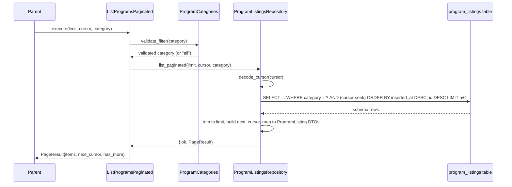
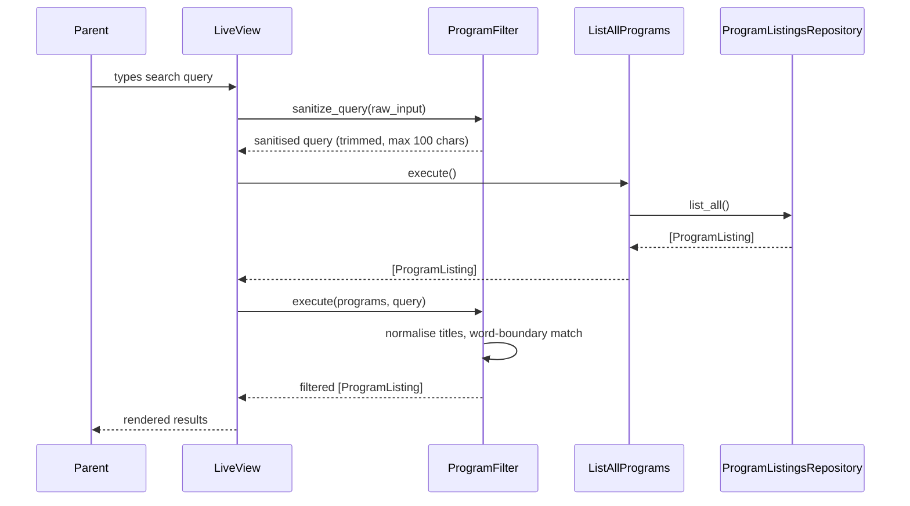
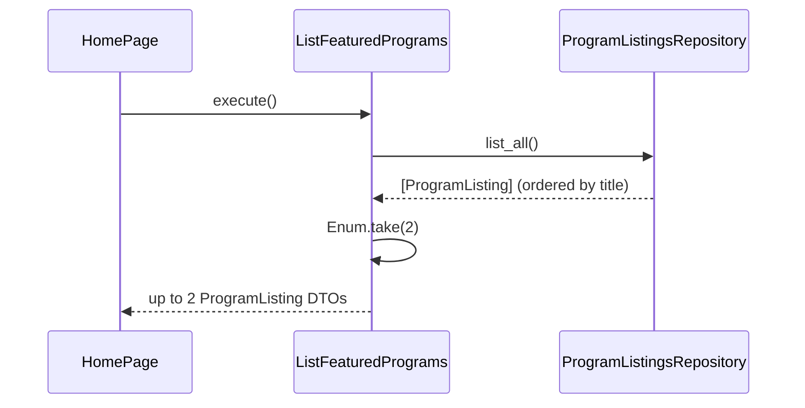

# Feature: Browse Programs

> **Context:** Program Catalog | **Status:** Active
> **Last verified:** 17f796f3

## Purpose

Lets parents discover afterschool activities, camps, and class trips by browsing a paginated catalog, filtering by category, searching by keyword, and seeing featured and trending suggestions -- all without requiring an account.

## What It Does

- **Paginated browsing** -- cursor-based pagination (newest first, 1-100 items per page) over a denormalized `program_listings` read model
- **Category filtering** -- database-level filtering against a closed set of categories (`sports`, `arts`, `music`, `education`, `life-skills`, `camps`, `workshops`)
- **In-memory search** -- word-boundary matching on program titles (any word that starts with the query, case-insensitive, special characters stripped)
- **Trending searches** -- hardcoded list of popular search suggestions (`Swimming`, `Math Tutor`, `Summer Camp`, `Piano`, `Soccer`)
- **Featured programs** -- first 2 programs by title order from the read model, displayed on the home page

## What It Does NOT Do

| Out of Scope | Handled By |
|---|---|
| Creating, editing, or deleting programs | Program Catalog -- Manage Programs feature (Provider) |
| Checking remaining capacity / availability | Enrollment context |
| Full-text search at the database level | [NEEDS INPUT] -- current search is in-memory only |
| Personalised recommendations | Not yet implemented |

## Business Rules

```
GIVEN a parent is browsing programs
WHEN  they load the programs page without a cursor
THEN  they receive the first page of programs ordered by creation date (newest first)
      with a next_cursor if more pages exist
```

```
GIVEN a parent has a next_cursor from a previous page
WHEN  they request the next page with that cursor
THEN  they receive the next page of programs after the cursor position
      using seek pagination (inserted_at DESC, id DESC)
```

```
GIVEN a parent selects a category filter
WHEN  the category is one of [sports, arts, music, education, life-skills, camps, workshops]
THEN  only programs matching that category are returned (filtered at the database level)
```

```
GIVEN a parent selects an invalid or unknown category
WHEN  the filter is applied
THEN  the category is silently replaced with "all" and all programs are returned
```

```
GIVEN a parent types a search query
WHEN  the query is non-empty after trimming
THEN  programs are filtered in-memory to those where any word in the title
      starts with the normalised query (case-insensitive, special chars removed)
```

```
GIVEN a search query longer than 100 characters
WHEN  it is submitted
THEN  the query is truncated to 100 characters before matching
```

```
GIVEN the home page loads
WHEN  featured programs are requested
THEN  the first 2 programs ordered by title are returned from the read model
```

```
GIVEN the home page loads
WHEN  trending searches are requested
THEN  the hardcoded list ["Swimming", "Math Tutor", "Summer Camp", "Piano", "Soccer"]
      is returned (optionally limited to the first N items)
```

## How It Works

### Browse with Pagination and Category Filter



### In-Memory Search



### Featured Programs



## Dependencies

| Direction | Context | What |
|---|---|---|
| Requires | Shared | `Pagination.PageParams` and `Pagination.PageResult` types for cursor-based pagination |
| Requires | Shared | `Categories.categories/0` for the canonical category list |
| Provides to | Web (HomeLive) | Featured programs and trending searches for the home page |
| Provides to | Web (ProgramsLive) | Paginated, filterable, searchable program listings |

## Edge Cases

- **Empty results** -- returns `PageResult` with `items: []`, `has_more: false`, `next_cursor: nil`. Featured programs returns `[]`. Search returns `[]`.
- **Invalid cursor** -- malformed or tampered cursor returns `{:error, :invalid_cursor}` (Base64 decode, JSON parse, timestamp parse, or UUID parse failure)
- **Invalid category** -- silently falls back to `"all"` via `ProgramCategories.validate_filter/1`; no error surfaced to the user
- **Empty or whitespace-only search query** -- `ProgramFilter.execute/2` returns the full unfiltered list
- **Search query exceeding 100 characters** -- truncated to 100 characters by `ProgramFilter.sanitize_query/1`
- **Nil search query** -- `sanitize_query(nil)` returns `""`, which means no filtering
- **No programs in database** -- `list_all/0` returns `[]`; featured returns `[]`; paginated returns empty `PageResult`
- **Fewer than 2 programs** -- featured programs returns only what exists (0 or 1)

## Roles & Permissions

| Role | Can Do | Cannot Do |
|---|---|---|
| Anonymous (no auth) | Browse, filter, search, view featured and trending | N/A -- all browse actions are public |
| Parent | Same as anonymous | N/A |
| Provider | Same as anonymous | N/A |

---

*Generated from code. Sections marked `[NEEDS INPUT]` require manual review.*
