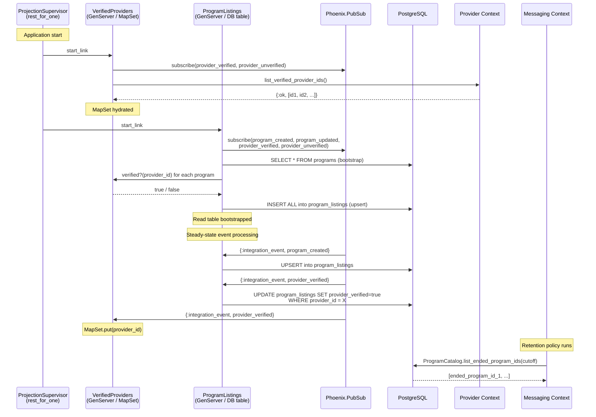

# Feature: CQRS Read Model

> **Context:** Program Catalog | **Status:** Active
> **Last verified:** 17f796f3

## Purpose

The CQRS Read Model keeps program listings fast and consistent by maintaining a separate, denormalized database table optimized for display. Instead of assembling program data from multiple normalized tables on every page load (slow, complex joins), the system listens for changes as they happen and pre-builds a flat "listing" row ready to serve immediately. Think of it like a store keeping a printed catalog on the counter: the back office (write side) manages inventory, but customers browse the pre-printed catalog (read side) for speed.

## What It Does

- **ProgramListings projection (GenServer):** Maintains the `program_listings` denormalized read table. On startup, bootstraps the full table from the authoritative `programs` write table. After that, incrementally applies changes by subscribing to `program_created`, `program_updated`, `provider_verified`, and `provider_unverified` integration events.
- **VerifiedProviders projection (GenServer):** Maintains an in-memory MapSet of verified provider IDs. Provides O(1) lookups (`verified?/1`) without any database query. Bootstraps from the Provider context on startup, stays in sync via PubSub events.
- **Subscribe-before-bootstrap pattern:** Both projections subscribe to PubSub topics *before* loading initial data. This eliminates the window where events could arrive between bootstrap completion and subscription, preventing data loss.
- **Bulk projection with upsert:** Bootstrap uses `Repo.insert_all` with `on_conflict: replace_all_except` for idempotent bulk writes. Subsequent events use individual upserts for the same idempotency guarantee.
- **Ended program listing:** The facade exposes `list_ended_program_ids/1`, which queries the write-side `programs` table for programs whose `end_date` is before a given cutoff. The Messaging context calls this to identify broadcast conversations eligible for retention-policy archival.
- **Cursor-based pagination:** The read-side repository (`ProgramListingsRepository`) supports seek pagination with Base64-encoded cursors over `(inserted_at DESC, id DESC)`, matching the write-side cursor format.

## What It Does NOT Do

| Out of Scope | Handled By |
|---|---|
| Creating, updating, or deleting programs (write side) | Program Catalog write model (`CreateProgram`, `UpdateProgram` use cases) |
| Enrollment capacity calculations | Enrollment context (exposed via `EnrollmentCapacityACL`) |
| Provider verification decisions | Provider context (publishes `provider_verified` / `provider_unverified` events) |
| Message archival execution | Messaging context (consumes `list_ended_program_ids` but owns the archival logic) |
| Search indexing by eligibility criteria | Future feature (EnrollmentEventHandler acknowledges `participant_policy_set` but is a no-op) |

## Business Rules

```
GIVEN the application is starting up
WHEN  the ProjectionSupervisor initializes
THEN  VerifiedProviders starts BEFORE ProgramListings (rest_for_one strategy)
      so that ProgramListings can call VerifiedProviders.verified?/1 during bootstrap
```

```
GIVEN a projection GenServer is initializing
WHEN  init/1 runs
THEN  PubSub subscriptions are established BEFORE bootstrap data is loaded
      (subscribe-before-bootstrap) to prevent missing events during the bootstrap window
```

```
GIVEN ProgramListings bootstrap fails (e.g., database unavailable)
WHEN  the bootstrap attempt raises an error
THEN  the GenServer retries with linear backoff (5s, 10s, 15s) up to 3 times
      and crashes after the third failure to let the supervisor handle restart
```

```
GIVEN VerifiedProviders crashes
WHEN  the rest_for_one supervisor detects the crash
THEN  ProgramListings (and ConversationSummaries) are also restarted,
      forcing a full re-bootstrap with fresh verification data
```

```
GIVEN a provider becomes verified
WHEN  a provider_verified integration event arrives
THEN  ProgramListings sets provider_verified = true for ALL listings belonging to that provider
      AND VerifiedProviders adds the provider ID to its in-memory MapSet
```

```
GIVEN a provider loses verification
WHEN  a provider_unverified integration event arrives
THEN  ProgramListings sets provider_verified = false for ALL listings belonging to that provider
      AND VerifiedProviders removes the provider ID from its in-memory MapSet
```

```
GIVEN a program_created event arrives
WHEN  the ProgramListings projection handles it
THEN  a new row is upserted into program_listings (idempotent via on_conflict)
```

```
GIVEN a program_updated event arrives
WHEN  the ProgramListings projection handles it
THEN  the listing row is upserted with updated fields
      BUT season and provider_verified are preserved on conflict (not overwritten)
```

```
GIVEN the Messaging context needs to archive stale broadcast conversations
WHEN  it calls ProgramCatalog.list_ended_program_ids(cutoff_date)
THEN  the write-side repository returns IDs of programs whose end_date < cutoff_date
```

## How It Works



## Dependencies

| Direction | Context | What |
|---|---|---|
| Requires | Provider | `list_verified_provider_ids/0` for bootstrap; `provider_verified` / `provider_unverified` integration events for ongoing sync |
| Requires | Program Catalog (write side) | `programs` table for bootstrap; `program_created` / `program_updated` integration events for incremental updates |
| Requires | Enrollment | `participant_policy_set` integration event (acknowledged, no-op today; future search index hook) |
| Provides to | Program Catalog (web layer) | `ProgramListingsRepository` serving `list_all`, `list_paginated`, `list_for_provider`, `get_by_id` queries |
| Provides to | Messaging | `list_ended_program_ids/1` for broadcast conversation retention archival |

## Edge Cases

- **Bootstrap failure (transient DB error):** Retries with linear backoff at 5s, 10s, 15s intervals. After 3 failed attempts, the GenServer crashes and the supervisor restarts the entire projection subtree.
- **VerifiedProviders unavailable during ProgramListings bootstrap:** `lookup_provider_verified/1` catches `:exit` and defaults to `provider_verified: false`. The next `provider_verified` event or full re-bootstrap corrects it.
- **Duplicate events (at-least-once delivery):** All writes use upsert semantics (`on_conflict`), so replayed events are idempotent.
- **Event ordering (event arrives before bootstrap completes):** Because subscriptions happen before bootstrap, events are queued in the GenServer mailbox. They process after `handle_continue(:bootstrap)` finishes, so no event is lost. The upsert-on-conflict strategy handles the case where bootstrap already wrote the row.
- **Stale read table after crash:** On restart, ProgramListings re-bootstraps the entire read table from the write table, correcting any stale data from the pre-crash state.
- **VerifiedProviders crash cascades:** The `rest_for_one` strategy restarts ProgramListings (and ConversationSummaries) whenever VerifiedProviders crashes, ensuring the dependent projections always re-bootstrap with fresh verification state.
- **Stale events carrying removed fields (e.g., icon_path):** Event payloads may carry fields that no longer exist in the schema. These are silently discarded by the changeset since only known schema fields are applied.
- **Instructor data format inconsistency:** Events may carry instructor data as flat fields (`instructor_name`) or nested maps (`%{instructor: %{name: ...}}`). The projection handles both formats via `extract_instructor_name/1` and `extract_instructor_headshot_url/1`.
- **Test environment:** Projections are disabled (`start_projections: false`) because VerifiedProviders bootstraps outside the Ecto sandbox, which would poison the connection pool.

## Roles & Permissions

| Role | Can Do | Cannot Do |
|---|---|---|
| Infrastructure | Projection GenServers run as supervised processes with no user-facing interface | N/A |

This feature is entirely infrastructure-level. No user role directly interacts with the projections. Parents and providers interact with the read model indirectly through the program browsing UI, which queries the `ProgramListingsRepository`. The projection processes have no authentication or authorization requirements.

---

*Generated from code. Sections marked `[NEEDS INPUT]` require manual review.*
