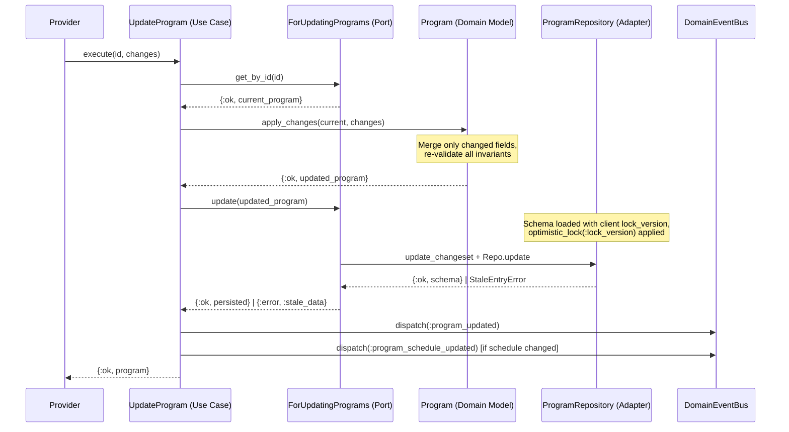

# Feature: Create and Update Program

> **Context:** Program Catalog | **Status:** Active
> **Last verified:** 17f796f3

## Purpose

Allows providers to create new program listings (afterschool activities, camps, class trips) and update existing ones, including scheduling, pricing, instructor assignment, and registration periods.

## What It Does

- **Create program** -- validates business invariants via the `Program.create/1` domain model, persists through the `ForCreatingPrograms` port, and dispatches a `program_created` domain event
- **Update program** -- loads the current aggregate via `get_by_id`, applies changes through `Program.apply_changes/2`, persists via the `ForUpdatingPrograms` port with optimistic locking, and dispatches `program_updated` (always) and `program_schedule_updated` (when scheduling fields change) domain events
- **Optimistic locking** -- uses a `lock_version` integer field incremented on every write; concurrent updates that read the same version produce `{:error, :stale_data}`
- **Instructor assignment** -- embeds instructor data as a value object (`Instructor`) inside the Program aggregate, acting as an Anti-Corruption Layer against the Provider context's `StaffMember`
- **Category validation** -- validates that the category belongs to the closed set defined in `Shared.Categories` (sports, arts, music, education, life-skills, camps, workshops); the meta-category "all" is only valid for filtering, not for assignment
- **Pricing** -- requires a non-negative `Decimal` price; currency is EUR only (hardcoded as the default currency symbol in `ProgramPricing`)
- **Registration period** -- models an optional registration window as a `RegistrationPeriod` value object with start/end dates; when both are nil, registration is always open
- **Integration events** -- publishes `ProgramCatalogIntegrationEvents.program_created` and `program_updated` for downstream contexts (notifications, read-model refresh); event dispatch is fire-and-forget and never rolls back the write
- **Scheduling validation** -- meeting days must be valid weekday names; start/end times must be paired and end must follow start; program start_date must precede end_date
- **Security** -- `provider_id`, `instructor_id`, `instructor_name`, `instructor_headshot_url`, and `cover_image_url` are set programmatically via `put_change`; they are excluded from `cast` to prevent form parameter injection

## What It Does NOT Do

| Out of Scope | Handled By |
|---|---|
| Capacity management (max participants, waitlists) | Enrollment context |
| Program discovery, search, and browsing | Browse Programs feature (`ForListingPrograms` port) |
| Program deletion / archival | [NEEDS INPUT] |
| Payment processing | Enrollment context |
| Staff member management (the source data for instructors) | Provider context |
| Session scheduling (individual meeting instances) | Participation context |

## Business Rules

```
GIVEN a provider submitting a new program
WHEN  all required fields (title, description, category, price, provider_id) are present and valid
THEN  a new program is persisted with lock_version=1 and a program_created event is dispatched
```

```
GIVEN a provider creating a program
WHEN  provider_id is missing or empty
THEN  creation fails with "provider ID is required"
```

```
GIVEN a provider assigning a category
WHEN  the category is not in the closed set (sports, arts, music, education, life-skills, camps, workshops)
THEN  validation fails with "category is invalid"
```

```
GIVEN a provider assigning the "all" meta-category to a program
WHEN  the program is created or updated
THEN  validation fails because "all" is only valid for filtering, not for assignment
```

```
GIVEN a provider setting a price
WHEN  the price is a negative Decimal
THEN  validation fails with "price must be greater than or equal to 0"
```

```
GIVEN a provider setting meeting times
WHEN  only one of meeting_start_time or meeting_end_time is provided
THEN  validation fails with "both meeting_start_time and meeting_end_time must be set together"
```

```
GIVEN a provider setting meeting times
WHEN  meeting_end_time is not after meeting_start_time
THEN  validation fails with "meeting_end_time must be after meeting_start_time"
```

```
GIVEN a provider setting program dates
WHEN  start_date is on or after end_date
THEN  validation fails with "start_date must be before end_date"
```

```
GIVEN a provider setting a registration period
WHEN  registration_start_date is on or after registration_end_date
THEN  validation fails because start must precede end
```

```
GIVEN a provider updating a program
WHEN  the lock_version on the submitted program matches the current database version
THEN  the update succeeds and lock_version is incremented by 1
```

```
GIVEN two providers (or browser tabs) updating the same program concurrently
WHEN  the second update is persisted after the first has already incremented lock_version
THEN  the second update fails with {:error, :stale_data}
```

```
GIVEN a provider updating scheduling fields (meeting_days, meeting_start_time, meeting_end_time, start_date, end_date)
WHEN  any of those fields differ from the previously persisted values
THEN  a program_schedule_updated event is dispatched in addition to program_updated
```

```
GIVEN a provider assigning an instructor
WHEN  the instructor map contains a valid id and name
THEN  the Instructor value object is embedded in the Program aggregate
```

```
GIVEN a provider assigning an instructor
WHEN  the instructor id or name is empty
THEN  validation fails with "Instructor: ID cannot be empty" or "Instructor: Name cannot be empty"
```

```
GIVEN form parameters submitted for program creation
WHEN  provider_id or instructor fields are injected into the form params
THEN  they are ignored because these fields bypass cast and are set only via put_change on the server side
```

## How It Works

### Create Flow

```mermaid
sequenceDiagram
    participant Provider
    participant CreateProgram as CreateProgram (Use Case)
    participant Program as Program (Domain Model)
    participant ForCreating as ForCreatingPrograms (Port)
    participant ProgramRepo as ProgramRepository (Adapter)
    participant DomainEventBus

    Provider->>CreateProgram: execute(attrs)
    CreateProgram->>Program: create(attrs)
    Note over Program: Validate title, description,<br/>category, price, provider_id,<br/>scheduling, instructor, registration period
    Program-->>CreateProgram: {:ok, program} | {:error, reasons}
    CreateProgram->>ForCreating: create(program)
    ForCreating->>ProgramRepo: create_changeset + Repo.insert
    ProgramRepo-->>ForCreating: {:ok, schema}
    ForCreating->>CreateProgram: {:ok, persisted_program}
    CreateProgram->>DomainEventBus: dispatch(:program_created)
    Note over DomainEventBus: Fire-and-forget; failures logged,<br/>never roll back the insert
    CreateProgram-->>Provider: {:ok, program}
```

### Update Flow



## Dependencies

| Direction | Context | What |
|---|---|---|
| Requires | Shared | `Shared.Categories` -- canonical category list used for validation |
| Requires | Shared | `Shared.DomainEventBus` -- dispatches domain and integration events |
| Requires | Provider | Instructor source data (id, name, headshot_url) provided at creation time via the web layer |
| Provides to | Downstream contexts | `program_created` integration event (e.g., notifications) |
| Provides to | Downstream contexts | `program_updated` integration event (e.g., read-model refresh) |
| Provides to | Downstream contexts | `program_schedule_updated` domain event (e.g., session rescheduling in Participation) |

## Edge Cases

- **Stale data on concurrent update** -- When two users update the same program, the second write receives `{:error, :stale_data}` via Ecto's `optimistic_lock`. The caller must reload and retry or inform the user.
- **Invalid category** -- Submitting a category not in the closed set (or the "all" filter-only value) returns a validation error from both the domain model and the Ecto schema.
- **Partial time specification** -- Providing only `meeting_start_time` without `meeting_end_time` (or vice versa) fails validation at both the domain and schema layers.
- **Invalid UUID on update** -- `get_by_id` uses `Ecto.UUID.dump/1` to validate the format; malformed UUIDs return `{:error, :not_found}` instead of crashing.
- **Nil lock_version on update** -- If `lock_version` is nil (program not loaded from DB), the repository raises `ArgumentError` immediately rather than producing a silent mismatch.
- **Instructor with invalid persistence data** -- `Instructor.from_persistence/1` returns `{:error, :invalid_persistence_data}` and the mapper logs an error and sets instructor to nil, avoiding a crash on corrupted data.
- **String-keyed attrs** -- `Program.create/1` normalizes string keys to existing atoms via `String.to_existing_atom/1`; unknown keys raise `ArgumentError`.
- **Event dispatch failure** -- All event dispatches are fire-and-forget. Failures are logged at the error level but never cause the create/update operation to fail.
- **Registration period with equal dates** -- If `registration_start_date` equals `registration_end_date`, validation fails because start must be strictly before end.

## Roles & Permissions

| Role | Can Do | Cannot Do |
|---|---|---|
| Provider | Create programs for their own provider_id; update their own programs | Create or update programs for a different provider; delete programs [NEEDS INPUT] |
| Parent | View programs (via browse feature) | Create, update, or delete programs |
| Admin | [NEEDS INPUT] | [NEEDS INPUT] |

---

*Generated from code. Sections marked `[NEEDS INPUT]` require manual review.*
