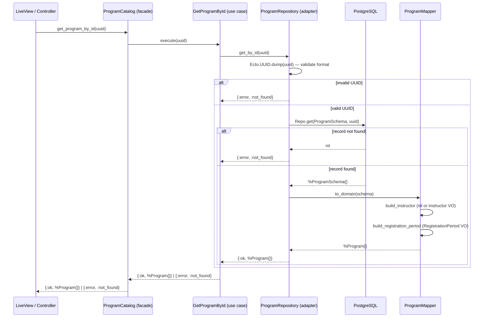

# Feature: Program Detail View

> **Context:** Program Catalog | **Status:** Active
> **Last verified:** 17f796f3

## Purpose

Allows a parent (or any visitor) to view the full details of a single afterschool program, including its description, schedule, pricing, instructor, and registration availability.

## What It Does

- Fetches a program by its UUID through the `GetProgramById` use case
- Maps the Ecto schema to a rich domain model (`Program`) via `ProgramMapper`
- Includes the assigned `Instructor` value object (name, headshot) when present
- Computes the current `RegistrationPeriod` status (`:always_open`, `:upcoming`, `:open`, `:closed`)
- Exposes `registration_open?/1` and `registration_status/1` on the facade for the web layer

## What It Does NOT Do

| Out of Scope | Handled By |
|---|---|
| Remaining enrollment capacity (seat count) | `ProgramCatalog.remaining_capacity/1` via Enrollment ACL |
| Creating or managing enrollments | Enrollment context |
| Editing or updating program details | `CreateAndUpdateProgram` feature (same context) |
| Review and rating display | Review & Rating context |

## Business Rules

```
GIVEN a valid program UUID
WHEN  a visitor requests the program detail
THEN  the full Program domain entity is returned with instructor and registration period
```

```
GIVEN a UUID that does not match any program
WHEN  a visitor requests the program detail
THEN  {:error, :not_found} is returned
```

```
GIVEN a string that is not a valid UUID format
WHEN  a visitor requests the program detail
THEN  {:error, :not_found} is returned (UUID validation rejects it before querying)
```

```
GIVEN a program with both registration start and end dates set
WHEN  today is before the start date
THEN  registration_status returns :upcoming
```

```
GIVEN a program with both registration start and end dates set
WHEN  today is between start and end dates (inclusive)
THEN  registration_status returns :open
```

```
GIVEN a program with both registration start and end dates set
WHEN  today is after the end date
THEN  registration_status returns :closed
```

```
GIVEN a program with no registration dates (both nil)
WHEN  registration_status is checked
THEN  :always_open is returned
```

## How It Works



## Dependencies

| Direction | Context | What |
|---|---|---|
| None | -- | Self-contained read operation within Program Catalog |

## Edge Cases

- **Invalid UUID format** -- `Ecto.UUID.dump/1` rejects the string before any DB query; returns `{:error, :not_found}`
- **Program without instructor** -- `ProgramMapper.build_instructor/1` pattern-matches on `instructor_id: nil` and sets `instructor` to `nil` on the domain model
- **Corrupted instructor data** -- If `instructor_id` is present but name is nil/invalid, `Instructor.from_persistence/1` returns `{:error, :invalid_persistence_data}`; the mapper logs an error and sets `instructor` to `nil` rather than crashing
- **Deleted or missing program** -- `Repo.get/2` returns `nil`; repository translates to `{:error, :not_found}`
- **Registration period with partial dates** -- `RegistrationPeriod.status/1` handles all four combinations (both nil, only start, only end, both set) with dedicated function clauses

## Roles & Permissions

| Role | Can Do | Cannot Do |
|---|---|---|
| Public (unauthenticated) | View any program's full details | -- |
| Parent | View any program's full details | -- |
| Provider | View any program's full details | -- |
| Admin | View any program's full details | -- |

This is a public read-only operation with no authentication or authorization requirements.

---

*Generated from code. Sections marked `[NEEDS INPUT]` require manual review.*
