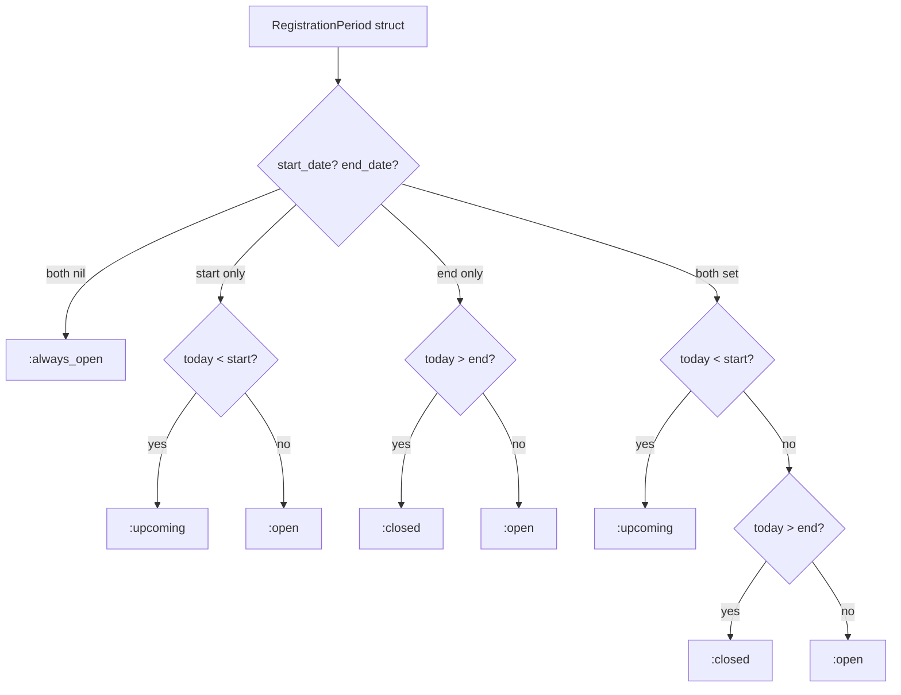

# Feature: Registration Period

> **Context:** Program Catalog | **Status:** Active
> **Last verified:** 17f796f3

## Purpose

Controls when parents can enroll in a program by defining an optional time window (start date and/or end date). Providers set these dates; the system derives a status that drives UI display and enrollment eligibility checks.

## What It Does

- Determines registration status: `always_open`, `upcoming`, `open`, or `closed`
- Supports partial date ranges (only start, only end, both, or neither)
- Exposes a boolean `open?/1` helper (true when status is `:always_open` or `:open`)
- Validates that start date is strictly before end date when both are provided
- Delegates convenience functions through the `Program` aggregate and the `ProgramCatalog` facade

## What It Does NOT Do

| Out of Scope | Handled By |
|---|---|
| Creating or cancelling enrollments | Enrollment context |
| Enforcing capacity limits | Enrollment context (`EnrollmentPolicy`) |
| Displaying registration UI badges | Web layer (presenters / LiveView) |

## Business Rules

```
GIVEN a program with no registration dates set
WHEN  a parent views the program
THEN  registration status is :always_open and enrollment is allowed
```

```
GIVEN a program with only a start date in the future
WHEN  today is before the start date
THEN  registration status is :upcoming and enrollment is not allowed
```

```
GIVEN a program with only a start date in the past or today
WHEN  a parent views the program
THEN  registration status is :open and enrollment is allowed
```

```
GIVEN a program with only an end date in the future or today
WHEN  a parent views the program
THEN  registration status is :open and enrollment is allowed
```

```
GIVEN a program with only an end date in the past
WHEN  a parent views the program
THEN  registration status is :closed and enrollment is not allowed
```

```
GIVEN a program with both start and end dates set
WHEN  today is before the start date
THEN  registration status is :upcoming
```

```
GIVEN a program with both start and end dates set
WHEN  today falls within the range [start, end] inclusive
THEN  registration status is :open
```

```
GIVEN a program with both start and end dates set
WHEN  today is after the end date
THEN  registration status is :closed
```

```
GIVEN a provider sets start date >= end date
WHEN  the registration period is constructed
THEN  validation fails with "registration_start_date must be before registration_end_date"
```

## How It Works



## Dependencies

| Direction | Context | What |
|---|---|---|
| Provides to | Enrollment | Registration open/closed status used to guard enrollment creation |
| Provides to | Web Layer | Status atom for badge rendering and CTA display |

## Edge Cases

- **No dates set** -- defaults to `:always_open`, matching legacy programs that predate the feature
- **Only start date set** -- registration opens on that date and never closes (open-ended)
- **Only end date set** -- registration was open from the beginning and closes on that date (early-bird deadlines)
- **Both dates in the past** -- status is `:closed`; providers must update dates to reopen
- **Start equals end** -- validation rejects; start must be strictly before end
- **Date comparison uses `Date.utc_today()`** -- server timezone determines the boundary; no per-user timezone support

## Roles & Permissions

| Role | Can Do | Cannot Do |
|---|---|---|
| Provider | Set/update registration start and end dates on their programs | Set start >= end |
| Parent | View registration status; enroll when status is open | Override a closed registration window |
| Admin | (not yet implemented) | -- |

## Key Files

- `lib/klass_hero/program_catalog/domain/models/registration_period.ex` -- value object, status logic
- `lib/klass_hero/program_catalog/domain/models/program.ex` -- aggregate delegates (`registration_open?/1`, `registration_status/1`)
- `lib/klass_hero/program_catalog.ex` -- facade functions (`registration_open?/1`, `registration_status/1`)
