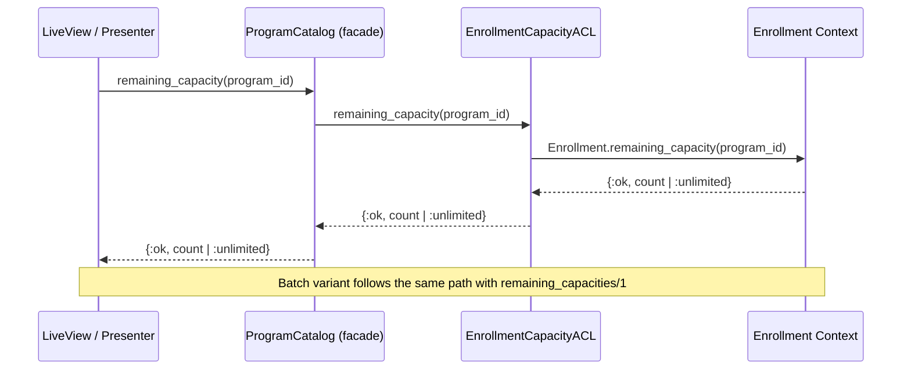

# Feature: Remaining Capacity

> **Context:** Program Catalog | **Status:** Active
> **Last verified:** 17f796f3

## Purpose

Lets parents see how many spots are left in a program. The Program Catalog context does not own capacity data -- it queries the Enrollment context through an Anti-Corruption Layer (ACL) and exposes the result for display in listings and detail pages.

## What It Does

- Queries remaining capacity for a single program (`remaining_capacity/1`)
- Batch-queries remaining capacity for multiple programs in one call (`remaining_capacities/1`) to avoid N+1 when rendering listings
- Returns `:unlimited` when no enrollment policy exists for a program
- Returns a non-negative integer when a capacity limit is configured

## What It Does NOT Do

| Out of Scope | Handled By |
|---|---|
| Enforcing capacity (rejecting enrollments when full) | Enrollment context (`EnrollmentPolicy`) |
| Defining or updating capacity limits | Enrollment context (provider management) |
| Counting active enrollments | Enrollment context (`count_active_enrollments`) |

## Business Rules

```
GIVEN a program with no enrollment policy
WHEN  remaining capacity is queried
THEN  the result is {:ok, :unlimited}
```

```
GIVEN a program with an enrollment policy (max_capacity = N)
WHEN  remaining capacity is queried
THEN  the result is {:ok, N - active_enrollment_count}
```

```
GIVEN a list of program IDs
WHEN  remaining capacities are batch-queried
THEN  a map is returned with each program_id mapped to its remaining count or :unlimited
```

```
GIVEN a program where active enrollments equal max capacity
WHEN  remaining capacity is queried
THEN  the result is {:ok, 0}
```

## How It Works



## Dependencies

| Direction | Context | What |
|---|---|---|
| Requires | Enrollment | `remaining_capacity/1` and `get_remaining_capacities/1` on the Enrollment facade |
| Provides to | Web Layer | Spot availability data for program cards and detail pages |

## Edge Cases

- **No enrollment policy exists** -- returns `:unlimited`; the program has no cap and displays as "unlimited spots"
- **Zero remaining** -- returns `0`; the UI can show "sold out" or disable enrollment CTA
- **Enrollment context unavailable** -- the ACL makes a direct function call (not HTTP/RPC), so unavailability would only occur if the Enrollment module fails to compile or the database is down, both of which surface as runtime errors
- **Empty program ID list** -- `remaining_capacities([])` returns an empty map `%{}`

## Roles & Permissions

| Role | Can Do | Cannot Do |
|---|---|---|
| Public (unauthenticated) | View remaining capacity on program listings and detail pages | -- |
| Parent | View remaining capacity; use it to decide whether to enroll | Modify capacity limits |
| Provider | View remaining capacity for their own programs | Modify capacity through Program Catalog (done via Enrollment context) |

## Key Files

- `lib/klass_hero/program_catalog/adapters/driven/acl/enrollment_capacity_acl.ex` -- ACL adapter bridging to Enrollment
- `lib/klass_hero/program_catalog.ex` -- facade delegates (`remaining_capacity/1`, `remaining_capacities/1`)
- `lib/klass_hero/enrollment.ex` -- upstream functions that compute capacity from policy and active count
