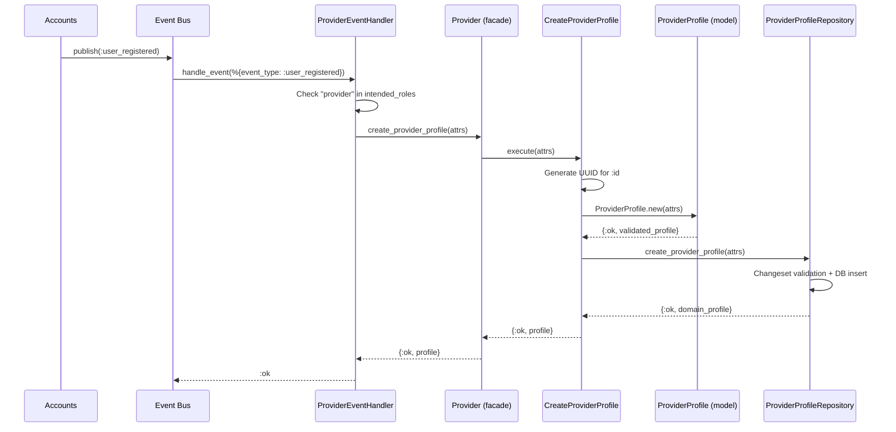
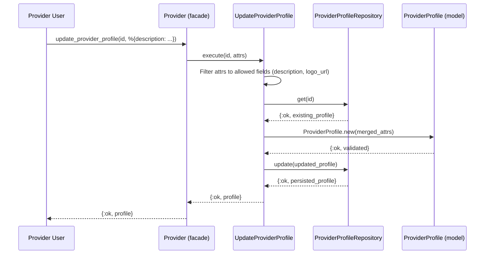

# Feature: Provider Profile Management

> **Context:** Provider | **Status:** Active
> **Last verified:** 17f796f3

## Purpose

Manages the lifecycle of provider business profiles, from automatic creation when a user registers with the "provider" role through to ongoing profile edits. Each profile links a Provider bounded context identity to an Accounts context user via a correlation ID, keeping the two contexts decoupled.

## What It Does

- Auto-creates a provider profile when a `user_registered` event fires with `"provider"` in `intended_roles`
- Allows providers to update their description and logo URL
- Correlates provider profiles to Accounts users via `identity_id` (not a foreign key)
- Assigns a default subscription tier (`starter`) at creation, or an explicitly selected tier from registration
- Provides form changeset support for LiveView profile editing
- Exposes lookup by `identity_id`, lookup by `id`, and existence check (`has_profile?`)

## What It Does NOT Do

| Out of Scope | Handled By |
|---|---|
| Staff member management | Provider context - Staff Members feature |
| Document verification workflow | Provider context - Verification Documents feature |
| Subscription tier upgrades/downgrades | Provider context - `ChangeSubscriptionTier` use case |
| Entitlement checks based on tier | Entitlements context |
| User authentication and registration | Accounts context |
| Admin verification toggle (verify/unverify) | Provider context - `VerifyProvider`/`UnverifyProvider` use cases + Backpex admin |

## Business Rules

```
GIVEN a user_registered event with "provider" in intended_roles
WHEN  the event handler receives the event
THEN  a provider profile is created with the user's ID as identity_id
      and the registration name as business_name
      and the subscription tier from registration (or default starter)
```

```
GIVEN a provider profile already exists for an identity_id
WHEN  a duplicate creation is attempted
THEN  the operation returns {:error, :duplicate_resource} (idempotent via unique constraint)
```

```
GIVEN an existing provider profile
WHEN  the provider submits an update
THEN  only description and logo_url fields are accepted (all other fields are stripped)
```

```
GIVEN a website URL is provided
WHEN  the profile is created or validated
THEN  the URL must start with "https://" (plain HTTP is rejected)
```

```
GIVEN a business_name
WHEN  the profile is created
THEN  business_name is required, non-empty, and at most 200 characters
      and it cannot be changed via the update use case
```

```
GIVEN a provider profile
WHEN  identity_id is set
THEN  identity_id is a correlation ID to the Accounts user (not a foreign key)
      enforced as unique at the database level
```

```
GIVEN a user_registered event without "provider" in intended_roles
WHEN  the event handler receives the event
THEN  the event is ignored (returns :ignore)
```

## How It Works

### Auto-Creation on Registration



### Profile Update



## Dependencies

| Direction | Context | What |
|---|---|---|
| Reacts to | Accounts | `user_registered` event triggers profile creation |
| Reacts to | Accounts | `user_anonymized` event (no-op; business_name retained for audit) |
| Uses | Shared | `SubscriptionTiers` for default tier and tier validation |
| Uses | Shared | `RetryHelpers` for retry-with-backoff on event handling |
| Uses | Shared | `DomainEvent` / `IntegrationEvent` structs for eventing |

## Edge Cases

- **Duplicate creation**: If `create_provider_profile` is called for an `identity_id` that already has a profile, the database unique constraint catches it and returns `{:error, :duplicate_resource}`. The event handler treats this as `:ok` via `RetryHelpers`.
- **Invalid website URL**: Domain model rejects any website not starting with `https://`. The Ecto schema also validates the protocol independently (defense in depth).
- **Missing business_name**: Both domain model and Ecto schema require a non-empty `business_name`. Domain returns a validation error list; schema returns a changeset error.
- **Invalid subscription tier at registration**: If the `provider_subscription_tier` from the registration event is not a valid tier string, the event handler logs a warning and falls back to the default starter tier.
- **Empty tier string**: Treated the same as `nil` -- default starter tier is used.
- **Transient failure during event-driven creation**: `RetryHelpers.retry_with_backoff/2` retries once with 100ms backoff before logging the failure.
- **Update with disallowed fields**: `UpdateProviderProfile` applies `Map.take(attrs, [:description, :logo_url])`, silently stripping any other keys (e.g., `business_name`, `verified`).

## Roles & Permissions

| Role | Can Do | Cannot Do |
|---|---|---|
| Provider | View own profile, update description and logo | Change business_name after creation, self-verify, change subscription tier directly |
| Admin | View any profile, toggle verification, change subscription tier (via Backpex) | [NEEDS INPUT] |
| Parent | [NEEDS INPUT] | Edit provider profiles |

---

*Generated from code. Sections marked `[NEEDS INPUT]` require manual review.*
