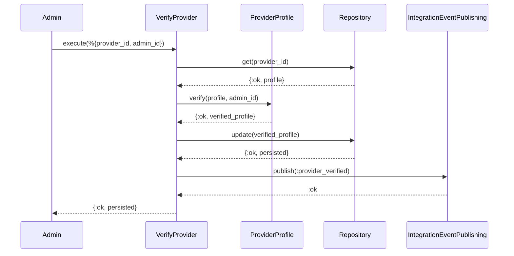
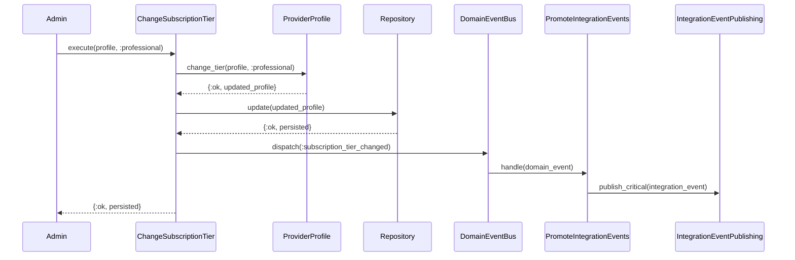
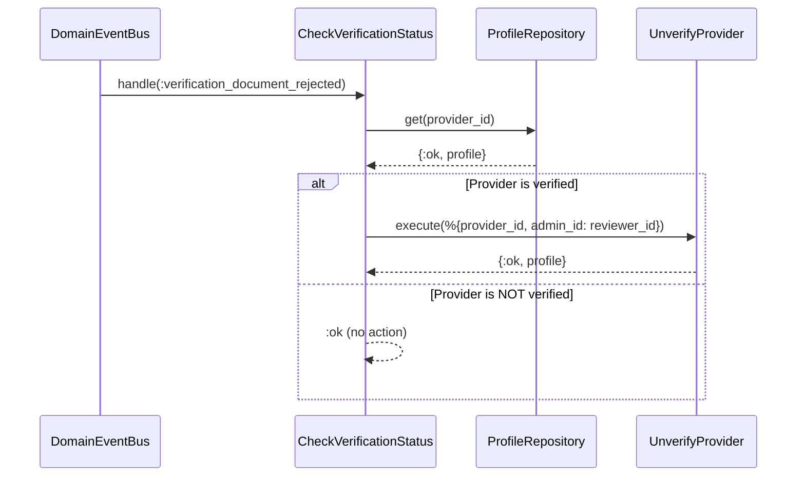

# Feature: Provider Verification (Admin)

> **Context:** Provider | **Status:** Active
> **Last verified:** 17f796f3

## Purpose

Allows administrators to verify or unverify provider profiles and change their subscription tier, maintaining an audit trail and notifying downstream contexts via integration events.

## What It Does

- **Verify a provider** -- sets `verified: true`, records `verified_at` timestamp and `verified_by_id` (admin who performed the action), persists via repository, publishes `:provider_verified` integration event
- **Unverify a provider** -- sets `verified: false`, clears `verified_at` and `verified_by_id`, persists via repository, publishes `:provider_unverified` integration event
- **Change subscription tier** -- validates the new tier against `SubscriptionTiers`, persists via repository, publishes `:subscription_tier_changed` domain event (promoted to integration event by `PromoteIntegrationEvents` handler)
- **Auto-verify after document approval** -- when a `verification_document_approved` domain event fires and ALL provider documents are `:approved`, automatically invokes `VerifyProvider`
- **Auto-unverify after document rejection** -- when a `verification_document_rejected` domain event fires and the provider is currently verified, automatically invokes `UnverifyProvider`

## What It Does NOT Do

| Out of Scope | Handled By |
|---|---|
| Reviewing individual verification documents (approve/reject workflow) | Provider context -- Verification Document Workflow feature |
| Editing provider profile fields (business name, description, etc.) | Provider context -- Provider Profile Management feature |
| Determining what a subscription tier entitles | Entitlements context (cross-context, no DB) |
| Surfacing verified-provider badge on programs | Program Catalog context (downstream consumer of integration events) |

## Business Rules

```
GIVEN a provider profile exists
WHEN  an admin verifies the provider
THEN  verified=true, verified_at=now (UTC, truncated to second), verified_by_id=admin_id
  AND a :provider_verified integration event is published
```

```
GIVEN a provider profile that is already verified
WHEN  an admin verifies the provider again
THEN  the operation succeeds (idempotent)
  AND verified_at and verified_by_id are updated to the new admin/timestamp
  AND a :provider_verified integration event is published again
```

```
GIVEN a provider profile exists
WHEN  an admin unverifies the provider
THEN  verified=false, verified_at=nil, verified_by_id=nil
  AND a :provider_unverified integration event is published
```

```
GIVEN a provider profile that is already unverified
WHEN  an admin unverifies the provider again
THEN  the operation succeeds (idempotent)
  AND a :provider_unverified integration event is published again
```

```
GIVEN a provider profile with subscription tier :starter
WHEN  an admin changes the tier to :professional
THEN  subscription_tier=:professional, updated_at=now
  AND a :subscription_tier_changed domain event is dispatched
  AND PromoteIntegrationEvents promotes it to an integration event
```

```
GIVEN a provider profile with subscription tier :professional
WHEN  an admin changes the tier to :professional (same tier)
THEN  {:error, :same_tier} is returned -- no persistence, no event
```

```
GIVEN a provider profile
WHEN  an admin changes the tier to an invalid atom (e.g., :gold)
THEN  {:error, :invalid_tier} is returned -- no persistence, no event
```

```
GIVEN a verification document is approved
WHEN  ALL documents for that provider are now :approved (non-empty list)
THEN  VerifyProvider is auto-invoked with the reviewer as admin_id
```

```
GIVEN a verification document is approved
WHEN  some documents for that provider are still pending or rejected
THEN  no auto-verification occurs
```

```
GIVEN a provider is currently verified
WHEN  a verification document is rejected
THEN  UnverifyProvider is auto-invoked with the reviewer as admin_id
```

```
GIVEN a provider is NOT currently verified
WHEN  a verification document is rejected
THEN  no action is taken (no invariant violation)
```

```
GIVEN a provider has zero verification documents
WHEN  the all_approved? check runs
THEN  returns false -- empty list does not satisfy verification
```

## How It Works

### Verify / Unverify Provider



_UnverifyProvider follows the same flow, calling `ProviderProfile.unverify/1` (no admin_id argument) and publishing `:provider_unverified`._

### Change Subscription Tier



### Auto-Verification After Document Approval

```mermaid
sequenceDiagram
    participant DomainEventBus
    participant CheckVerificationStatus
    participant DocRepository
    participant VerifyProvider

    DomainEventBus->>CheckVerificationStatus: handle(:verification_document_approved)
    CheckVerificationStatus->>DocRepository: get_by_provider(provider_id)
    DocRepository-->>CheckVerificationStatus: {:ok, docs}
    alt All docs approved (non-empty)
        CheckVerificationStatus->>VerifyProvider: execute(%{provider_id, admin_id: reviewer_id})
        VerifyProvider-->>CheckVerificationStatus: {:ok, profile}
    else Some docs pending/rejected OR empty
        CheckVerificationStatus-->>CheckVerificationStatus: :ok (no action)
    end
```



### Auto-Unverification After Document Rejection



## Dependencies

| Direction | Context | What |
|---|---|---|
| Provides to | Program Catalog | `:provider_verified` / `:provider_unverified` integration events -- enables verified-provider projection |
| Provides to | Entitlements | `:subscription_tier_changed` integration event -- enables tier-based authorization |
| Internal | Provider (Verification Documents) | Consumes `:verification_document_approved` / `:verification_document_rejected` domain events for auto-verify/unverify |

## Edge Cases

- **Already verified provider** -- `VerifyProvider` is idempotent; succeeds and overwrites `verified_at`/`verified_by_id` with the new admin and timestamp
- **Already unverified provider** -- `UnverifyProvider` is idempotent; succeeds and re-publishes the `:provider_unverified` event
- **Provider not found** -- both use cases return `{:error, :not_found}` from the repository `get/1` call
- **No documents uploaded** -- `all_approved?([])` returns `false`; auto-verification does not trigger on an empty document list
- **Partial document approval** -- `all_approved?` returns `false` when any doc is not `:approved`; auto-verification waits until every document passes
- **Auto-verify/unverify failure** -- logged as warning via `Logger.warning/1`, returns `:ok` to avoid blocking the event pipeline
- **Same subscription tier** -- `ProviderProfile.change_tier/2` returns `{:error, :same_tier}` before any persistence or event dispatch
- **Invalid subscription tier atom** -- `ProviderProfile.change_tier/2` returns `{:error, :invalid_tier}` (validated against `SubscriptionTiers.valid_provider_tier?/1`)

## Roles & Permissions

| Role | Can Do | Cannot Do |
|---|---|---|
| Admin | Verify provider, unverify provider, change subscription tier | [NEEDS INPUT] |
| Provider | N/A -- no self-service verification actions | Verify/unverify themselves, change own subscription tier |
| Parent | N/A | Any verification or tier actions |

_Note: The use cases accept an `admin_id` parameter for audit purposes but do not enforce role-based access control internally. Authorization is expected to be enforced at the web/driving adapter layer._ [NEEDS INPUT: confirm where admin role check is enforced]

---

*Generated from code. Sections marked `[NEEDS INPUT]` require manual review.*
