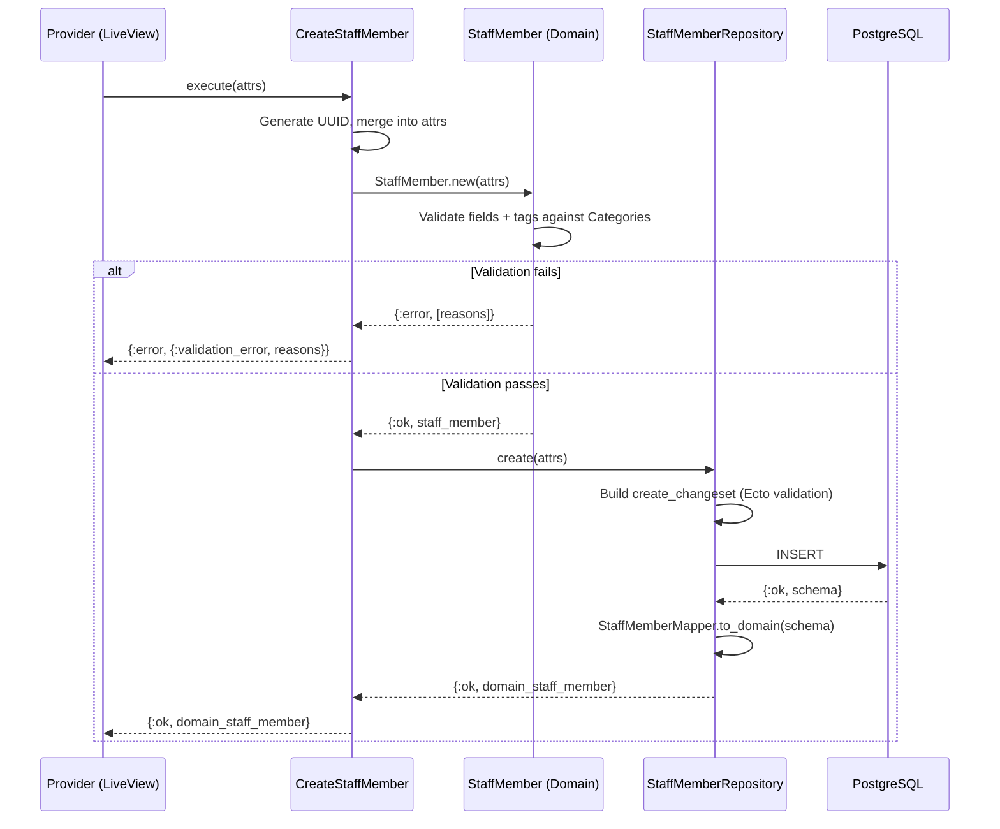
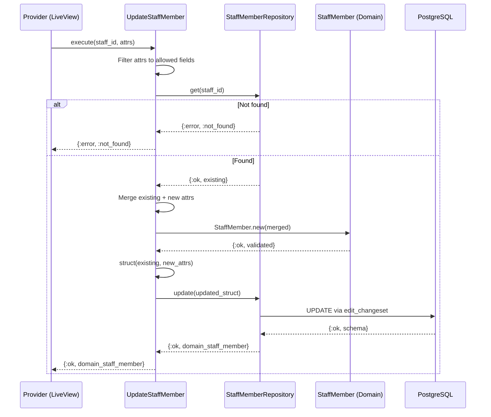

# Feature: Staff Member Management

> **Context:** Provider | **Status:** Active
> **Last verified:** 17f796f3

## Purpose

Lets providers manage their team (coaches, instructors, assistants) so that staff profiles can appear on program pages and be associated with activities. Each staff member carries tags from a shared category vocabulary and freeform qualifications describing their expertise.

## What It Does

- **Create** a staff member with name, role, email, bio, headshot, tags, and qualifications
- **Update** any editable field on an existing staff member (provider_id is immutable after creation)
- **Delete** a staff member by ID (hard delete)
- **List** all staff members for a provider, or only active ones
- **Validate tags** against the shared `Categories` vocabulary (`sports`, `arts`, `music`, `education`, `life-skills`, `camps`, `workshops`)
- **Accept freeform qualifications** as an arbitrary list of strings (e.g., "First Aid", "UEFA B License")
- **Toggle active status** -- admin-only changeset restricts edits to the `active` flag via Backpex dashboard

## What It Does NOT Do

| Out of Scope | Handled By |
|---|---|
| Staff login / authentication | Accounts context (no user account is linked to a staff member) |
| Assigning staff to sessions or check-ins | Participation context |
| Displaying instructor info on program pages | Program Catalog (consumes staff data via ACL) |
| File upload for headshots | `[NEEDS INPUT]` -- headshot_url is stored, but upload mechanism is not part of this feature |

## Business Rules

```
GIVEN a provider is creating a staff member
WHEN  they supply first_name, last_name, and provider_id
THEN  the staff member is persisted with a generated UUID and active=true by default
```

```
GIVEN a staff member has tags
WHEN  any tag is not in the shared Categories list
THEN  creation/update is rejected with "Invalid tags: <list>"
      (validated in both domain model and Ecto changeset)
```

```
GIVEN a staff member has qualifications
WHEN  all entries are strings
THEN  they are accepted as-is (freeform, no vocabulary constraint)
```

```
GIVEN a provider is updating a staff member
WHEN  they change allowed fields (name, role, email, bio, headshot_url, tags, qualifications, active)
THEN  the existing record is loaded, merged with new attrs, re-validated, and persisted
      (provider_id is excluded from the allowed update fields)
```

```
GIVEN a staff member ID that does not exist
WHEN  an update or delete is attempted
THEN  {:error, :not_found} is returned
```

```
GIVEN an admin is editing a staff member via Backpex
WHEN  they submit changes
THEN  only the active field can be toggled (all other fields are provider-owned)
```

## How It Works

### Create Flow



### Update Flow



## Dependencies

| Direction | Context | What |
|---|---|---|
| Requires | Shared | `Categories.categories/0` for tag validation vocabulary |
| Provides to | Program Catalog | Staff member data for instructor display on program pages `[NEEDS INPUT]` |
| Provides to | Participation | Staff member identity for session assignment `[NEEDS INPUT]` |

## Edge Cases

- **Invalid tags** -- Both domain model (`StaffMember.new/1`) and Ecto changeset (`validate_tags/1`) reject tags not in `Categories.categories/0`. Error message includes the specific invalid tags.
- **Staff member not found** -- Update and delete return `{:error, :not_found}` when the ID does not match a persisted record.
- **Duplicate staff members** -- No unique constraint exists on (provider_id, first_name, last_name) or email. A provider can create multiple staff members with the same name. `[NEEDS INPUT]` -- decide if uniqueness is needed.
- **Empty optional fields** -- `role`, `email`, `bio`, `headshot_url` are all optional (nil allowed). Email, if provided, must contain `@` and be non-empty.
- **Provider_id immutability** -- `edit_changeset` does not cast `provider_id`, so it cannot be changed after creation.
- **Persistence data reconstruction** -- `StaffMember.from_persistence/1` skips business validation (trusts data that was validated on write). Returns `{:error, :invalid_persistence_data}` if required keys are missing.

## Roles & Permissions

| Role | Can Do | Cannot Do |
|---|---|---|
| Provider | Create, read, update, delete their own staff members | Access staff of other providers `[NEEDS INPUT]` -- scoping enforcement location TBD |
| Admin | Toggle `active` flag via Backpex dashboard | Edit provider-owned fields (name, role, bio, etc.) |
| Parent | `[NEEDS INPUT]` -- likely read-only view of active staff on program pages | Create, update, or delete staff |

---

*Generated from code. Sections marked `[NEEDS INPUT]` require manual review.*
