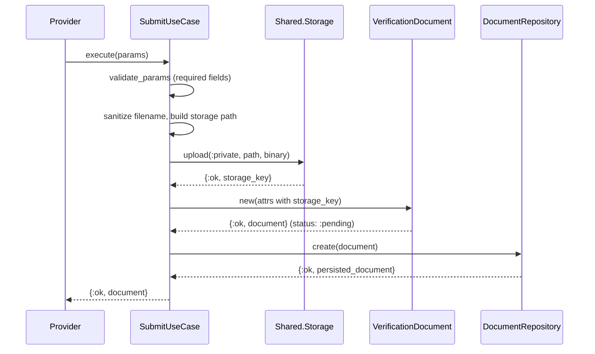
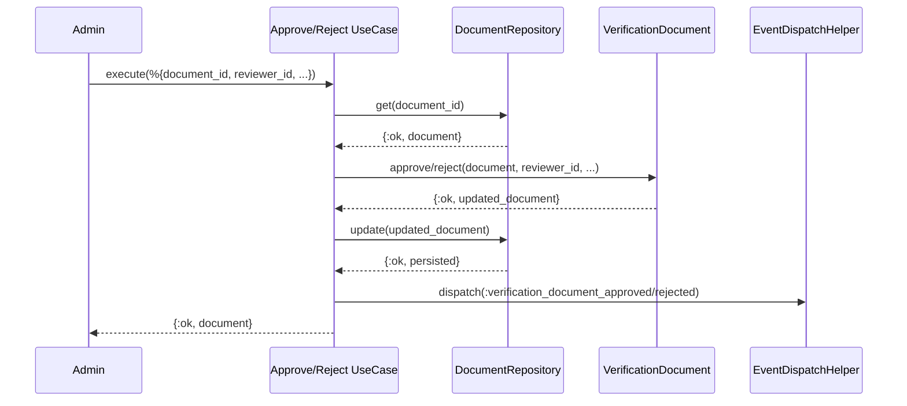
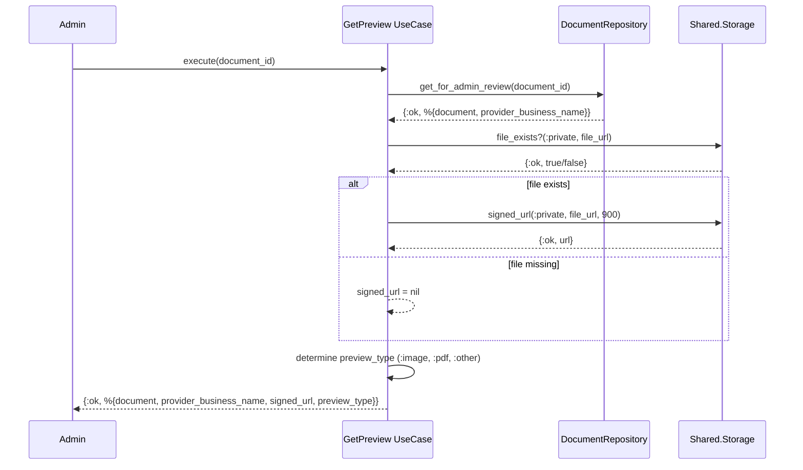

# Feature: Verification Document Workflow

> **Context:** Provider | **Status:** Active
> **Last verified:** 17f796f3

## Purpose

Allows providers to submit identity and compliance documents (business registration, insurance certificates, etc.) for admin review, and allows admins to approve or reject those documents with feedback. This is the document lifecycle machinery -- upload, store, review, preview.

## What It Does

- Accepts a file upload from a provider, sanitizes the filename, and stores it in private (non-public) object storage
- Creates a verification document record in `pending` status tied to the provider
- Lets an admin approve a pending document, recording the reviewer and timestamp
- Lets an admin reject a pending document with a mandatory rejection reason
- Generates a time-limited signed URL for previewing a document, but only after verifying the file actually exists in storage
- Dispatches domain events (`verification_document_approved`, `verification_document_rejected`) after review decisions
- Supports admin review queries that join documents with provider business names, with FIFO ordering for pending documents

## What It Does NOT Do

| Out of Scope | Handled By |
|---|---|
| Determining overall provider verification status based on document outcomes | Provider Verification Admin feature |
| Provider onboarding flow / which documents are required | [NEEDS INPUT] |
| File virus scanning or content validation | [NEEDS INPUT] |
| Notifying the provider of approval/rejection | Domain event subscribers (not yet implemented) |

## Business Rules

```
GIVEN a provider with a valid profile
WHEN  they submit a document with a file, document type, and original filename
THEN  the file is uploaded to private storage, the filename is sanitized,
      and a verification document record is created with status :pending
```

```
GIVEN a verification document in :pending status
WHEN  an admin approves it (providing their reviewer ID)
THEN  the document status becomes :approved, reviewer ID and timestamp are recorded,
      and a :verification_document_approved domain event is dispatched
```

```
GIVEN a verification document in :pending status
WHEN  an admin rejects it (providing their reviewer ID and a non-empty reason)
THEN  the document status becomes :rejected, the rejection reason is stored,
      reviewer ID and timestamp are recorded,
      and a :verification_document_rejected domain event is dispatched
```

```
GIVEN a verification document that has already been approved or rejected
WHEN  an admin attempts to approve or reject it again
THEN  the operation fails with :document_not_pending
```

```
GIVEN a verification document with a file stored in private storage
WHEN  an admin requests a preview
THEN  the system checks the file exists in storage before generating a signed URL
      (signed URLs expire in 900 seconds / 15 minutes)
```

```
GIVEN a verification document whose file is missing from storage
WHEN  an admin requests a preview
THEN  signed_url is returned as nil (no broken preview rendered)
```

```
GIVEN an uploaded filename containing unsafe characters
WHEN  the file is stored
THEN  characters outside [a-zA-Z0-9._-] are replaced with underscores,
      and a millisecond timestamp is prepended to prevent collisions
```

```
GIVEN a valid document type
WHEN  a provider submits a document
THEN  the document_type must be one of:
      business_registration, insurance_certificate, id_document, tax_certificate, other
```

## How It Works

### Document Submission



### Admin Review (Approve/Reject)



### Document Preview



## Dependencies

| Direction | Context | What |
|---|---|---|
| Requires | Shared | `ForStoringFiles` port / `Storage` facade for file upload, existence check, signed URL generation |
| Requires | Shared | `DomainEvent` and `EventDispatchHelper` for dispatching review events |
| Provides to | Provider (other features) | Domain events (`verification_document_approved`, `verification_document_rejected`) consumed by verification status handlers |

## Edge Cases

- **File not found on preview**: `GetVerificationDocumentPreview` performs a `file_exists?` check before generating a signed URL. If the file is missing, `signed_url` is returned as `nil` and a warning is logged. The template receives `preview_type` to decide rendering strategy.
- **Already-reviewed document**: Both `approve/2` and `reject/3` on the domain model pattern-match on `status: :pending`. Attempting to review a non-pending document returns `{:error, :document_not_pending}`.
- **Invalid document type**: The domain model validates `document_type` against a whitelist (`business_registration`, `insurance_certificate`, `id_document`, `tax_certificate`, `other`). Invalid types produce a validation error tuple.
- **Missing rejection reason**: The `RejectVerificationDocument` use case validates reason presence before fetching the document, returning `{:error, :reason_required}` for nil or empty reasons.
- **Invalid reviewer ID**: The domain model guards on `is_binary(reviewer_id) and byte_size(reviewer_id) > 0`. Nil or empty reviewer IDs return `{:error, :invalid_reviewer}` (approve) or `{:error, :invalid_review_params}` (reject).
- **Corrupt status in database**: The mapper uses `String.to_existing_atom/1` with a whitelist check. Unknown status strings raise immediately rather than silently degrading.
- **Storage upload failure**: If `Storage.upload/4` fails, the `with` chain in `SubmitVerificationDocument` short-circuits -- no document record is created for a failed upload.
- **Filename collision**: Storage paths include a millisecond timestamp prefix (`{timestamp}_{sanitized_filename}`) under the provider's directory to prevent overwrites.

## Roles & Permissions

| Role | Can Do | Cannot Do |
|---|---|---|
| Provider | Submit verification documents with file uploads | Approve/reject documents, view other providers' documents |
| Admin | Approve or reject pending documents, preview document files, list documents for review | Submit documents on behalf of providers |
| Parent | Nothing | Any verification document operations |

---

*Generated from code. Sections marked `[NEEDS INPUT]` require manual review.*
