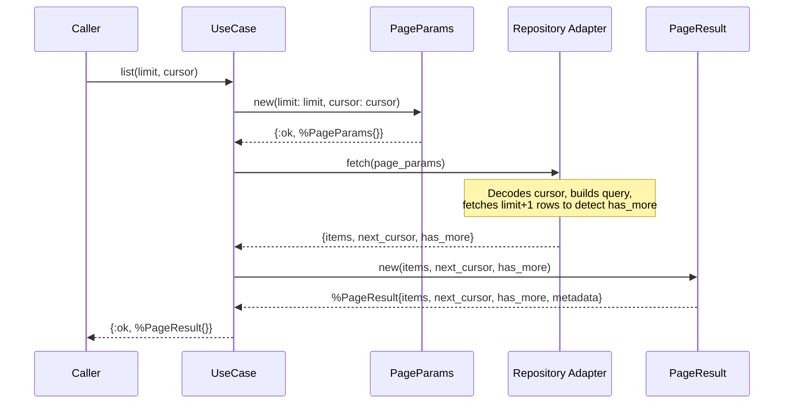

# Feature: Cursor Pagination

> **Context:** Shared | **Status:** Active
> **Last verified:** 17f796f3

## Purpose

Provides shared pagination types so that list endpoints across bounded contexts can paginate results using opaque cursors instead of numeric offsets, giving stable page boundaries even when underlying data changes.

## What It Does

- Accepts pagination input via `PageParams` (limit + optional cursor)
- Returns pagination output via `PageResult` (items, next_cursor, has_more, metadata)
- Clamps out-of-range limit values silently to the valid range (1-100, default 20)
- Keeps cursor format opaque to callers (Base64-encoded string)
- Tracks `returned_count` in result metadata

## What It Does NOT Do

| Out of Scope | Handled By |
|---|---|
| Offset-based pagination (page numbers) | N/A -- deliberately excluded |
| Total count of matching records | N/A -- incompatible with cursor model |
| Cursor encoding/decoding (translating cursor to DB WHERE clause) | Persistence adapters in each bounded context |
| Query execution | Repository adapters in each bounded context |

## Business Rules

```
GIVEN a caller requests a page with no cursor
WHEN  PageParams.new() is called with cursor: nil
THEN  the first page of results is returned
```

```
GIVEN a caller requests a page with a limit below 1
WHEN  PageParams.new(limit: 0) is called
THEN  limit is silently clamped to 1
```

```
GIVEN a caller requests a page with a limit above 100
WHEN  PageParams.new(limit: 200) is called
THEN  limit is silently clamped to 100
```

```
GIVEN a caller provides a non-integer limit
WHEN  PageParams.new(limit: "foo") is called
THEN  {:error, :invalid_limit} is returned
```

```
GIVEN a repository returns N items where N equals the requested limit
WHEN  PageResult.new(items, next_cursor, true) is called
THEN  has_more is true and next_cursor contains the opaque token for the next page
```

```
GIVEN a repository returns fewer items than the requested limit
WHEN  PageResult.new(items, nil, false) is called
THEN  has_more is false and next_cursor is nil
```

## How It Works



## Dependencies

| Direction | Context | What |
|---|---|---|
| Provides to | All bounded contexts | `PageParams` and `PageResult` types for consistent pagination |

## Edge Cases

- **Limit below 1:** Clamped to 1 silently -- caller always gets a valid page size
- **Limit above 100:** Clamped to 100 silently -- prevents unbounded result sets
- **Non-integer limit:** Returns `{:error, :invalid_limit}` -- the only validation error
- **Nil cursor (first page):** Treated as a request for the first page of results
- **Empty result set:** `PageResult` returns `items: []`, `has_more: false`, `next_cursor: nil`, `metadata: %{returned_count: 0}`
- **Cursor format:** Opaque Base64 string; decoding is the responsibility of each context's persistence adapter

## Roles & Permissions

| Role | Notes |
|---|---|
| Infrastructure | These are pure domain types with no authorization concerns. Access control is enforced by the use cases and contexts that consume these types. |

---

*Generated from code. Sections marked `[NEEDS INPUT]` require manual review.*
