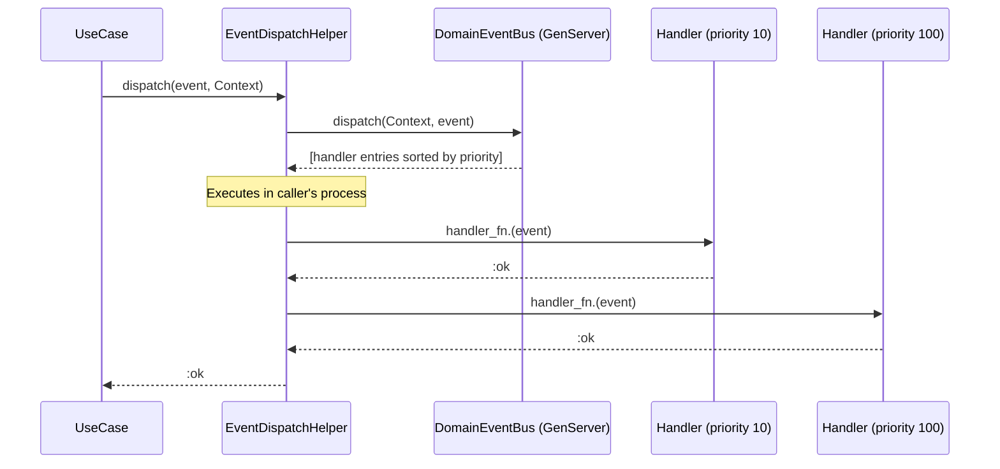
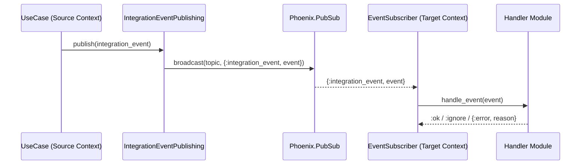
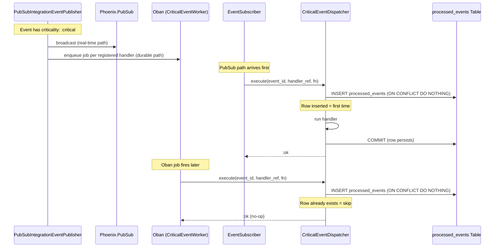

# Feature: Domain Event System

> **Context:** Shared | **Status:** Active
> **Last verified:** 17f796f3

## Purpose

A two-tier event system that enables communication within and between bounded contexts. Domain events dispatch synchronously inside a single context, while integration events broadcast asynchronously across contexts via Phoenix PubSub, with an optional durable delivery path through Oban for critical events.

## What It Does

- **Domain events** (`DomainEvent`) — per-context, synchronous dispatch through a `DomainEventBus` GenServer that acts as a handler registry; handlers execute in the caller's process
- **Integration events** (`IntegrationEvent`) — cross-context, asynchronous broadcast via Phoenix PubSub with a versioned, stable contract; consumed by `EventSubscriber` GenServer processes
- **Shared metadata** — every event carries a UUID `event_id`, `occurred_at` timestamp, and optional `correlation_id`, `causation_id`, and `criticality` metadata (built by `EventMetadata`)
- **Priority-ordered handler execution** — `DomainEventBus` sorts handlers by priority (lower number runs first, default 100), with registration-order tiebreaking
- **Critical event durable delivery** — events marked `criticality: :critical` get exactly-once semantics via `CriticalEventDispatcher` + `processed_events` table + Oban retry jobs
- **Test isolation** — `TestEventPublisher` and `TestIntegrationEventPublisher` use the process dictionary to collect published events per test process, safe for concurrent `async: true` tests
- **Configurable publisher adapters** — `EventPublishing` and `IntegrationEventPublishing` facades resolve the publisher module from application config, defaulting to PubSub adapters

## What It Does NOT Do

| Out of Scope | Handled By |
|---|---|
| Event persistence / outbox pattern | Not implemented; PubSub is fire-and-forget for normal events |
| Guaranteed delivery for normal events | Only critical events have durable delivery (Oban fallback) |
| Event replay / event sourcing | Not implemented |
| Cross-node PubSub distribution | Phoenix.PubSub cluster configuration (infrastructure concern) |
| Defining concrete event types per context | Each bounded context defines its own event types |
| Oban job queue configuration | Application supervision tree / `config/` |

## Business Rules

```
GIVEN a domain event is dispatched via DomainEventBus
WHEN  handlers are registered for that event type
THEN  handlers execute synchronously in the caller's process, sorted by priority (lower first)
```

```
GIVEN a domain event handler returns {:error, reason} or raises an exception
WHEN  the event has criticality: :normal
THEN  the failure is logged at warning level and dispatch returns :ok (fire-and-forget)
```

```
GIVEN a domain event handler fails
WHEN  the event has criticality: :critical and the handler has a named identity
THEN  an Oban retry job is enqueued via CriticalEventDispatcher for that specific handler
```

```
GIVEN a domain event handler succeeds for a critical event
WHEN  the handler has a named identity ({Module, :function})
THEN  the event-handler pair is marked as processed (idempotency gate) so Oban retries are no-ops
```

```
GIVEN an integration event is published with criticality: :critical
WHEN  CriticalEventHandlerRegistry has handlers registered for the derived topic
THEN  one Oban CriticalEventWorker job is enqueued per handler alongside the PubSub broadcast
```

```
GIVEN the EventSubscriber receives a critical integration event
WHEN  dispatching to its handler module
THEN  execution goes through CriticalEventDispatcher.execute/3 for exactly-once semantics
```

```
GIVEN the CriticalEventWorker Oban job runs for an already-processed event-handler pair
WHEN  the processed_events row already exists
THEN  the handler is skipped and the job returns :ok (duplicate treated as success)
```

```
GIVEN a CriticalEventWorker job exhausts all retry attempts (max 3)
WHEN  the handler still returns {:error, reason}
THEN  the failure is logged at error level for operator alerting
```

```
GIVEN the EventDispatchHelper.dispatch_or_error/2 is called
WHEN  any handler returns an error
THEN  the first failure is propagated as {:error, reason} (does NOT enqueue Oban retries)
```

## How It Works

### Tier 1: Domain Events (Intra-Context, Synchronous)



### Tier 2: Integration Events (Cross-Context, Async via PubSub)



### Critical Event Durable Delivery (Belt-and-Suspenders)



## Key Modules

| Module | Role |
|---|---|
| `Shared.Domain.Events.DomainEvent` | Struct for intra-context events (aggregate_type/aggregate_id) |
| `Shared.Domain.Events.IntegrationEvent` | Struct for cross-context events (source_context, entity_type, version) |
| `Shared.Domain.Events.EventMetadata` | Shared metadata builders and accessors (criticality, correlation/causation IDs) |
| `Shared.DomainEventBus` | Per-context GenServer registry; dispatches handlers in caller's process |
| `Shared.EventPublishing` | Facade resolving configured domain event publisher from app config |
| `Shared.IntegrationEventPublishing` | Facade resolving configured integration event publisher; `publish_critical/3` and `publish_best_effort/3` convenience functions |
| `Shared.EventDispatchHelper` | Fire-and-forget wrapper for `DomainEventBus`; routes critical events to Oban on failure |
| `Shared.Domain.Ports.ForPublishingEvents` | Behaviour for domain event publishers |
| `Shared.Domain.Ports.ForPublishingIntegrationEvents` | Behaviour for integration event publishers |
| `Shared.Domain.Ports.ForHandlingEvents` | Behaviour for domain event handlers (subscribed_events + handle_event) |
| `Shared.Domain.Ports.ForHandlingIntegrationEvents` | Behaviour for integration event handlers |
| `Shared.Domain.Ports.ForTrackingProcessedEvents` | Behaviour for exactly-once persistence (processed_events table) |
| `Shared.Domain.Services.CriticalEventDispatcher` | Exactly-once dispatch; idempotency gate via processed_events |
| `Shared.Adapters.Driven.Events.PubSubEventPublisher` | PubSub adapter for domain events (topic: `{aggregate_type}:{event_type}`) |
| `Shared.Adapters.Driven.Events.PubSubIntegrationEventPublisher` | PubSub adapter for integration events (topic: `integration:{source_context}:{event_type}`); enqueues Oban jobs for critical events |
| `Shared.Adapters.Driven.Events.EventSubscriber` | GenServer that subscribes to PubSub topics and dispatches to handler modules |
| `Shared.Adapters.Driven.Events.CriticalEventHandlerRegistry` | Config-driven lookup of handlers needing durable delivery per topic |
| `Shared.Adapters.Driven.Events.CriticalEventSerializer` | JSON round-trip serialization of event structs for Oban job args |
| `Shared.Adapters.Driven.Workers.CriticalEventWorker` | Oban worker (queue: `:critical_events`, max 3 attempts) for durable delivery |
| `Shared.Adapters.Driven.Events.TestEventPublisher` | Test double using process dictionary for domain event collection |
| `Shared.Adapters.Driven.Events.TestIntegrationEventPublisher` | Test double using process dictionary for integration event collection; supports `configure_publish_error/1` |

## Topic Naming Conventions

| Event Type | Pattern | Example |
|---|---|---|
| Domain event | `{aggregate_type}:{event_type}` | `user:user_registered` |
| Integration event | `integration:{source_context}:{event_type}` | `integration:identity:child_data_anonymized` |

## Dependencies

| Direction | Context/Library | What |
|---|---|---|
| Requires | Phoenix.PubSub | Broadcast transport for both domain and integration events |
| Requires | Oban | Durable delivery queue for critical events (`critical_events` queue) |
| Requires | Ecto/PostgreSQL | `processed_events` table for exactly-once idempotency gate |
| Provides to | All bounded contexts | Event structs, publishing facades, handler behaviours, subscriber GenServer, DomainEventBus |

## Edge Cases

- **Handler crashes** — `DomainEventBus.safe_call/2` rescues exceptions, logs at error level, and returns `{:error, {:handler_crashed, error}}`; `EventSubscriber` also rescues handler crashes with distinct log messages for critical vs. normal events
- **No handlers registered** — `DomainEventBus.dispatch/2` short-circuits to `:ok` when the handler list is empty for an event type
- **Missing DomainEventBus process** — calling `dispatch/2` for a context without a running bus will raise a `GenServer.call` exit (no implicit fallback)
- **Anonymous handler identity** — runtime-subscribed lambdas get `:anonymous` identity; `dispatch_critical/2` cannot serialize them for Oban retry, so failures are logged but not retried durably
- **Oban job insertion failure** — `PubSubIntegrationEventPublisher` logs at error level when `Oban.insert/1` fails for a critical event, noting that the durable delivery guarantee is voided for that handler
- **Duplicate processing** — `CriticalEventDispatcher.execute/3` uses `ON CONFLICT DO NOTHING` on the `processed_events` table; if the row already exists, the handler is skipped and `:ok` is returned
- **Test isolation** — test publishers use the process dictionary (`Process.put/get`), providing automatic per-process isolation; `TestIntegrationEventPublisher.configure_publish_error/1` allows simulating publish failures
- **Handler returns unexpected value** — `EventSubscriber` logs a warning; `DomainEventBus` wraps it as `{:error, {:unexpected_return, value}}`
- **CriticalEventWorker exhausts retries** — after max 3 attempts, logs at error level with full context for operator alerting; intermediate failures log at warning level

## Roles & Permissions

This is an infrastructure feature with no direct user interaction. All contexts use it equally; access control is not applicable at this layer.

## Configuration

```elixir
# config/config.exs (or environment-specific config)

# Domain event publisher
config :klass_hero, :event_publisher,
  module: KlassHero.Shared.Adapters.Driven.Events.PubSubEventPublisher,
  pubsub: KlassHero.PubSub

# Integration event publisher
config :klass_hero, :integration_event_publisher,
  module: KlassHero.Shared.Adapters.Driven.Events.PubSubIntegrationEventPublisher,
  pubsub: KlassHero.PubSub

# Critical event handler registry (topic -> handler list)
config :klass_hero, :critical_event_handlers, %{
  "integration:identity:child_data_anonymized" => [
    {MyApp.Participation.ChildAnonymizedHandler, :handle_event}
  ]
}

# Processed events tracking adapter
config :klass_hero, :shared,
  for_tracking_processed_events: KlassHero.Shared.Adapters.Driven.Persistence.ProcessedEventsAdapter
```

```elixir
# config/test.exs — swap to test doubles
config :klass_hero, :event_publisher,
  module: KlassHero.Shared.Adapters.Driven.Events.TestEventPublisher

config :klass_hero, :integration_event_publisher,
  module: KlassHero.Shared.Adapters.Driven.Events.TestIntegrationEventPublisher
```

---

*Generated from code. Sections marked `[NEEDS INPUT]` require manual review.*
