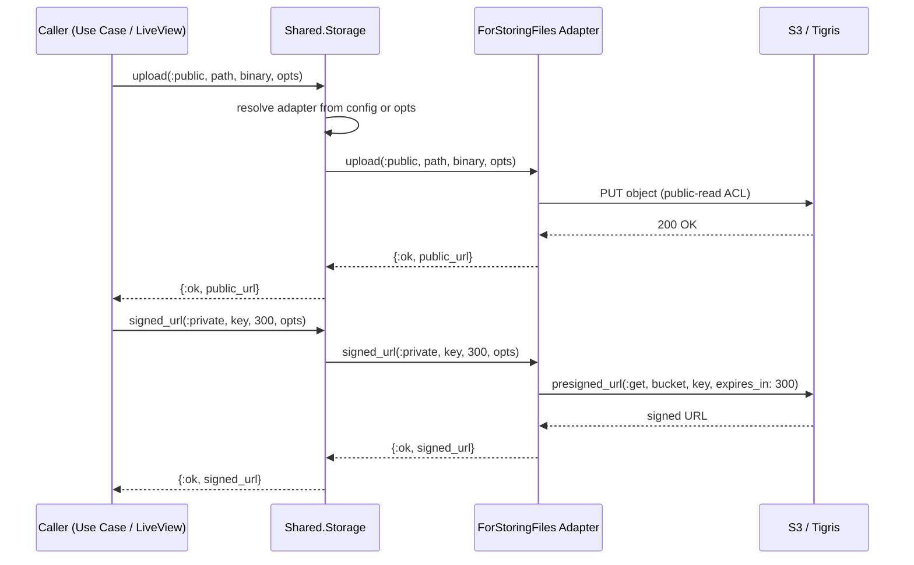

# Feature: File Storage

> **Context:** Shared | **Status:** Active
> **Last verified:** 17f796f3

## Purpose

Provides a unified API for uploading, retrieving, checking, and deleting files (verification documents, provider logos, program images) across all bounded contexts, abstracting away the underlying storage backend through a port/adapter boundary.

## What It Does

- Upload files with per-object visibility control (`:public` for direct URLs, `:private` for signed-URL access)
- Generate time-limited signed URLs for private file access
- Check whether a file exists in storage before generating URLs
- Delete files from storage
- Route all operations through a configurable adapter resolved at runtime from application config
- Provide an in-memory stub adapter (Agent-backed) for deterministic testing without network calls

## What It Does NOT Do

| Out of Scope | Handled By |
|---|---|
| Image processing, resizing, or thumbnail generation | [NEEDS INPUT] |
| Virus/malware scanning of uploaded files | [NEEDS INPUT] |
| File type validation or MIME type enforcement | Caller (e.g., Provider context upload use case) |
| Multipart upload orchestration from the browser | LiveView upload handling in the web layer |

## Business Rules

```
GIVEN a file is uploaded with bucket type :public
WHEN  the upload succeeds
THEN  a direct public URL is returned (e.g., https://<bucket>.fly.storage.tigris.dev/<path>)
  AND the object is stored with public-read ACL
```

```
GIVEN a file is uploaded with bucket type :private
WHEN  the upload succeeds
THEN  the storage key (path) is returned, not a URL
  AND the object is stored with default (private) ACL
```

```
GIVEN a private file exists in storage
WHEN  a signed URL is requested with an expiration (seconds)
THEN  a pre-signed URL is returned that grants temporary GET access
```

```
GIVEN a signed URL has been generated
WHEN  the expiration time elapses
THEN  the URL becomes invalid and returns an access-denied error
```

```
GIVEN no adapter option is passed in opts
WHEN  any storage operation is called
THEN  the adapter is resolved from Application config (:klass_hero, :storage, :adapter)
```

```
GIVEN an adapter option is passed in opts
WHEN  any storage operation is called
THEN  that adapter is used instead of the configured default
```

## How It Works



### Key Modules

| Module | Role |
|---|---|
| `KlassHero.Shared.Storage` | Public API facade; delegates to configured adapter |
| `KlassHero.Shared.Domain.Ports.ForStoringFiles` | Behaviour (port) defining the storage contract |
| `S3StorageAdapter` | Production adapter using ExAws against S3-compatible backends |
| `StubStorageAdapter` | Test adapter using an Agent for in-memory file storage |

### Adapter Resolution

The `Storage` module resolves the adapter at call time via `Application.get_env(:klass_hero, :storage)[:adapter]`. Callers can override this per-call by passing `adapter: MyAdapter` in the opts keyword list.

### Public URL Construction (S3 Adapter)

- **Tigris (default, no endpoint configured):** `https://<bucket>.fly.storage.tigris.dev/<path>`
- **Custom endpoint (MinIO, etc.):** `<endpoint>/<bucket>/<path>`

## Dependencies

| Direction | Context | What |
|---|---|---|
| Requires | Infrastructure | S3-compatible storage backend (Tigris on Fly.io in production) |
| Requires | Config | `:klass_hero, :storage` — bucket name, credentials, adapter module, optional endpoint |
| Requires | Hex | `ex_aws` and `ex_aws_s3` for S3 API calls |
| Provides to | Provider | File upload/retrieval for verification documents and logos |
| Provides to | Program Catalog | File upload/retrieval for program images |
| Provides to | Any Context | Generic file storage operations via `Shared.Storage` |

## Edge Cases

- **Upload failure (network/auth):** S3 adapter logs the error and returns `{:error, :upload_failed}`; callers must handle gracefully
- **File not found on existence check:** S3 adapter catches HTTP 404 from `HEAD` request and returns `{:ok, false}` (not an error)
- **Storage service unreachable:** S3 adapter returns `{:error, :storage_unavailable}` for non-404 errors on existence checks
- **Signed URL for nonexistent file:** S3 presigned URLs are pure URL math and succeed even for missing files; callers should use `file_exists?/3` first to avoid broken previews
- **Expired signed URL:** The URL returns an access-denied response from S3; no server-side handling needed
- **Delete of nonexistent file:** S3 `DELETE` is idempotent and returns success; adapter returns `:ok`
- **Stub adapter without Agent started:** The stub gracefully handles a missing Agent process -- `upload` returns a stub URL, `file_exists?` defaults to `true`, `signed_url` returns a stub URL

## Roles & Permissions

| Role | Notes |
|---|---|
| Infrastructure | This is a shared infrastructure service with no user-facing role checks. Access control is the responsibility of the calling context (e.g., Provider context authorizes who can upload verification documents). |

---

*Generated from code. Sections marked `[NEEDS INPUT]` require manual review.*
